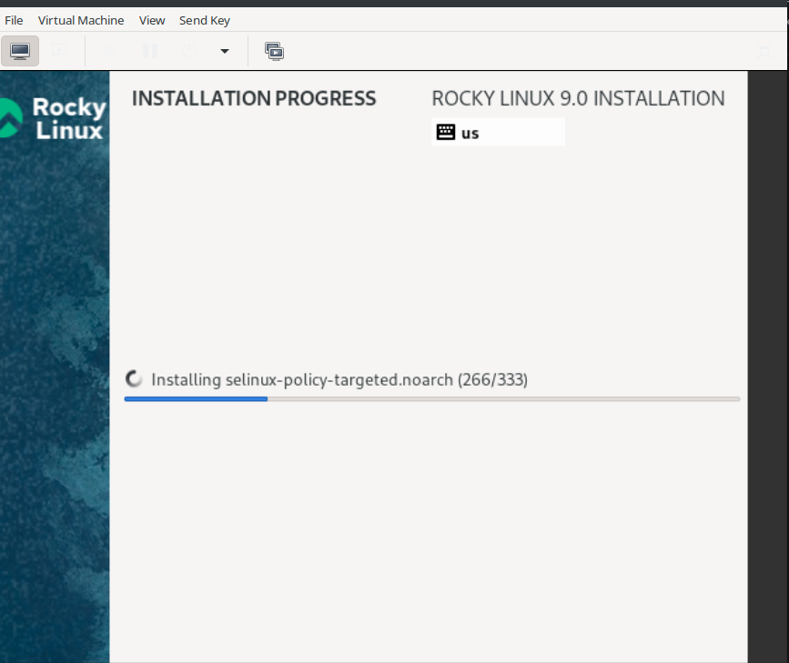
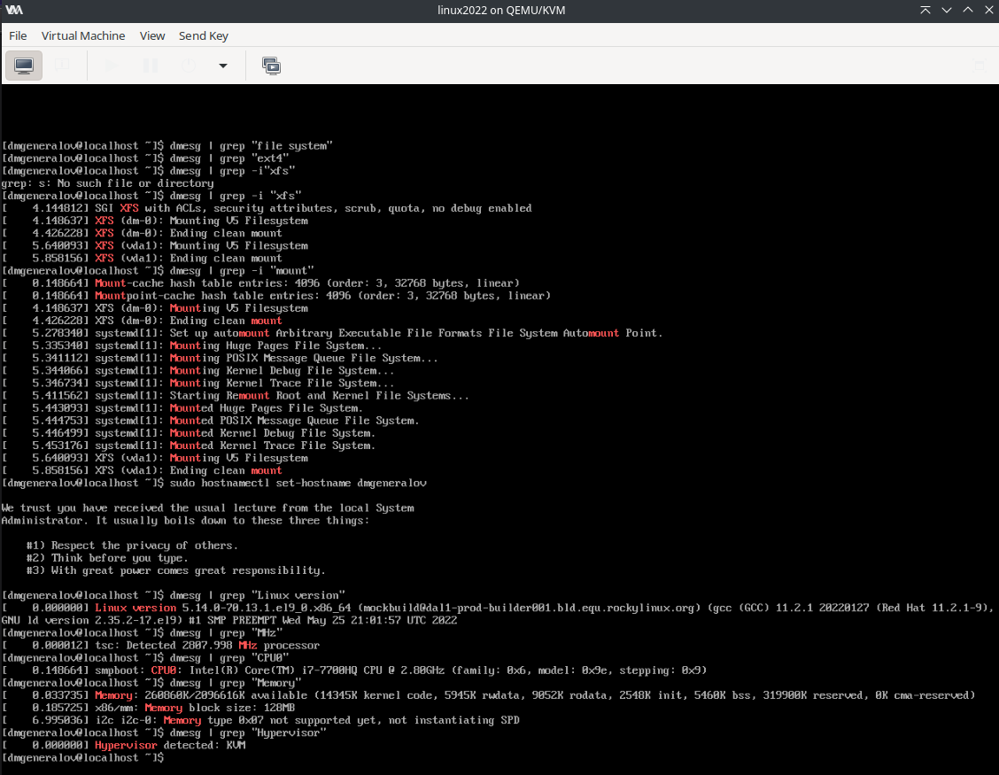

---
## Front matter
lang: ru-RU
title: Лабораторная работа 1
author: |
  Генералов Даниил, НПИбд-01-21, 1032202280
institute: |
	\inst{1}RUDN University, Moscow, Russian Federation
date: 2022

## Formatting
toc: false
slide_level: 2
theme: metropolis
header-includes: 
 - \metroset{progressbar=frametitle,sectionpage=progressbar,numbering=fraction}
 - '\makeatletter'
 - '\beamer@ignorenonframefalse'
 - '\makeatother'
aspectratio: 43
section-titles: true
---

# Задача

> Лабораторная работа подразумевает установку на виртуальную машину VirtualBox
> (https://www.virtualbox.org/) операционной системы Linux (дистрибутив
> Rocky (https://rockylinux.org/) или CentOS (https://www.centos.org/)).
> Выполнение работы возможно как в дисплейном классе факультета физико-
> математических и естественных наук РУДН, так и дома. Описание выполнения
> работы приведено для дисплейного класса со следующими характеристиками:
> – Intel Core i3-550 3.2 GHz, 4 GB оперативной памяти, 20 GB свободного места на
жёстком диске;
> – ОС Linux Gentoo (http://www.gentoo.ru/);
> – VirtualBox верс. 6.1 или старше;
> – каталог с образами ОС для работающих в дисплейном классе:
> /afs/dk.sci.pfu.edu.ru/common/files/iso/

# Выполнение 

## Установка ОС

## Проверка свойств установки

## Вывод

> Результатом моей работы оказалась рабочая установка системы Rocky Linux,
> которую я затем смогу использовать для выполнения последующих лабораторных работ.
