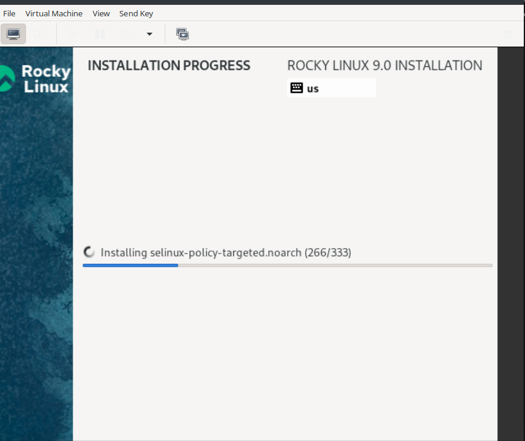
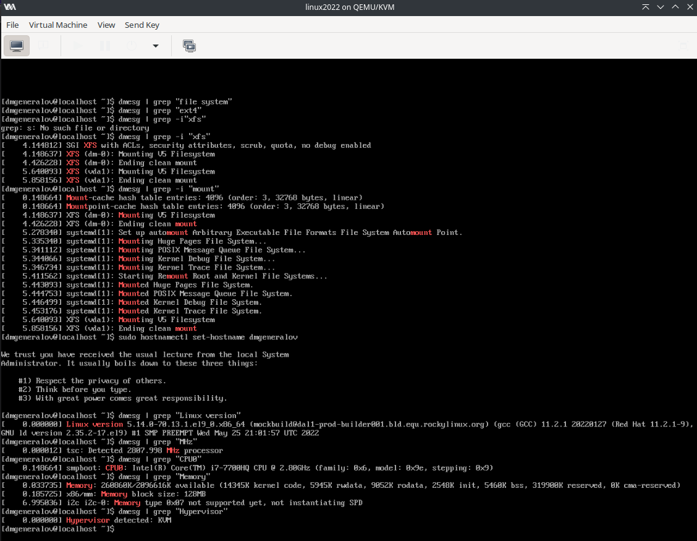

---
## Front matter
title: "Отчет по лабораторной работе 1"
subtitle: ""
author: "Генералов Даниил, НПИбд-01-21, 1032202280"

## Generic otions
lang: ru-RU
toc-title: "Содержание"

## Pdf output format
toc: true # Table of contents
toc-depth: 2
lof: true # List of figures
lot: true # List of tables
fontsize: 12pt
linestretch: 1.5
papersize: a4
documentclass: scrreprt
## I18n polyglossia
polyglossia-lang:
  name: russian
  options:
	- spelling=modern
	- babelshorthands=true
polyglossia-otherlangs:
  name: english
## I18n babel
babel-lang: russian
babel-otherlangs: english
## Fonts
mainfont: PT Serif
romanfont: PT Serif
sansfont: PT Sans
monofont: PT Mono
mainfontoptions: Ligatures=TeX
romanfontoptions: Ligatures=TeX
sansfontoptions: Ligatures=TeX,Scale=MatchLowercase
monofontoptions: Scale=MatchLowercase,Scale=0.9
## Biblatex
biblatex: true
biblio-style: "gost-numeric"
biblatexoptions:
  - parentracker=true
  - backend=biber
  - hyperref=auto
  - language=auto
  - autolang=other*
  - citestyle=gost-numeric
## Pandoc-crossref LaTeX customization
figureTitle: "Рис."
tableTitle: "Таблица"
listingTitle: "Листинг"
lofTitle: "Список иллюстраций"
lotTitle: "Список таблиц"
lolTitle: "Листинги"
## Misc options
indent: true
header-includes:
  - \usepackage{indentfirst}
  - \usepackage{float} # keep figures where there are in the text
  - \floatplacement{figure}{H} # keep figures where there are in the text
---

# Цель работы

В рамках этой лабораторной работы требуется установить систему Rocky Linux на виртуальную машину.
Это необходимо для последующих лабораторных работ.

# Задание

> Лабораторная работа подразумевает установку на виртуальную машину VirtualBox
> (https://www.virtualbox.org/) операционной системы Linux (дистрибутив
> Rocky (https://rockylinux.org/) или CentOS (https://www.centos.org/)).
> Выполнение работы возможно как в дисплейном классе факультета физико-
> математических и естественных наук РУДН, так и дома. Описание выполнения
> работы приведено для дисплейного класса со следующими характеристиками:
> – Intel Core i3-550 3.2 GHz, 4 GB оперативной памяти, 20 GB свободного места на
жёстком диске;
> – ОС Linux Gentoo (http://www.gentoo.ru/);
> – VirtualBox верс. 6.1 или старше;
> – каталог с образами ОС для работающих в дисплейном классе:
> /afs/dk.sci.pfu.edu.ru/common/files/iso/

# Выполнение лабораторной работы

Сначала я скачал образ системы с официального сайта Rocky Linux.
Выбранная версия -- minimal, x86_64.
Для выполнения последующих лабораторных работ не требуется графический интерфейс, и поэтому я решил использовать minimal версию, чтобы сэкономить пространство на диске.

После этого я использовал `virt-manager` -- графический интерфейс для системы виртуализации `libvirt` -- для создания виртуальной машины.
В этой виртуальной машине я запустил установочный образ системы, и после нескольких настроек запустилась установка.

{ #fig:001 width=70% }

В то время, как устанавливалась система, я написал этот отчет.

Когда система установилась, я зашел в систему и узнал требуемую информацию из лога `dmesg` -- она показана на скриншоте ниже. Здесь же я указал `hostname` системы -- это будет обновлено при следующей перезагрузке.

{ #fig:001 width=70% }

# Выводы

Результатом моей работы оказалась рабочая установка системы Rocky Linux,
которую я затем смогу использовать для выполнения последующих лабораторных работ.

# Контрольные вопросы
1. Какую информацию содержит учётная запись пользователя?

В `/etc/passwd` -- файле, в котором хранится информация о пользователях системы -- есть следующие поля:

- имя пользователя
- пароль пользователя (или символ `x`, если пароль хранится в `/etc/shadow`, или символ `*`, если пароль отсутствует, или символ `!`, если аккаунт заблокирован)
- ID пользователя
- ID группы пользователя
- человеко-читаемое имя пользователя
- путь к домашней директории пользователя
- путь к shell, который использует пользователь по умолчанию

2. Укажите команды терминала и приведите примеры:
– для получения справки по команде: `man <command>`
– для перемещения по файловой системе: `cd <path>`
– для просмотра содержимого каталога: `ls <path>`
– для определения объёма каталога: `du -c <path>`
– для создания / удаления каталогов / файлов: `mkdir <dir>` / `rmdir <dir>` / `touch <file>` / `rm <file>`
– для задания определённых прав на файл / каталог: `chmod <mode> <path>`
– для просмотра истории команд: `history`
3. Что такое файловая система? Приведите примеры с краткой характеристикой.

Файловая система -- это структура данных, которая хранится на устройстве-носителе информации (жестком диске, флешке, дискете или магнитной ленте), и часто занимает все пространство этого носителя.
Файловые системы содержат концептуальные "файлы" -- блоки байтов определенного размера, а также "папки" -- структуры, которые внутри себя содержат ссылки на файлы и другие папки.
Самой простой реализацией этой идеи является FAT *File Allocation Table*, которая содержит таблицу, в которой каждая запись описывает один файл, и содержит ссылки на блоки данных этого файла; сами блоки же содержат данные файла, а также ссылки на следующий блок данных, тем самым образуя связный список.
Таким образом, в FAT есть разделение между содержимым файлов и информацией об их названиях и расположении.
Это свойство присутствует во многих файловых системах, хотя оно не универсально.
Например, архивы `tar` (которые также можно рассматривать как файловые системы) состоят из блоков 512 байтов,
и каждый из этих блоков либо является заголовком файла (содержит полный путь к файлу, его размер и другие данные), либо является частью данных файла, и все блоки файла расположены последовательно и сразу следуя за заголовком.

4. Как посмотреть, какие файловые системы подмонтированы в ОС?

Эту информацию предоставляет команда `mount` без аргументов.
Помимо этого, команда `df` используется, чтобы узнать информацию о свободном месте на файловых системах,
и ее можно вызвать с ключом `-T`, чтобы увидеть тип файловой системы.

5. Как удалить зависший процесс?
Для того, чтобы прервать процесс, ему нужно послать сигнал. Сигналы посылаются с помощью команды `kill`.
"Вежливый" способ закрыть процесс -- это сигнал `SIGTERM`, получив который программы должны завершать свою работу (например, сохранять временные файлы, закрывать соединения и т.д.).
Если программа не делает этого ("зависла"), то можно послать сигнал `SIGKILL`.
Этот сигнал обрабатывается не программой, а ядром Linux, которое удаляет запись о процессе из таблицы процессов и тем самым прерывает его работу.
Если это сделать, то у процесса не будет шанса сохранить данные или закрыть открытые ресурсы, поэтому этот способ следует использовать только в крайних случаях.
