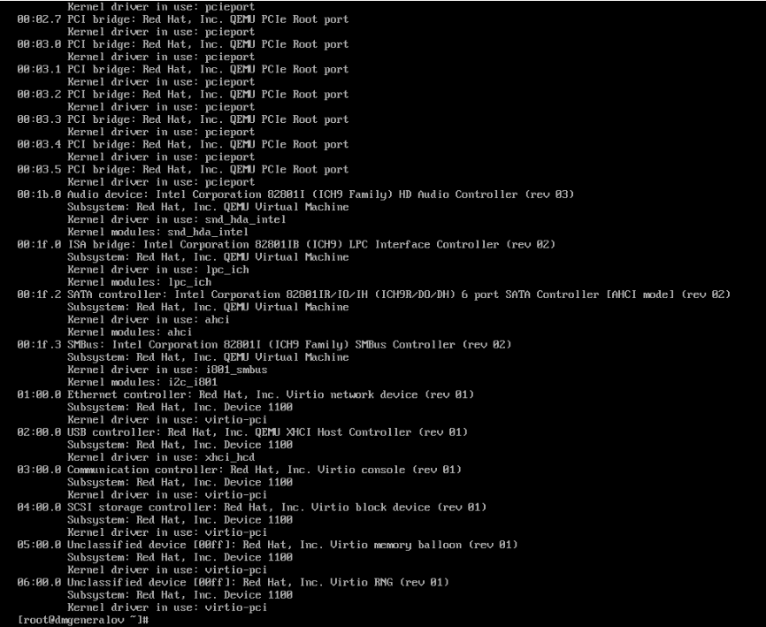
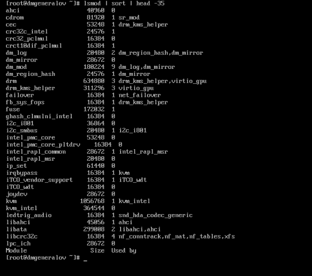
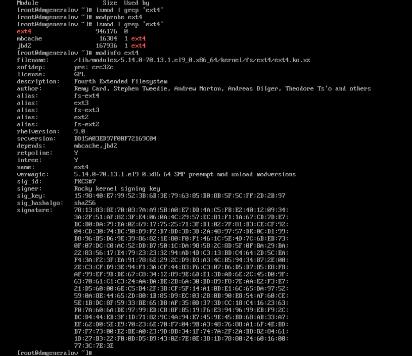
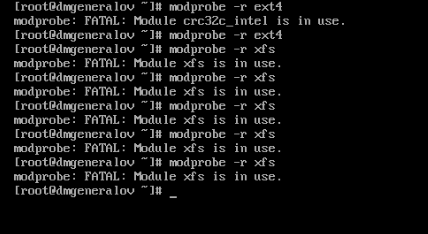
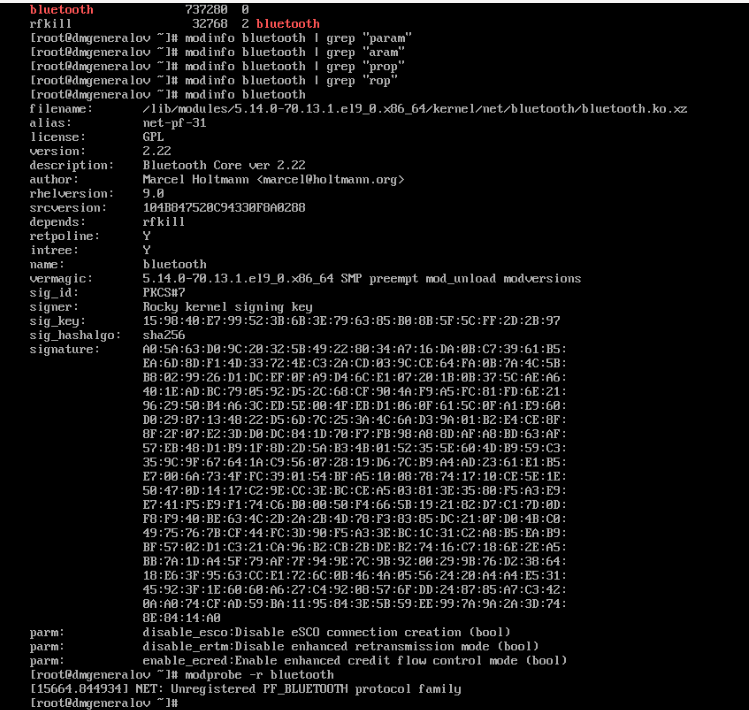
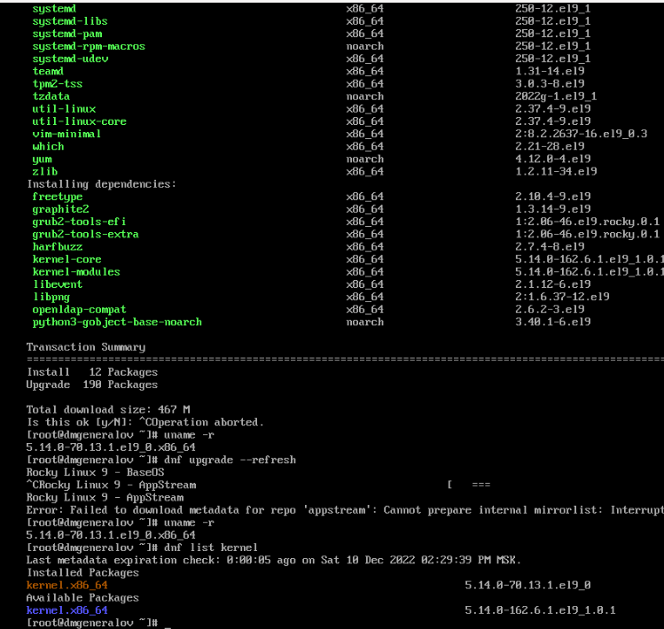
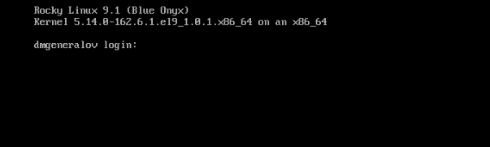

---
## Front matter
lang: ru-RU
title: Лабораторная работа 10
author: |
  Генералов Даниил, НПИбд-01-21, 1032202280
institute: |
	\inst{1}RUDN University, Moscow, Russian Federation
date: 2022

## Formatting
toc: false
slide_level: 2
theme: metropolis
header-includes: 
 - \metroset{progressbar=frametitle,sectionpage=progressbar,numbering=fraction}
 - '\makeatletter'
 - '\beamer@ignorenonframefalse'
 - '\makeatother'
aspectratio: 43
section-titles: true
---

# Задача

> 1. Продемонстрируйте навыки работы по управлению модулями ядра (см. раз-
> дел 10.4.1).
> 2. Продемонстрируйте навыки работы по загрузке модулей ядра с параметрами (см.
> раздел 10.4.2).

# Выполнение 

## lspci

## lsmod

## modprobe

## modprobe -r

## modinfo

## uname

## uname

## Вывод

Я получил опыт работы с модулями ядра.
