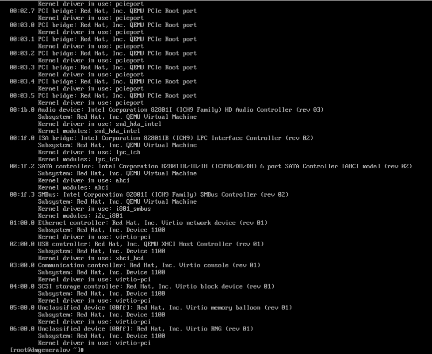
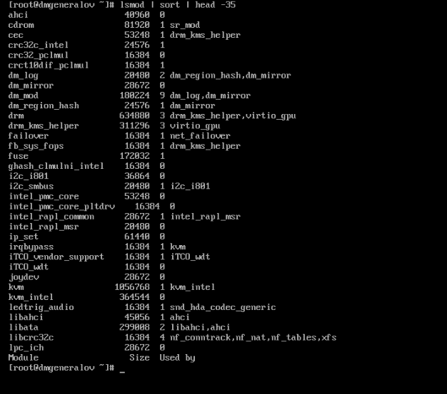
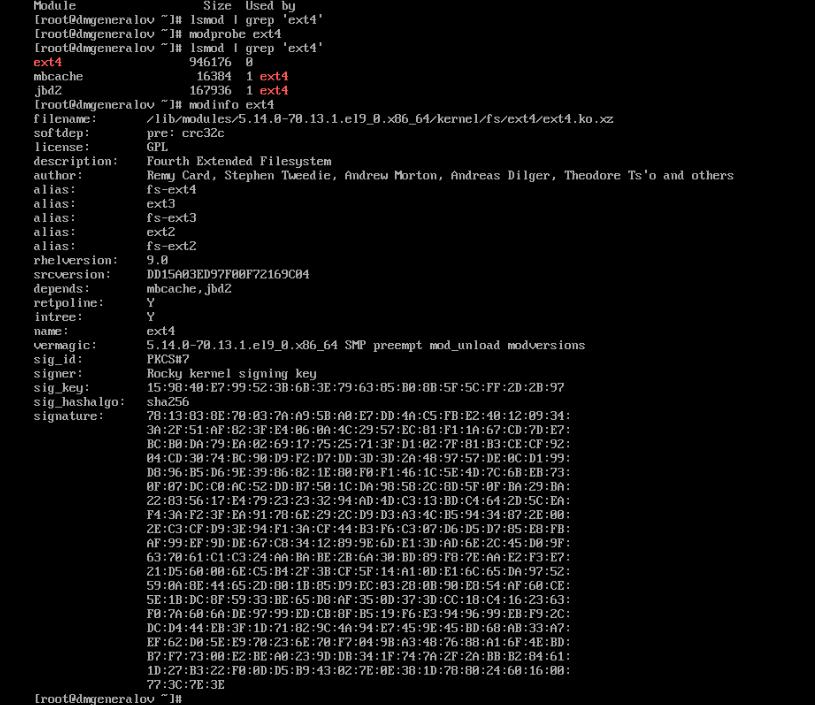
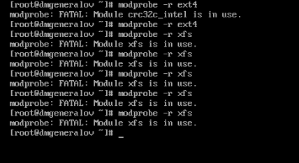
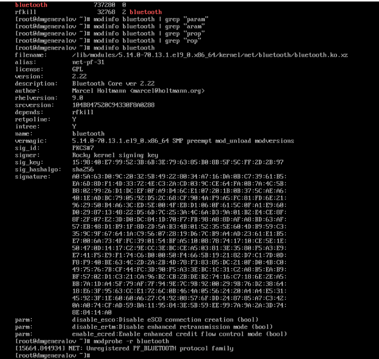
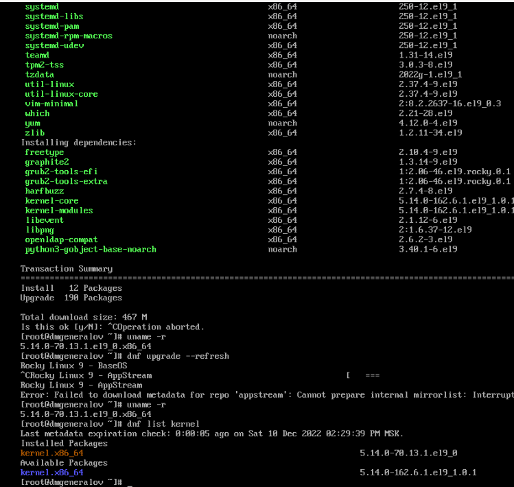
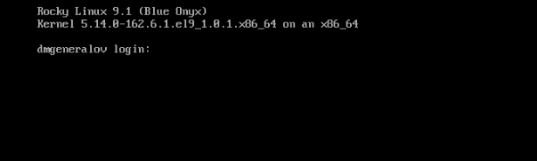
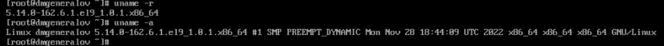

---
## Front matter
title: "Отчет по лабораторной работе 10"
subtitle: ""
author: "Генералов Даниил, НПИбд-01-21, 1032202280"

## Generic otions
lang: ru-RU
toc-title: "Содержание"

## Pdf output format
toc: true # Table of contents
toc-depth: 2
lof: true # List of figures
lot: true # List of tables
fontsize: 12pt
linestretch: 1.5
papersize: a4
documentclass: scrreprt
## I18n polyglossia
polyglossia-lang:
  name: russian
  options:
	- spelling=modern
	- babelshorthands=true
polyglossia-otherlangs:
  name: english
## I18n babel
babel-lang: russian
babel-otherlangs: english
## Fonts
mainfont: PT Serif
romanfont: PT Serif
sansfont: PT Sans
monofont: PT Mono
mainfontoptions: Ligatures=TeX
romanfontoptions: Ligatures=TeX
sansfontoptions: Ligatures=TeX,Scale=MatchLowercase
monofontoptions: Scale=MatchLowercase,Scale=0.9
## Biblatex
biblatex: true
biblio-style: "gost-numeric"
biblatexoptions:
  - parentracker=true
  - backend=biber
  - hyperref=auto
  - language=auto
  - autolang=other*
  - citestyle=gost-numeric
## Pandoc-crossref LaTeX customization
figureTitle: "Рис."
tableTitle: "Таблица"
listingTitle: "Листинг"
lofTitle: "Список иллюстраций"
lotTitle: "Список таблиц"
lolTitle: "Листинги"
## Misc options
indent: true
header-includes:
  - \usepackage{indentfirst}
  - \usepackage{float} # keep figures where there are in the text
  - \floatplacement{figure}{H} # keep figures where there are in the text
---

# Цель работы

В рамках этой лабораторной работы требуется выполнить операции по управлению модулями ядра.

# Задание

> 1. Продемонстрируйте навыки работы по управлению модулями ядра (см. раз-
> дел 10.4.1).
> 2. Продемонстрируйте навыки работы по загрузке модулей ядра с параметрами (см.
> раздел 10.4.2).

# Выполнение лабораторной работы

Сначала я посмотрел список устройств, подключенных к PCI-портам виртуальной машины.
Здесь можно увидеть аудио-устройство от Intel,
ISA- и SATA-контроллеры,
контроллер SMBus,
USB-контроллер
и несколько Virtio-устройств (для взаимодействия с хостовой ОС).
Для каждого из них указано, какой драйвер они используют.

Затем я посмотрел список загруженных модулей ядра.
Для каждого из модулей указано, какой размер он занимает в памяти, а также от каких других модулей он зависит.

В этом списке нет модуля `ext4`. Команда `modprobe` позволяет загрузить модуль ядра, если он не загружен,
и после этого `modinfo` показывает информацию о модуле.
В частности, здесь указано, где хранится файл модуля,
от каких других модулей он зависит,
под какой лицензией распространяется,
как еще он может называться (`ext2` и `ext3` также загрузят этот модуль),
какие параметры он принимает и какие значения по умолчанию у них -- в данном случае у этого модуля нет параметров.

Модуль ядра также можно выгрузить, но только если он не используется сам или другими модулями.
Например, мы можем выгрузить модуль `ext4`, потому что у нас нет примонтированных разделов с этой файловой системой.
Однако модуль `xfs` не может быть выгружен, потому что этот драйвер используется для корневой файловой системы.

У модулей могут быть параметры, которые можно задать при загрузке этого модуля.
Например, у модуля `bluetooth` есть три параметра: `disable_ertm`, `disable_esco` и `enable_ecred`.
Они позволяют задать особенное поведение Bluetooth-протокола, которое меняет поведение контроллера.
Каждый из них имеет тип `bool`, но бывают и другие типы параметров.

У ядра Linux есть разные версии.
Сейчас на моей виртуальной машине установлено ядро версии `5.14.0-70.13.1`,
но сейчас самая свежая версия -- `6.0.12`, а самая свежая LTS-версия -- `5.15.82`.
Обновив систему, я могу получить более новые версии ядра.

После обновления системы теперь запущено ядро версии `5.14.0-162.6.1`.

# Выводы

Я получил опыт работы с модулями ядра Linux.

# Контрольные вопросы

1. Какая команда показывает текущую версию ядра, которая используется на вашей
системе?

`uname -r`

2. Как можно посмотреть более подробную информацию о текущей версии ядра
операционной системы?

`uname -a`

3. Какая команда показывает список загруженных модулей ядра?

`lsmod`

4. Какая команда позволяет вам определять параметры модуля ядра?

`modinfo`

5. Как выгрузить модуль ядра?

`modprobe -r`

6. Что вы можете сделать, если получите сообщение об ошибке при попытке выгру-
зить модуль ядра?

Можно найти все системные ресурсы, которые используют этот модуль, и убедиться, что они не используются.
Например, если модуль ядра `bluetooth` используется, то можно проверить, что нет активных соединений Bluetooth.
Если этот модуль используется как драйвер файловой системы, то можно отмонтировать все файловые системы этого типа.

Если это не помогает, и в настройках вашего ядра включена опция `CONFIG_MODULE_FORCE_UNLOAD`,
то можно использовать `rmmod -f` для принудительной выгрузки модуля ядра.
Это может привести к непредсказуемым последствиям для системы.

7. Как определить, какие параметры модуля ядра поддерживаются?

`modinfo -p`

8. Как установить новую версию ядра?

Проще всего это делать с помощью стандартного обновления системы менеджером пакетов.
Есть способы установки ядра вручную, но это не рекомендуется для стабильных систем.