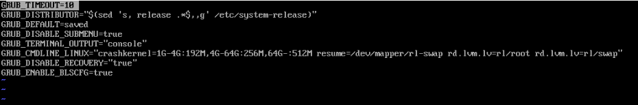
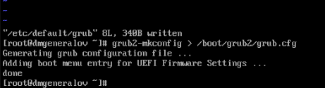
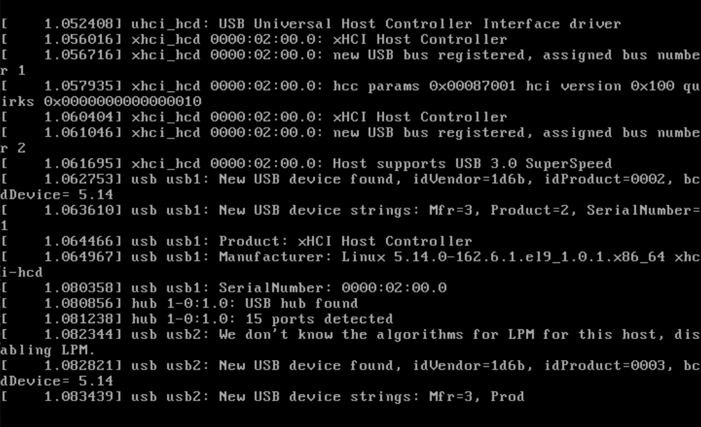
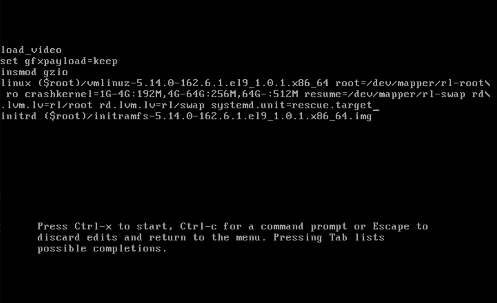
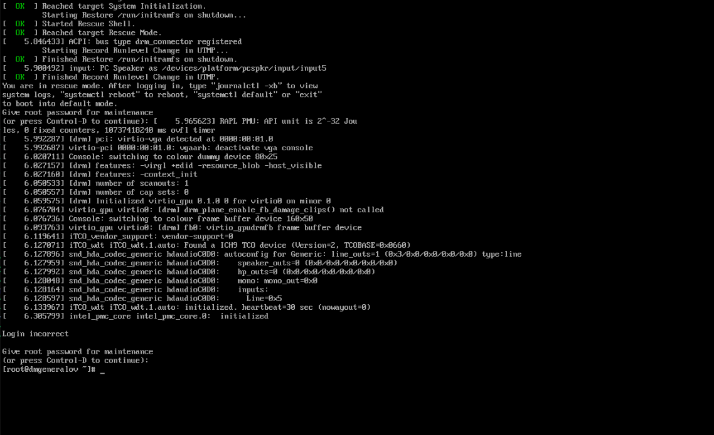
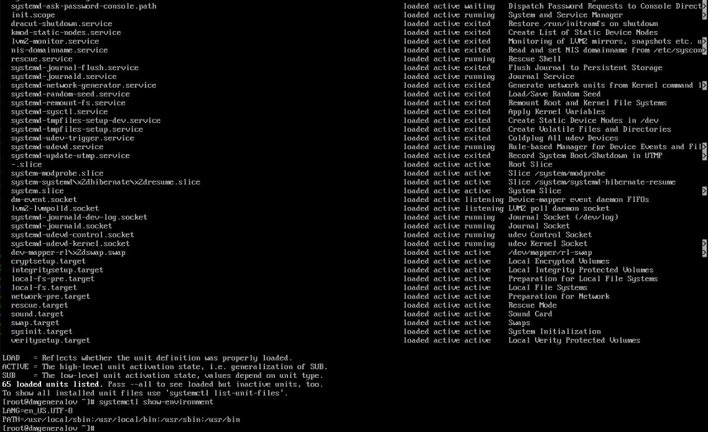
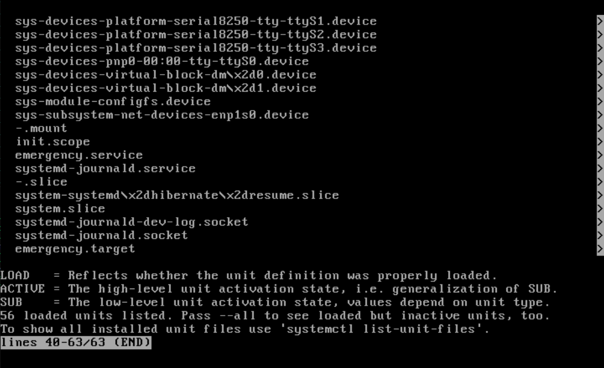
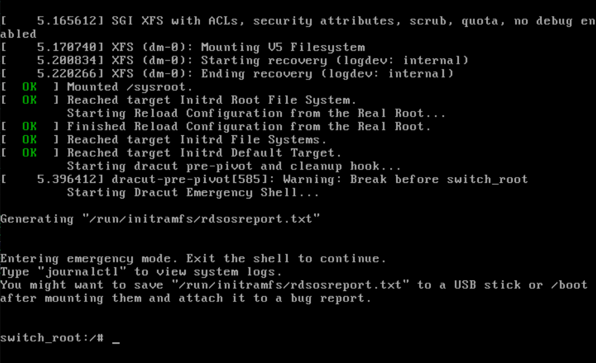
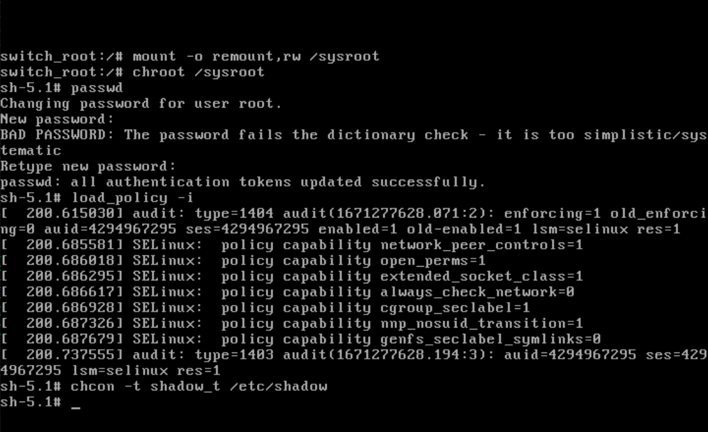
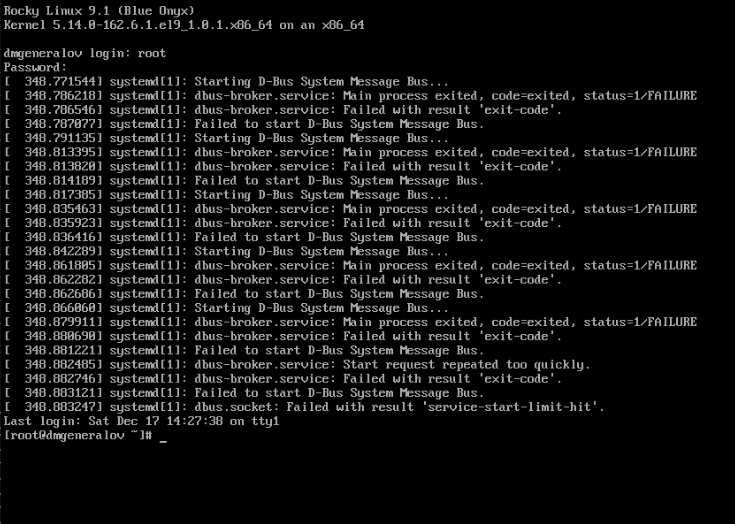

---
## Front matter
lang: ru-RU
title: Лабораторная работа 11
author: |
  Генералов Даниил, НПИбд-01-21, 1032202280
institute: |
	\inst{1}RUDN University, Moscow, Russian Federation
date: 2022

## Formatting
toc: false
slide_level: 2
theme: metropolis
header-includes: 
 - \metroset{progressbar=frametitle,sectionpage=progressbar,numbering=fraction}
 - '\makeatletter'
 - '\beamer@ignorenonframefalse'
 - '\makeatother'
aspectratio: 43
section-titles: true
---

# Задача

> 1. Продемонстрируйте навыки по изменению параметров GRUB и записи изменений
> в файл конфигурации (см. раздел 11.4.1).
> 2. Продемонстрируйте навыки устранения неполадок при работе с GRUB (см. раз-
> дел 11.4.2).
> 3. Продемонстрируйте навыки работы с GRUB без использования root (см. раз-
> дел 11.4.3)

# Выполнение 

## /etc/default/grub

## grub2-mkconfig

## dmesg

## linux

## rescue

## systemctl list-units

## systemctl list-units

## initramfs

## passwd

## exit

## Вывод

Я получил опыт работы с загрузчиком GRUB.
