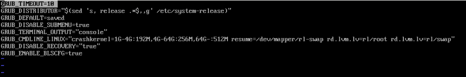
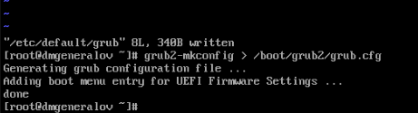
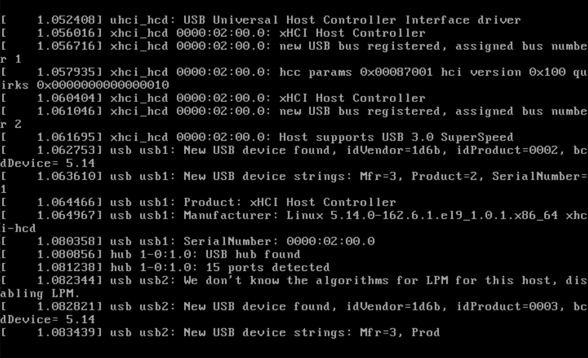
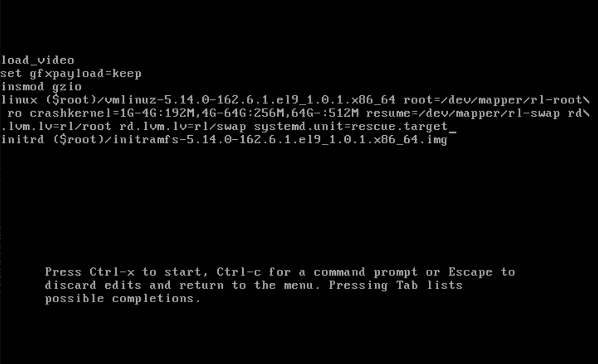
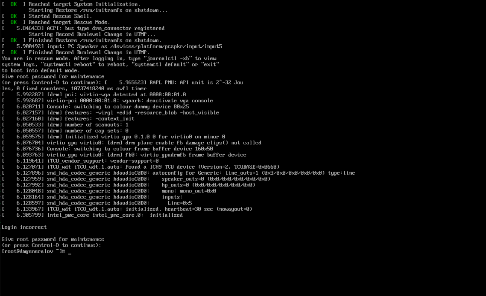
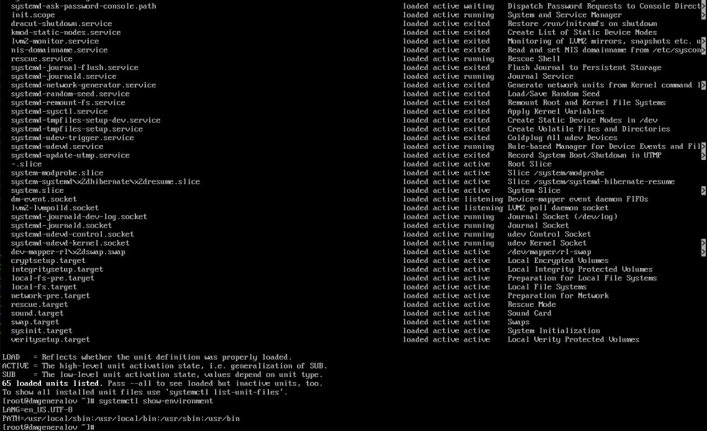
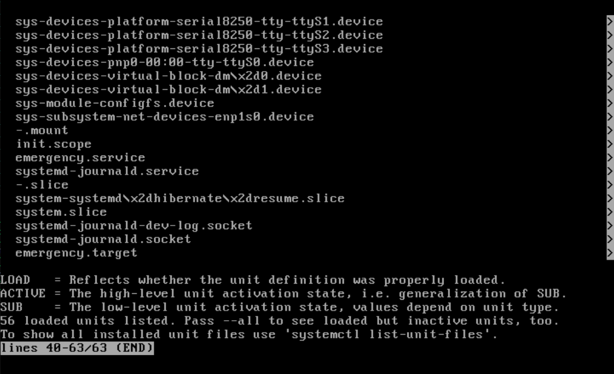
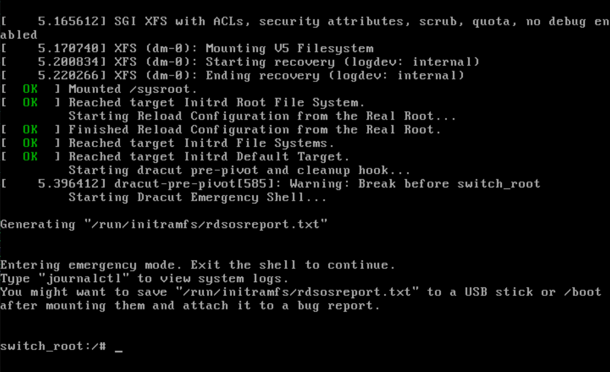
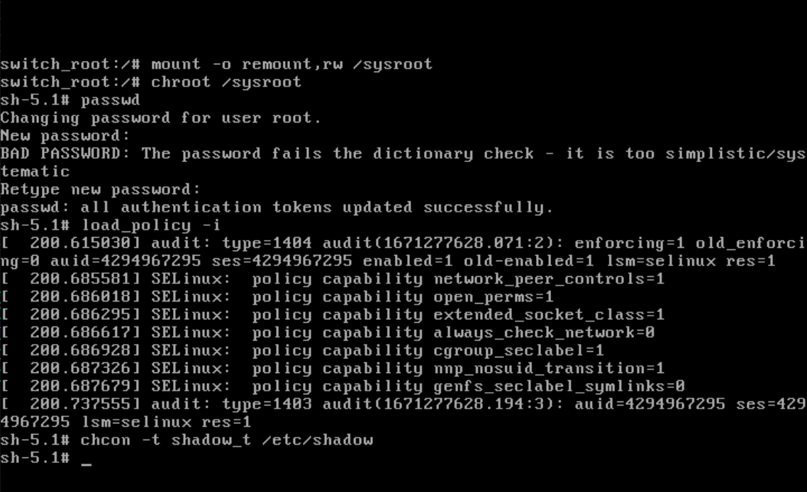
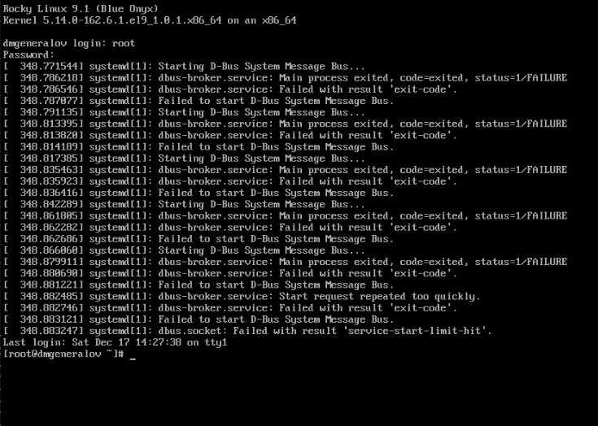

---
## Front matter
title: "Отчет по лабораторной работе 11"
subtitle: ""
author: "Генералов Даниил, НПИбд-01-21, 1032202280"

## Generic otions
lang: ru-RU
toc-title: "Содержание"

## Pdf output format
toc: true # Table of contents
toc-depth: 2
lof: true # List of figures
lot: true # List of tables
fontsize: 12pt
linestretch: 1.5
papersize: a4
documentclass: scrreprt
## I18n polyglossia
polyglossia-lang:
  name: russian
  options:
	- spelling=modern
	- babelshorthands=true
polyglossia-otherlangs:
  name: english
## I18n babel
babel-lang: russian
babel-otherlangs: english
## Fonts
mainfont: PT Serif
romanfont: PT Serif
sansfont: PT Sans
monofont: PT Mono
mainfontoptions: Ligatures=TeX
romanfontoptions: Ligatures=TeX
sansfontoptions: Ligatures=TeX,Scale=MatchLowercase
monofontoptions: Scale=MatchLowercase,Scale=0.9
## Biblatex
biblatex: true
biblio-style: "gost-numeric"
biblatexoptions:
  - parentracker=true
  - backend=biber
  - hyperref=auto
  - language=auto
  - autolang=other*
  - citestyle=gost-numeric
## Pandoc-crossref LaTeX customization
figureTitle: "Рис."
tableTitle: "Таблица"
listingTitle: "Листинг"
lofTitle: "Список иллюстраций"
lotTitle: "Список таблиц"
lolTitle: "Листинги"
## Misc options
indent: true
header-includes:
  - \usepackage{indentfirst}
  - \usepackage{float} # keep figures where there are in the text
  - \floatplacement{figure}{H} # keep figures where there are in the text
---

# Цель работы

В рамках этой лабораторной работы требуется выполнить операции по настройке загрузчика GRUB.

# Задание

> 1. Продемонстрируйте навыки по изменению параметров GRUB и записи изменений
> в файл конфигурации (см. раздел 11.4.1).
> 2. Продемонстрируйте навыки устранения неполадок при работе с GRUB (см. раз-
> дел 11.4.2).
> 3. Продемонстрируйте навыки работы с GRUB без использования root (см. раз-
> дел 11.4.3)

# Выполнение лабораторной работы

Сначала я сделал изменения в файле конфигурации GRUB, чтобы изменить время
задержки перед загрузкой операционной системы,
а также чтобы не показывалась графическая заставка при загрузке.
(Графической заставки не было изначально, так как она не настраивается в минимальной установке Rocky Linux.)

После сохранения этого файла требуется пересборка файла конфигурации GRUB.

Я перезагрузился и убедился, что при загрузке системы
показываются сообщения ядра.

С помощью GRUB можно изменять настройки запуска операционной системы:
например, запустить `rescue.target` вместо `multi-user.target`.
Это делается с помощью параметра `systemd.unit` в аргументах ядра.

Эта настройка загружает систему в однопользовательский режим,
в котором можно восстановить работоспособность системы.

Этот режим запускает сравнительно минимальный набор служб,
которые не будут препятствовать запуску `rescue.target` --
например, серверы приложений вроде `httpd` и `mysqld` не будут запущены.

Если же какие-то из этих служб также не запускаются,
то можно использовать `emergency.target` -- 
в этом режиме загружается еще меньше служб.

Наконец, самый минимальный из режимов, который активируется опцией `rd.break`,
останавливает загрузку в окружении `initramfs`.
В этом состоянии корневая файловая система еще не примонтирована,
и пользователь может сделать это вручную, затем починить проблемы,
прежде чем продолжить загрузку.

В этом состоянии можно выполнить задачи вроде изменения пароля для root,
даже в обход SELinux.
Для этого нужно примонтировать корневую файловую систему для записи,
изменить пароль с помощью `passwd`, 
а затем загрузить используемую политику SELinux
и применить контекст `shadow_t` к файлу `/etc/shadow`.

После этого можно продолжить загрузку с помощью команды `exit`.
Однако, потому что мы оставили систему в неожиданном состоянии,
то происходят некоторые ошибки при запуске служб.
Они будут исправлены при следующей загрузке.

# Выводы

Я получил опыт работы с GRUB.

# Контрольные вопросы
1. Какой файл конфигурации следует изменить для применения общих изменений
в GRUB2?

`/etc/default/grub`. Он используется, чтобы собрать `/boot/grub2/grub.cfg` с помощью
`grub2-mkconfig`.

2. Как называется конфигурационный файл GRUB2, в котором вы применяете изме-
нения для GRUB2?

GRUB использует файл `/boot/grub2/grub.cfg` при загрузке.
Любые изменения конфигурации должны быть отражены в нем.

3. После внесения изменений в конфигурацию GRUB2, какую команду вы должны
выполнить, чтобы изменения сохранились и воспринялись при загрузке системы?

`grub2-mkconfig > /boot/grub2/grub.cfg`

