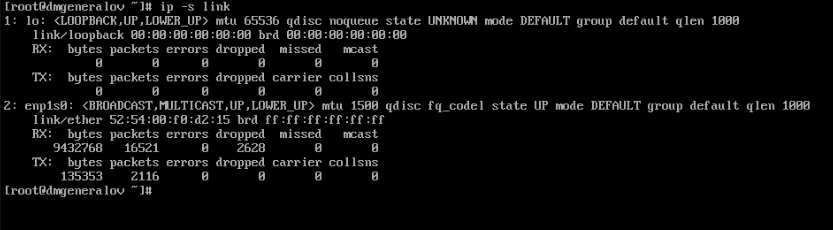
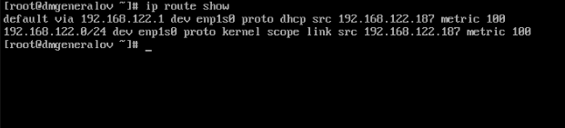
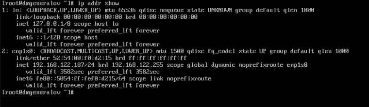
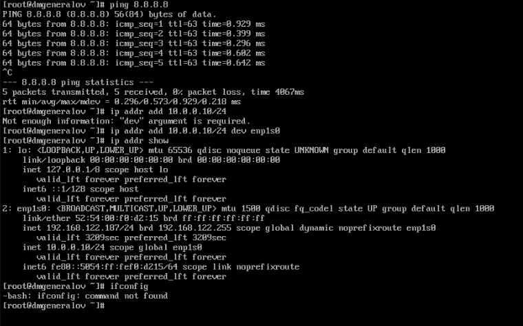
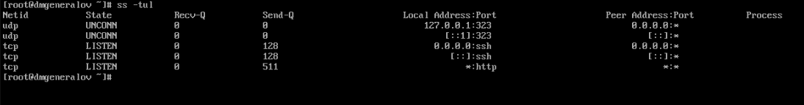
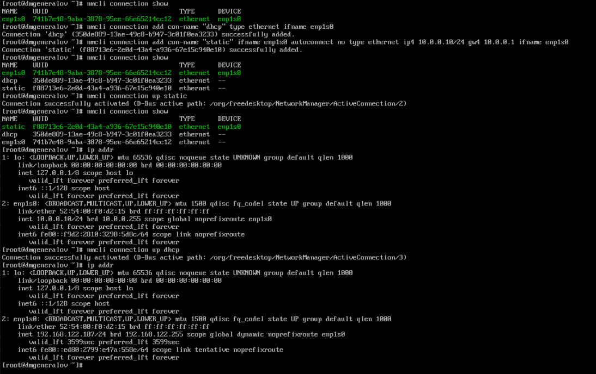
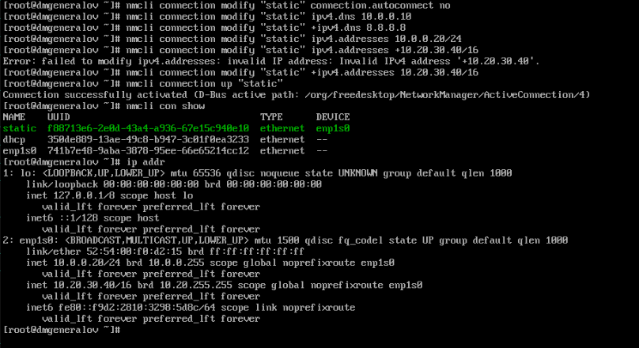
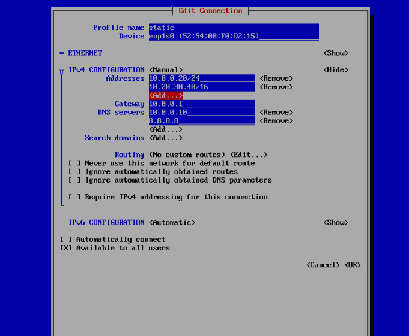
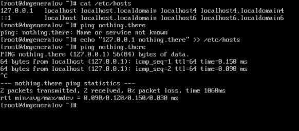
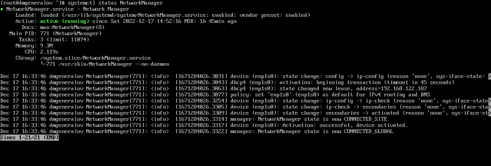

---
## Front matter
title: "Отчет по лабораторной работе 12"
subtitle: ""
author: "Генералов Даниил, НПИбд-01-21, 1032202280"

## Generic otions
lang: ru-RU
toc-title: "Содержание"

## Pdf output format
toc: true # Table of contents
toc-depth: 2
lof: true # List of figures
lot: true # List of tables
fontsize: 12pt
linestretch: 1.5
papersize: a4
documentclass: scrreprt
## I18n polyglossia
polyglossia-lang:
  name: russian
  options:
	- spelling=modern
	- babelshorthands=true
polyglossia-otherlangs:
  name: english
## I18n babel
babel-lang: russian
babel-otherlangs: english
## Fonts
mainfont: PT Serif
romanfont: PT Serif
sansfont: PT Sans
monofont: PT Mono
mainfontoptions: Ligatures=TeX
romanfontoptions: Ligatures=TeX
sansfontoptions: Ligatures=TeX,Scale=MatchLowercase
monofontoptions: Scale=MatchLowercase,Scale=0.9
## Biblatex
biblatex: true
biblio-style: "gost-numeric"
biblatexoptions:
  - parentracker=true
  - backend=biber
  - hyperref=auto
  - language=auto
  - autolang=other*
  - citestyle=gost-numeric
## Pandoc-crossref LaTeX customization
figureTitle: "Рис."
tableTitle: "Таблица"
listingTitle: "Листинг"
lofTitle: "Список иллюстраций"
lotTitle: "Список таблиц"
lolTitle: "Листинги"
## Misc options
indent: true
header-includes:
  - \usepackage{indentfirst}
  - \usepackage{float} # keep figures where there are in the text
  - \floatplacement{figure}{H} # keep figures where there are in the text
---

# Цель работы

В рамках этой лабораторной работы требуется выполнить операции по настройке сетевых интерфейсов в Linux.

# Задание

> 1. Продемонстрируйте навыки использования утилиты ip (см. раздел 12.4.1).
> 2. Продемонстрируйте навыки использования утилиты nmcli (см. раздел 12.4.2
> и 12.4.3).

# Выполнение лабораторной работы

Сначала я посмотрел информацию о существующих сетевых интерфейсах и их статистике.
Например, `enp1s0` передал 135363 байта в 2116 пакетах,
и получил 9543768 байтов в 16521 пакетах,
из которых 2628 пакетов были проигнорированы.

Далее я посмотрел на информацию о маршрутах.
Таблица маршрутизации сейчас довольно короткая:
для связи с IP-адресами диапазона `192.168.122.0` по `192.168.122.255`, а также со всеми остальными, нужно обращаться к роутеру по адресу `192.168.122.1` через интерфейс `enp1s0`.

Наконец, я посмотрел на IP-адреса, назначенные интерфейсам.
Интерфейс `enp1s0` имеет IP-адрес `192.168.122.187`, где первые 24 бита описывают сеть, а остальные 8 битов - адрес хоста в этой сети.
Он также имеет IPv6-адрес `fe80::5054:ff:fef0:d215`, и первые 64 бита описывают сеть.

Программа `ping` позволяет проверить, что есть соединение с интернетом.
После этого я добавил к интерфейсу `enp1s0` еще один IP-адрес `10.0.0.10/24`. Команда `ip addr` показывает, что адрес добавлен.
(Команда `ifconfig` не доступна, потому что она была заменена набором команд `ip`.)

Я также проверил, на каких портах слушают какие сервисы, с помощью команды `ss`.
Ответ: на портах TCP 22 и 80 сервисы `sshd` и `httpd` соответственно, а еще порт UDP 323 открыт локально.

Для более удобного управления сетевыми соединениями существует служба `NetworkManager`.
Ее интерфейс, `nmcli`, позволяет управлять сетевыми соединениями, а также отображать их статус.

Я добавил два соединения: dhcp, которое получает IP-адрес автоматически, и static, которое имеет IP-адрес `10.0.0.10/24`, шлюз `10.0.0.1` и не автоподключается.
Затем, активируя одно из этих двух соединений, я проверил, что IP-адрес изменился --
`NetworkManager` автоматически настраивает сетевые интерфейсы и таблицу маршрутизации.

Для соединения, которое было создано, можно изменять параметры. Здесь я добавляю DNS-сервера и изменяю IP-адреса для соединения "static", и эти изменения применяются при следующем подключении.

Для более удобной настройки этих параметров утилита `nmtui` предоставляет текстовый интерфейс, который позволяет редактировать все эти опции.

# Выводы

Я получил опыт работы с сетями в Linux.

# Контрольные вопросы

1. Какая команда отображает только статус соединения, но не IP-адрес?

`ip link show`

2. Какая служба управляет сетью в ОС типа RHEL?
`NetworkManager`

3. Какой файл содержит имя узла (устройства) в ОС типа RHEL?

`/etc/hostname`

4. Какая команда позволяет вам задать имя узла (устройства)?

`hostnamectl set-hostname`

5. Какой конфигурационный файл можно изменить для включения разрешения имён
для конкретного IP-адреса?

`/etc/hosts`

6. Какая команда показывает текущую конфигурацию маршрутизации?

`ip route show`

7. Как проверить текущий статус службы NetworkManager?

`systemctl status NetworkManager`

8. Какая команда позволяет вам изменить текущий IP-адрес и шлюз по умолчанию
для вашего сетевого соединения?

`nmcli connection modify`

