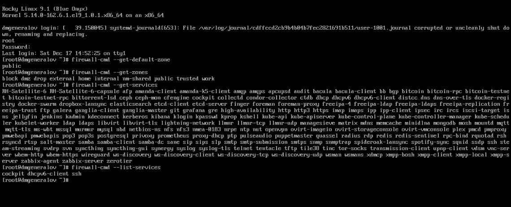
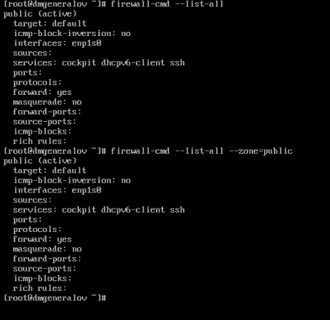
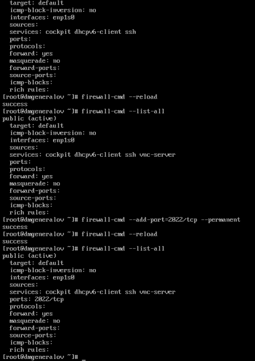
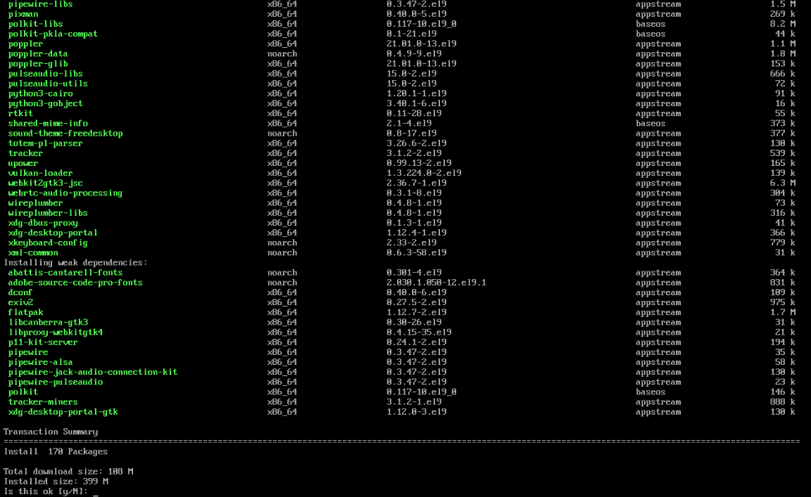
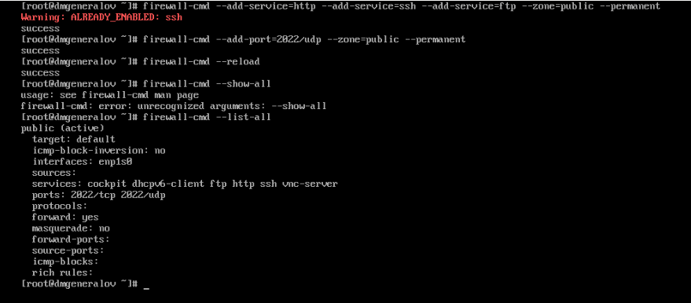
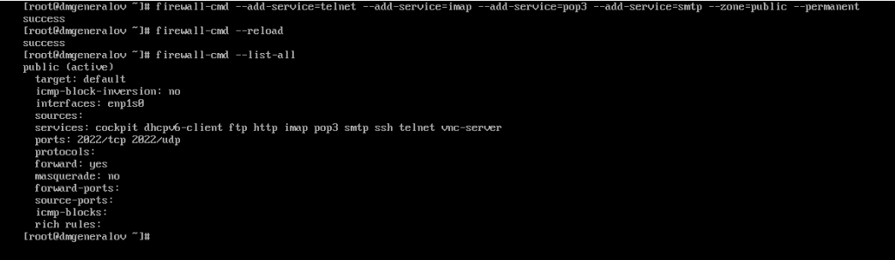
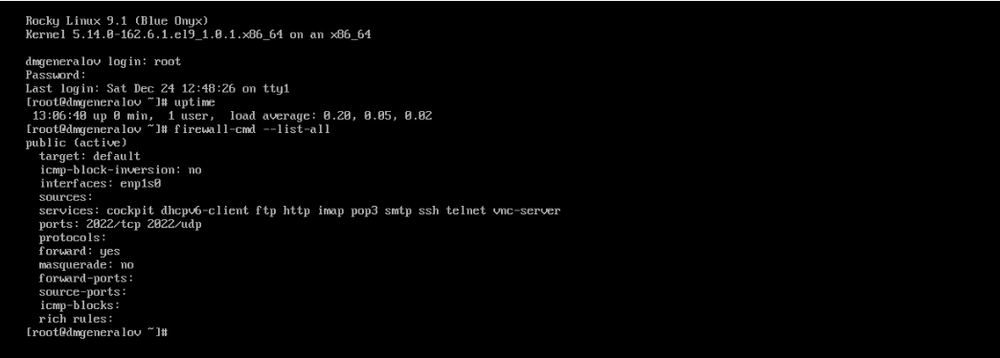

---
## firewall-cmd
lang: ru-RU
title: Лабораторная работа 13
author: |
  Генералов Даниил, НПИбд-01-21, 1032202280
institute: |
	\inst{1}RUDN University, Moscow, Russian Federation
date: 2022

## firewall-cmd
toc: false
slide_level: 2
theme: metropolis
header-includes: 
 - \metroset{progressbar=frametitle,sectionpage=progressbar,numbering=fraction}
 - '\makeatletter'
 - '\beamer@ignorenonframefalse'
 - '\makeatother'
aspectratio: 43
section-titles: true
---

# Задача

> 1. Используя firewall-cmd:
> – определить текущую зону по умолчанию;
> – определить доступные для настройки зоны;
> – определить службы, включённые в текущую зону;
> – добавить сервер VNC в конфигурацию брандмауэра.
> 2. Используя firewall-config:
> – добавьте службы http и ssh в зону public;
> – добавьте порт 2022 протокола UDP в зону public;
> – добавьте службу ftp.
> 3. Выполните задание для самостоятельной работы (раздел 13.5).

# Выполнение 

## firewall-cmd

## firewall-cmd

## firewall-cmd

## firewall-cmd

## firewall-cmd

## firewall-cmd

## firewall-cmd

## Вывод

Я получил опыт работы с фильтром пакетов в Linux.
