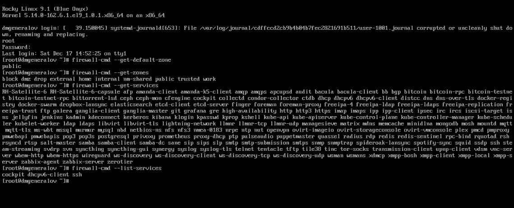
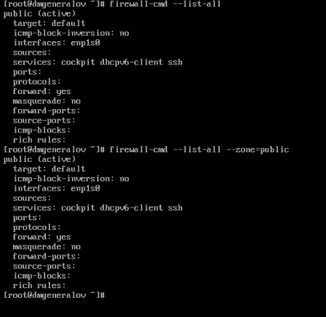
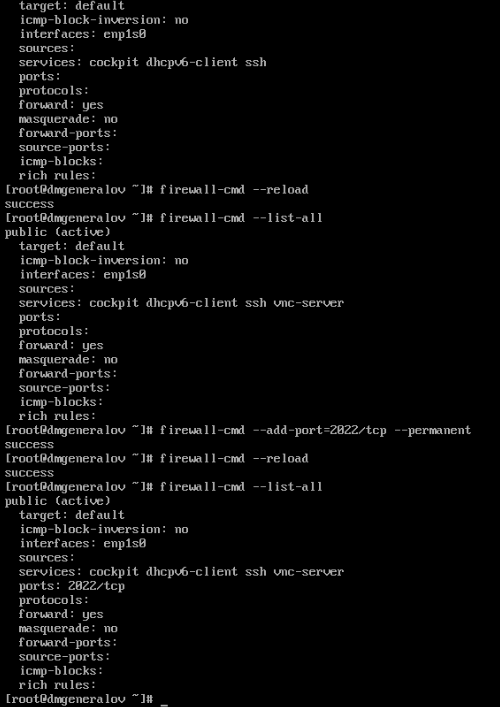
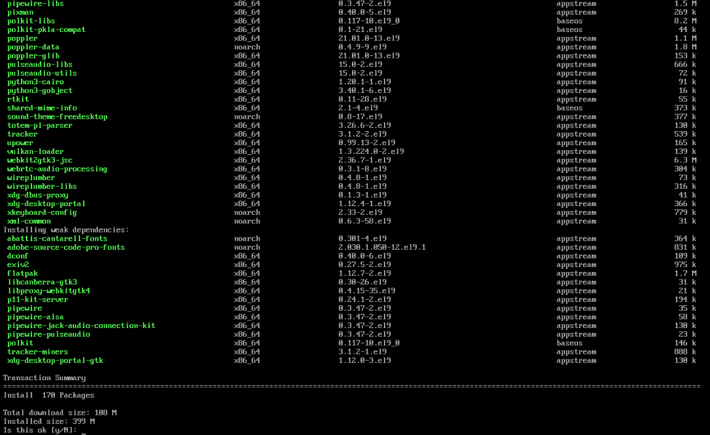
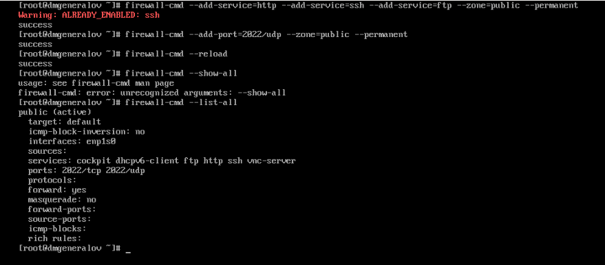
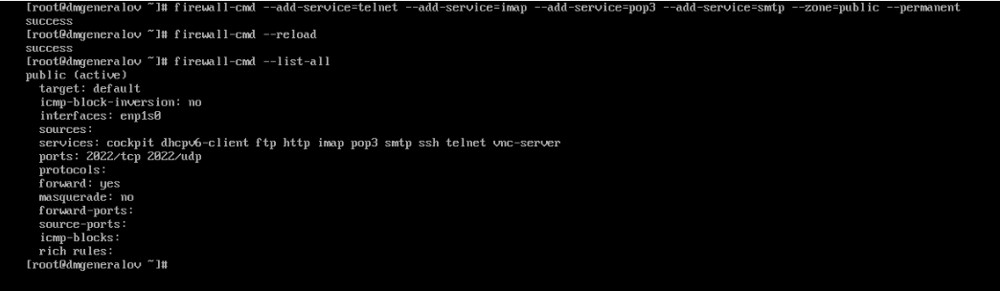
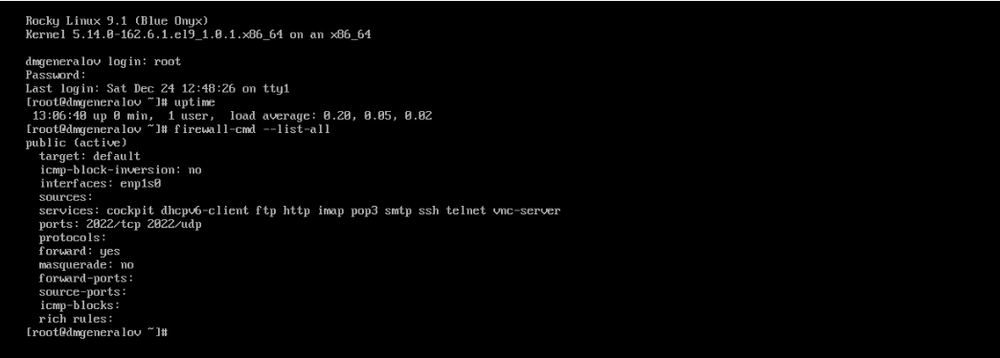
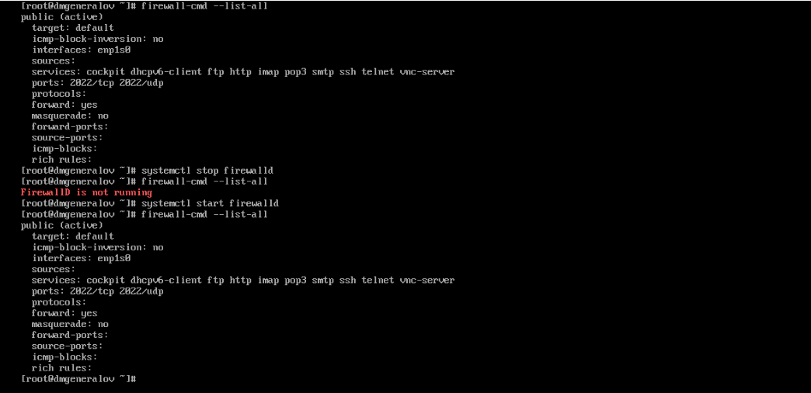
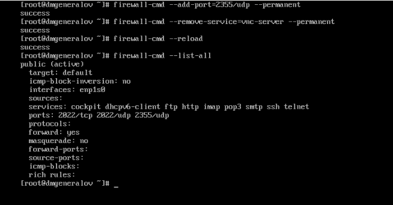

---
## Front matter
title: "Отчет по лабораторной работе 13"
subtitle: ""
author: "Генералов Даниил, НПИбд-01-21, 1032202280"

## Generic otions
lang: ru-RU
toc-title: "Содержание"

## Pdf output format
toc: true # Table of contents
toc-depth: 2
lof: true # List of figures
lot: true # List of tables
fontsize: 12pt
linestretch: 1.5
papersize: a4
documentclass: scrreprt
## I18n polyglossia
polyglossia-lang:
  name: russian
  options:
	- spelling=modern
	- babelshorthands=true
polyglossia-otherlangs:
  name: english
## I18n babel
babel-lang: russian
babel-otherlangs: english
## Fonts
mainfont: PT Serif
romanfont: PT Serif
sansfont: PT Sans
monofont: PT Mono
mainfontoptions: Ligatures=TeX
romanfontoptions: Ligatures=TeX
sansfontoptions: Ligatures=TeX,Scale=MatchLowercase
monofontoptions: Scale=MatchLowercase,Scale=0.9
## Biblatex
biblatex: true
biblio-style: "gost-numeric"
biblatexoptions:
  - parentracker=true
  - backend=biber
  - hyperref=auto
  - language=auto
  - autolang=other*
  - citestyle=gost-numeric
## Pandoc-crossref LaTeX customization
figureTitle: "Рис."
tableTitle: "Таблица"
listingTitle: "Листинг"
lofTitle: "Список иллюстраций"
lotTitle: "Список таблиц"
lolTitle: "Листинги"
## Misc options
indent: true
header-includes:
  - \usepackage{indentfirst}
  - \usepackage{float} # keep figures where there are in the text
  - \floatplacement{figure}{H} # keep figures where there are in the text
---

# Цель работы

В рамках этой лабораторной работы требуется выполнить операции по настройке фильтра пакетов в Linux.

# Задание

> 1. Используя firewall-cmd:
> – определить текущую зону по умолчанию;
> – определить доступные для настройки зоны;
> – определить службы, включённые в текущую зону;
> – добавить сервер VNC в конфигурацию брандмауэра.
> 2. Используя firewall-config:
> – добавьте службы http и ssh в зону public;
> – добавьте порт 2022 протокола UDP в зону public;
> – добавьте службу ftp.
> 3. Выполните задание для самостоятельной работы (раздел 13.5).

# Выполнение лабораторной работы

Сначала я использовал `firewall-cmd`, чтобы определить текущую зону, доступные для настройки зоны и службы, включённые в текущую зону.

Поскольку активна зона public, то вывод команды `firewall-cmd --list-all` не меняется от добавления ключа `--zone=public`.

Можно добавить сервер VNC в конфигурацию брандмауэра, используя команду `firewall-cmd --add-service=vnc-server` -- флаг `--permanent` сделает, чтобы это изменение было применено в файлы конфигурации.
После этого нужно перезагрузить файлы конфигурации брандмауэра командой `firewall-cmd --reload`.
Помимо служб, можно добавлять порты, например `--add-port=2022/tcp`.

Следующую часть работы предлагается сделать с помощью `firewall-config`, графической утилиты для настройки брандмауэра.
У меня на виртуальной машине не установлен графический интерфейс, и все зависимости для него не установлены.

К счастью, аналогичные действия можно выполнить с помощью `firewall-cmd`:
чтобы добавить службы http, ssh и ftp в зону public, нужно выполнить команду `firewall-cmd --add-service=http --add-service=ssh --add-service=ftp --zone=public --permanent`,
и чтобы добавить порт 2022 протокола UDP в зону public, нужно выполнить команду `firewall-cmd --add-port=2022/udp --zone=public --permanent`.

Наконец, нужно сделать то же самое, чтобы включить службы telnet, imap, pop3 и smtp в зону public.
Как раньше, те шаги, которые требуют графического интерфейса, я пропускаю.

Перезагрузив систему, можно увидеть, что все эти изменения применены.

# Выводы

Я получил опыт работы с фильтром пакетов в Linux.

# Контрольные вопросы

1. Какая служба должна быть запущена перед началом работы с менеджером конфи-
гурации брандмауэра firewall-config?

`firewall-config` и `firewall-cmd` — это два разных инструмента для настройки службы `firewalld`.

2. Какая команда позволяет добавить UDP-порт 2355 в конфигурацию брандмауэра
в зоне по умолчанию?

`firewall-cmd --add-port=2355/udp --permanent`

3. Какая команда позволяет показать всю конфигурацию брандмауэра во всех зонах?

`firewall-cmd --list-all`

4. Какая команда позволяет удалить службу vnc-server из текущей конфигурации
брандмауэра?

`firewall-cmd --remove-service=vnc-server --permanent`

5. Какая команда firewall-cmd позволяет активировать новую конфигурацию,
добавленную опцией --permanent?

`firewall-cmd --reload`

6. Какой параметр firewall-cmd позволяет проверить, что новая конфигурация
была добавлена в текущую зону и теперь активна?

Опция `--runtime-to-permanent` позволяет записать текущую активную конфигурацию в файлы.
Обычно настраивают `firewalld` так: сначала добавляют правила без опции `--permanent`,
проверяют, что они работают, а затем добавляют опцию `--runtime-to-permanent`.

7. Какая команда позволяет добавить интерфейс eno1 в зону public?

`firewall-cmd --zone=public --add-interface=eno1 --permanent`

8. Если добавить новый интерфейс в конфигурацию брандмауэра, пока не указана
зона, в какую зону он будет добавлен?

В текущую зону по умолчанию.