---
## firewall-cmd
lang: ru-RU
title: Лабораторная работа 14
author: |
  Генералов Даниил, НПИбд-01-21, 1032202280
institute: |
	\inst{1}RUDN University, Moscow, Russian Federation
date: 2022

## firewall-cmd
toc: false
slide_level: 2
theme: metropolis
header-includes: 
 - \metroset{progressbar=frametitle,sectionpage=progressbar,numbering=fraction}
 - '\makeatletter'
 - '\beamer@ignorenonframefalse'
 - '\makeatother'
aspectratio: 43
section-titles: true
---

# Задача

> 1. Добавьте два диска на виртуальной машине (раздел 14.4.1).
> 2. Продемонстрируйте навыки создания разделов MBR с помощью fdisk (раз-
> дел 14.4.2).
> 3. Продемонстрируйте навыки создания логических разделов с помощью fdisk (раз-
> дел 14.4.3).
> 4. Продемонстрируйте навыки создания раздела подкачки с помощью fdisk (раз-
> дел 14.4.4).
> 5. Продемонстрируйте навыки создания разделов GPT с помощью gdisk (раз-
> дел 14.4.5).
> 6. Продемонстрируйте навыки форматирования файловой системы XFS (раз-
> дел 14.4.6).
> 7. Продемонстрируйте навыки форматирования файловой системы EXT4 (раз-
> дел 14.4.7).
> 8. Продемонстрируйте навыки ручного монтирования файловых систем (раз-
> дел 14.4.8).
> 9. Продемонстрируйте навыки монтирования файловых систем с помощью
> /etc/fstab (раздел 14.4.9).
> 10. Выполните задание для самостоятельной работа (раздел 14.5).

# Выполнение 

## virt-manager
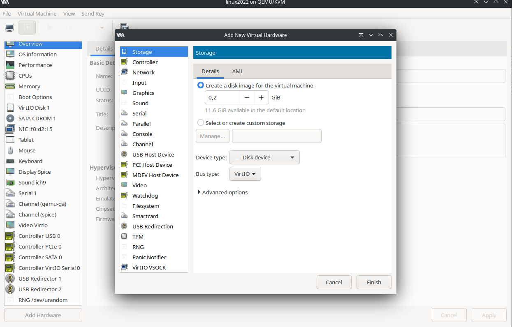

## fdisk

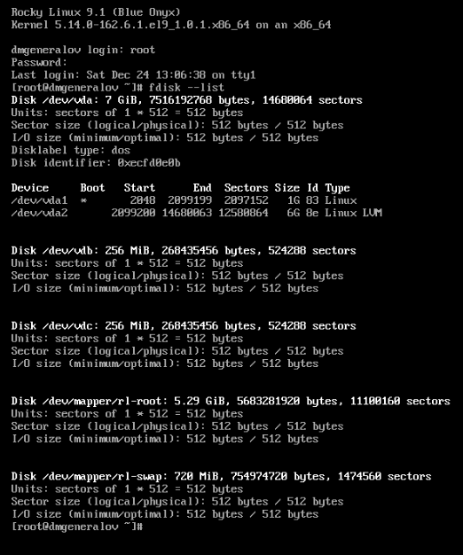

## fdisk

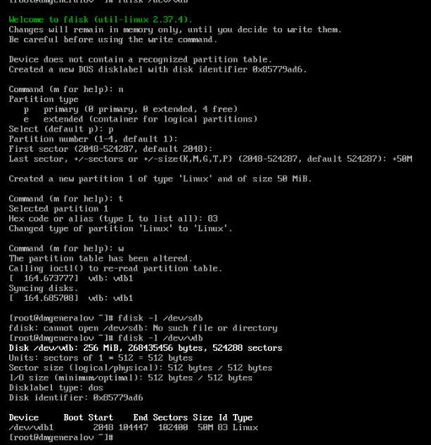

## fdisk
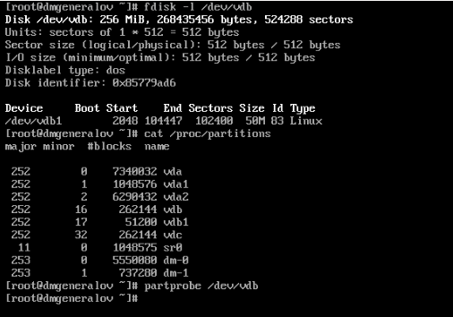

## fdisk

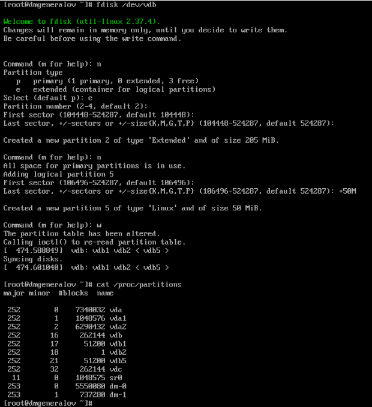

## fdisk

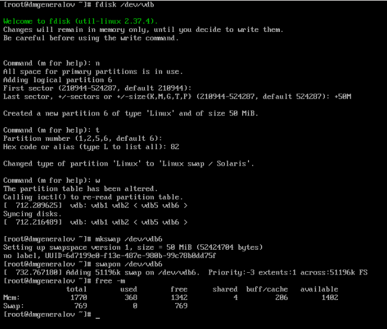

## gdisk

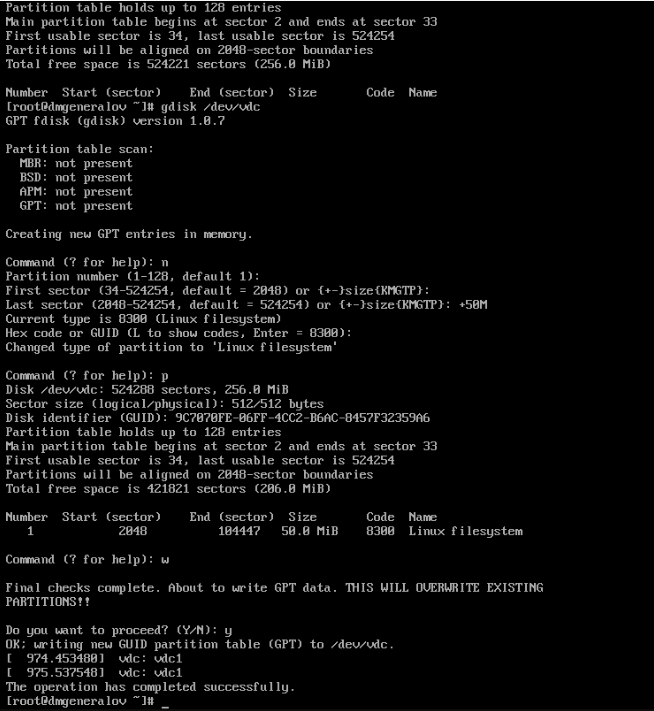

## mkfs

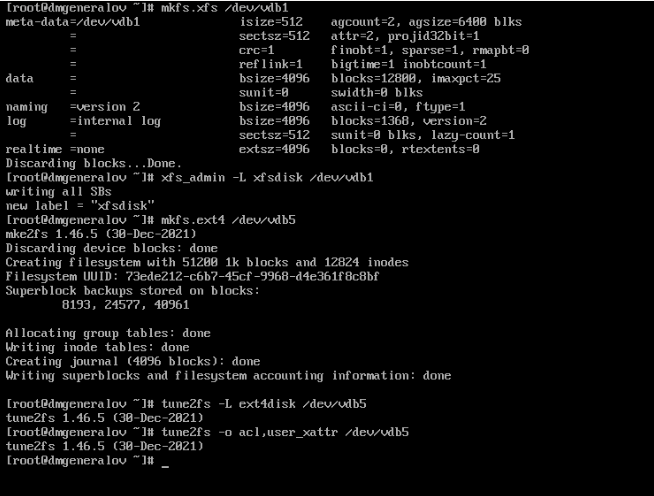

## mount

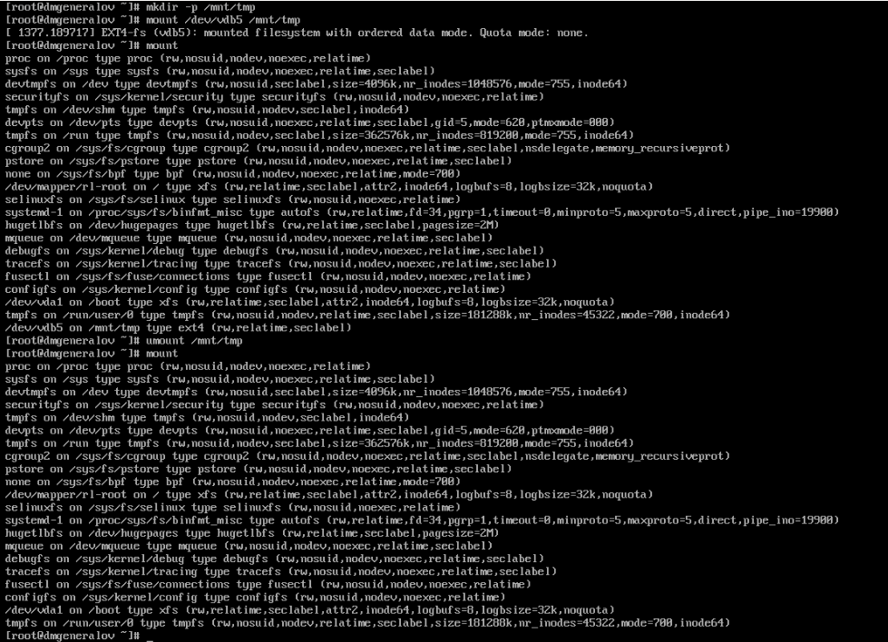

## fstab

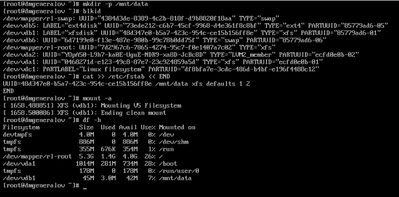

## gdisk

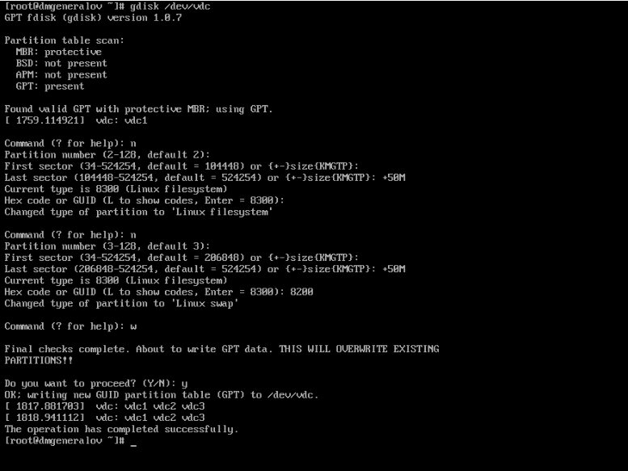

## fstab

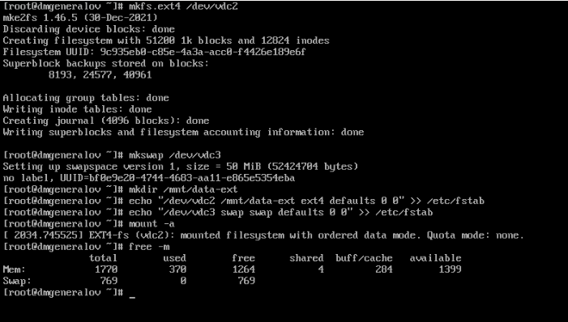

## fstab

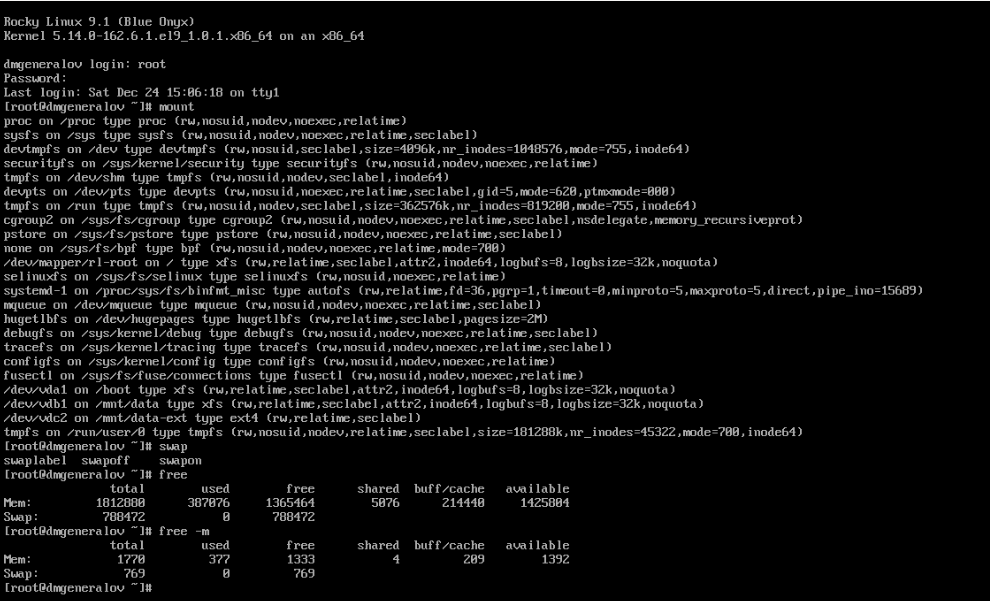

## Вывод

Я получил опыт работы с разделами диска в Linux.
