---
## Front matter
title: "Отчет по лабораторной работе 14"
subtitle: ""
author: "Генералов Даниил, НПИбд-01-21, 1032202280"

## Generic otions
lang: ru-RU
toc-title: "Содержание"

## Pdf output format
toc: true # Table of contents
toc-depth: 2
lof: true # List of figures
lot: true # List of tables
fontsize: 12pt
linestretch: 1.5
papersize: a4
documentclass: scrreprt
## I18n polyglossia
polyglossia-lang:
  name: russian
  options:
	- spelling=modern
	- babelshorthands=true
polyglossia-otherlangs:
  name: english
## I18n babel
babel-lang: russian
babel-otherlangs: english
## Fonts
mainfont: PT Serif
romanfont: PT Serif
sansfont: PT Sans
monofont: PT Mono
mainfontoptions: Ligatures=TeX
romanfontoptions: Ligatures=TeX
sansfontoptions: Ligatures=TeX,Scale=MatchLowercase
monofontoptions: Scale=MatchLowercase,Scale=0.9
## Biblatex
biblatex: true
biblio-style: "gost-numeric"
biblatexoptions:
  - parentracker=true
  - backend=biber
  - hyperref=auto
  - language=auto
  - autolang=other*
  - citestyle=gost-numeric
## Pandoc-crossref LaTeX customization
figureTitle: "Рис."
tableTitle: "Таблица"
listingTitle: "Листинг"
lofTitle: "Список иллюстраций"
lotTitle: "Список таблиц"
lolTitle: "Листинги"
## Misc options
indent: true
header-includes:
  - \usepackage{indentfirst}
  - \usepackage{float} # keep figures where there are in the text
  - \floatplacement{figure}{H} # keep figures where there are in the text
---

# Цель работы

В рамках этой лабораторной работы требуется выполнить операции по работе с разделами диска в Linux.

# Задание

> 1. Добавьте два диска на виртуальной машине (раздел 14.4.1).
> 2. Продемонстрируйте навыки создания разделов MBR с помощью fdisk (раз-
> дел 14.4.2).
> 3. Продемонстрируйте навыки создания логических разделов с помощью fdisk (раз-
> дел 14.4.3).
> 4. Продемонстрируйте навыки создания раздела подкачки с помощью fdisk (раз-
> дел 14.4.4).
> 5. Продемонстрируйте навыки создания разделов GPT с помощью gdisk (раз-
> дел 14.4.5).
> 6. Продемонстрируйте навыки форматирования файловой системы XFS (раз-
> дел 14.4.6).
> 7. Продемонстрируйте навыки форматирования файловой системы EXT4 (раз-
> дел 14.4.7).
> 8. Продемонстрируйте навыки ручного монтирования файловых систем (раз-
> дел 14.4.8).
> 9. Продемонстрируйте навыки монтирования файловых систем с помощью
> /etc/fstab (раздел 14.4.9).
> 10. Выполните задание для самостоятельной работа (раздел 14.5).

# Выполнение лабораторной работы

Сначала я создал два виртуальных диска и подключил их к виртуальной машине.
Используя virt-manager, это можно сделать через меню изменения конфигурации виртуальной машины.
Я сделал диск размером 0.2 Гб, чтобы он был достаточно маленьким, чтобы не занимать много места на жестком диске --
этого размера должно быть достаточно для выполнения лабораторной работы.

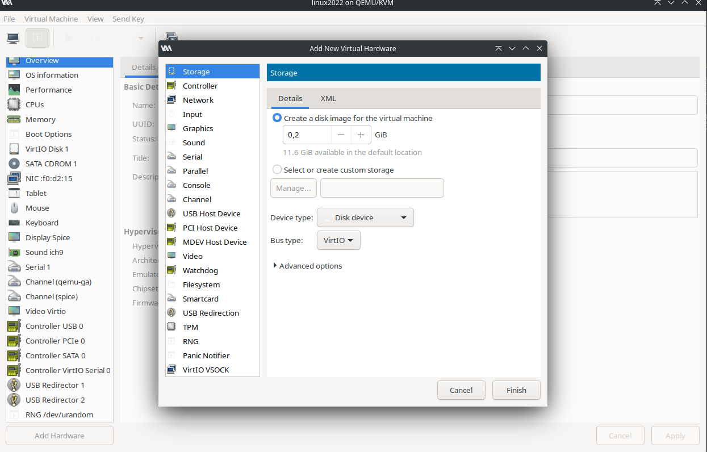

После загрузки виртуальной машины можно увидеть, что появились два новых диска -- /dev/vdb и /dev/vdc.

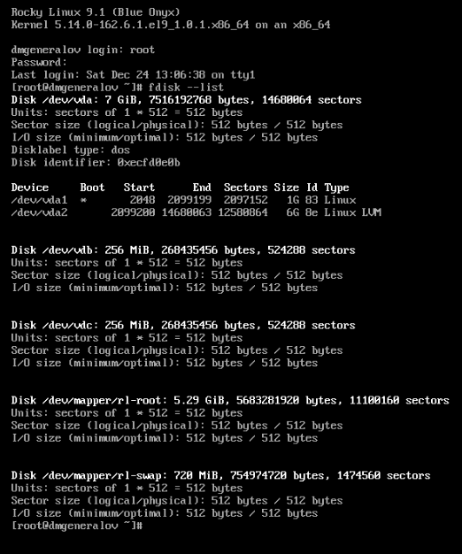

Используя fdisk, я затем создал раздел длиной 50 Мб на первом диске. 

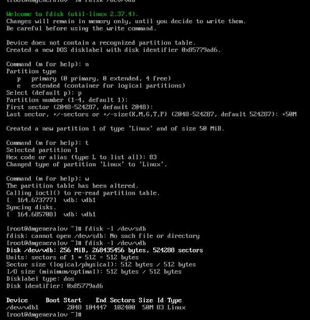

Моя версия fdisk информирует ядро об изменениях таблицы разделов, поэтому в /proc/partitions отображается существование раздела vdb1.
Если бы этого не было, то команда partprobe используется, чтобы сообщить ядру об изменениях.

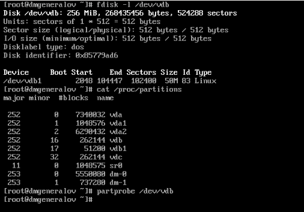

На диске может быть до 4 основных разделов.
Если нужно больше, то один из основных разделов может стать расширенным разделом -- контейнером для других разделов.
Так, я создаю раздел 2, занимающий весь диск, а затем создаю новый раздел, который имеет объем 50 Мб и находится внутри раздела 2.
Сделав это, можно увидеть, что раздел 2 теперь имеет длину в 1 блок -- этот блок содержит метаданные для всех разделов, находящихся внутри него.

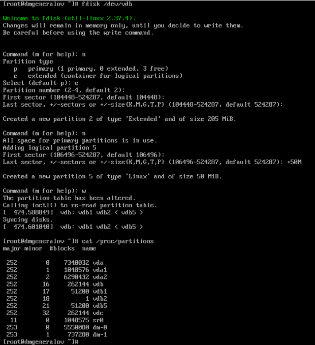

Чтобы раздел диска использовался как раздел подкачки, необходимо обозначить его тип раздела как 82.
После этого нужно создать структуры данных подкачки с помощью mkswap, а затем активировать раздел с помощью swapon.
Затем команда free будет учитывать его при подсчете объема свободной памяти.

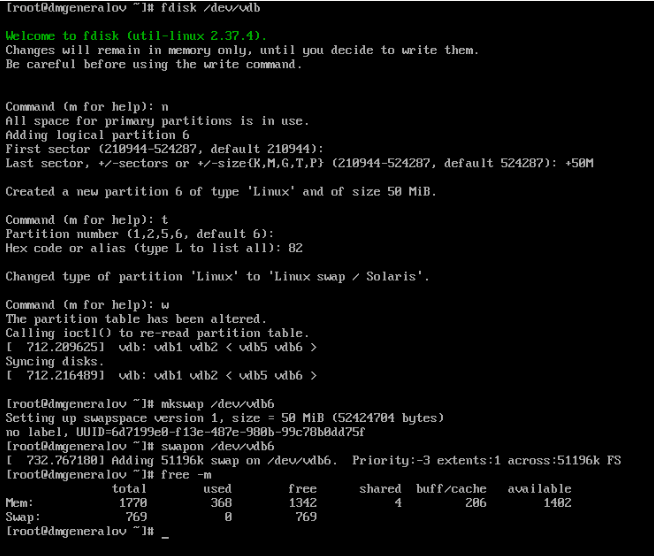

Чтобы управлять разделами диска GPT, используется утилита gdisk.
Первый запуск утилиты показывает, что на диске vdc нет таблицы разделов какого-либо типа.
Мы создаем таблицу разделов GPT, а затем создаем раздел длиной 50 Мб.
После этого мы можем увидеть, что раздел имеет тип 8300, что соответствует типу Linux.
После записи таблицы разделов нам становится доступен диск /dev/vdc1.

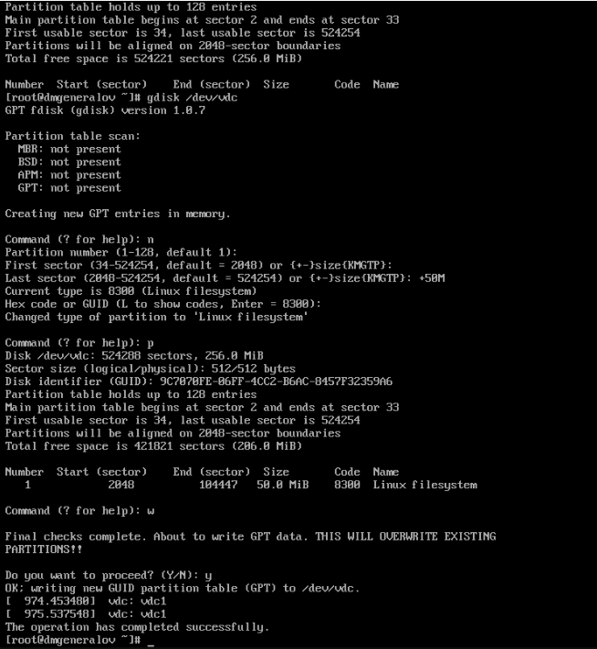

После создания раздела мы можем создать на нем файловую систему.
Набор программ mkfs позволяют это сделать.
Например, мы создаем файловую систему XFS на разделе /dev/vdb1,
файловую систему ext4 на /dev/vdb5 и обозначаем им метки диска.

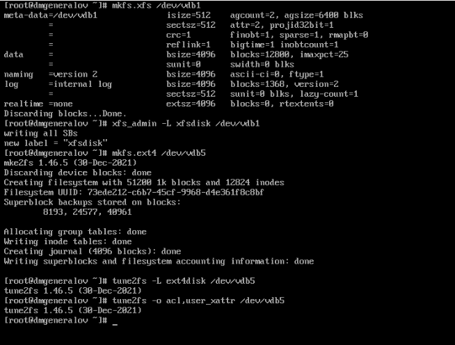

Файловые системы можно подключать к дереву каталогов с помощью команды mount,
и отключать с помощью команды umount.

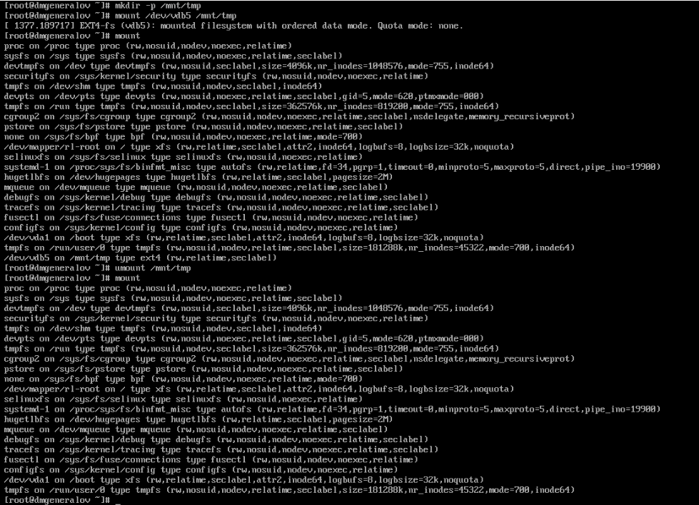

Чтобы раздел автоматически подключался при загрузке, необходимо добавить его в файл /etc/fstab.

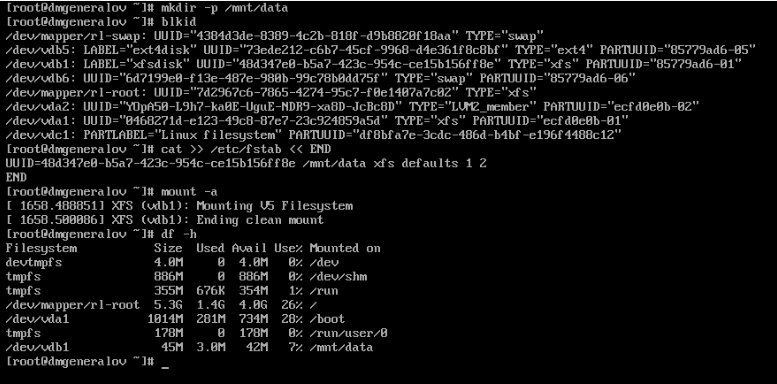

Чтобы создать два раздела на GPT-диске, можно использовать gdisk.

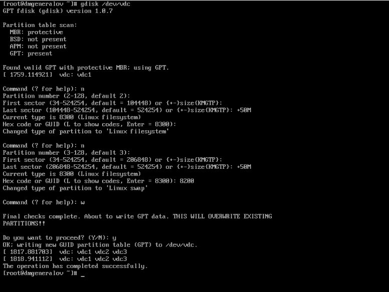

После этого доступны разделы vdc2 и vdc3.
На первом из них нужно создать файловую систему ext4, на втором - область подкачки,
а затем добавить оба раздела в /etc/fstab.

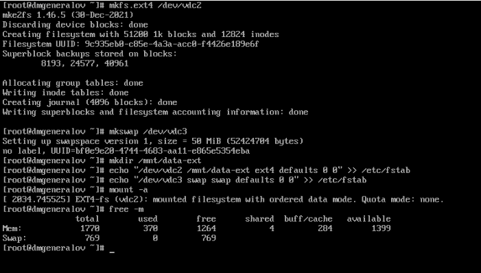

После перезагрузки все нужные разделы будут подключены.

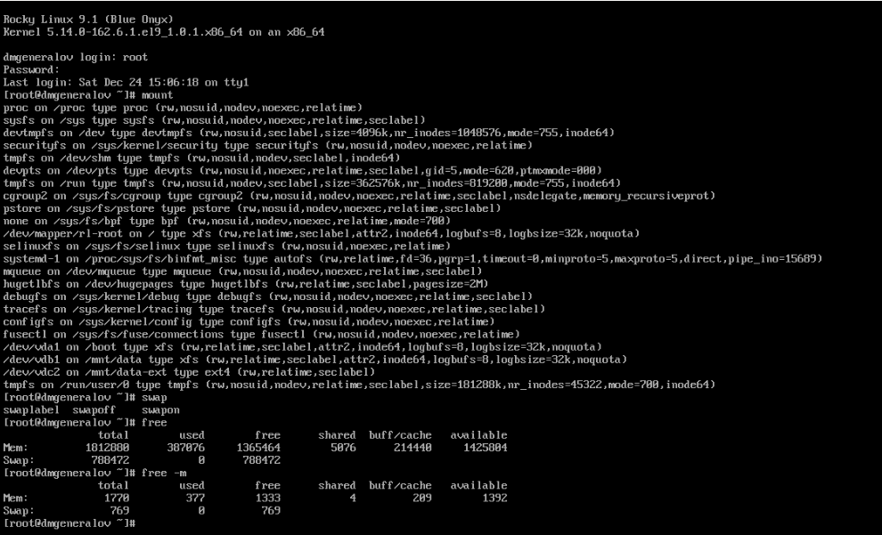

# Выводы

Я получил опыт работы с разделами диска в Linux.

# Контрольные вопросы

1. Какой инструмент используется для создания разделов GUID?

`gdisk`

2. Какой инструмент применяется для создания разделов MBR?

`fdisk`

3. Какая файловая система используется по умолчанию для систем типа RHEL?

В нашей установке по умолчанию используется XFS, но это можно выбрать во время установки системы.

4. Какой файл используется для автоматического монтирования разделов во время
загрузки?

`/etc/fstab`

5. Какой вариант монтирования целесообразно выбрать, если необходимо, чтобы
файловая система не была автоматически примонтирована во время загрузки?

Можно вручную монтировать эту файловую систему с помощью команды mount.
Также существует опция `noauto`, которая отключает автоматическое монтирование при загрузке.

6. Какая команда позволяет форматировать раздел с типом 82 с соответствующей
файловой системой?

`mkswap`

7. Вы только что добавили несколько разделов для автоматического монтирования
при загрузке. Как можно безопасно проверить, будет ли это работать без реальной
перезагрузки?

`mount -a`

8. Какая файловая система создаётся, если вы используете команду mkfs без какой-
либо спецификации файловой системы?

Моя версия `mkfs` создает файловую систему `ext2` по умолчанию.

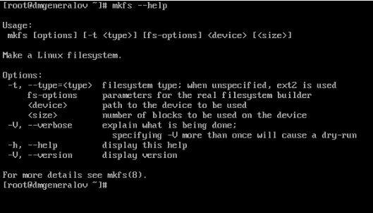

9. Как форматировать раздел EXT4?

`mkfs.ext4`

10. Как найти UUID для всех устройств на компьютере?

`blkid`

