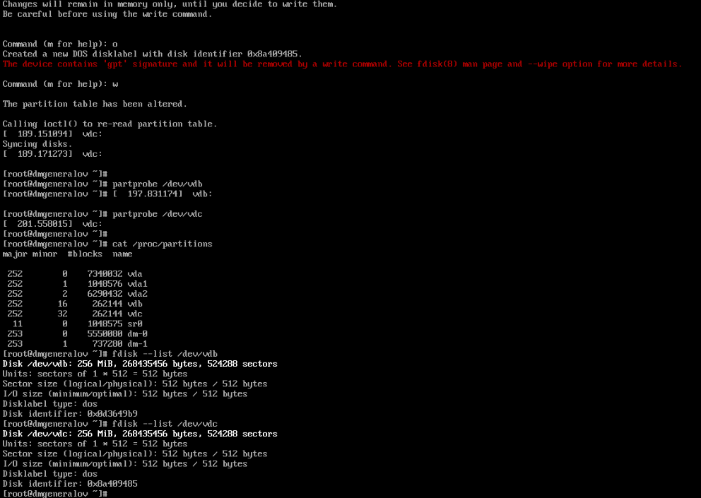
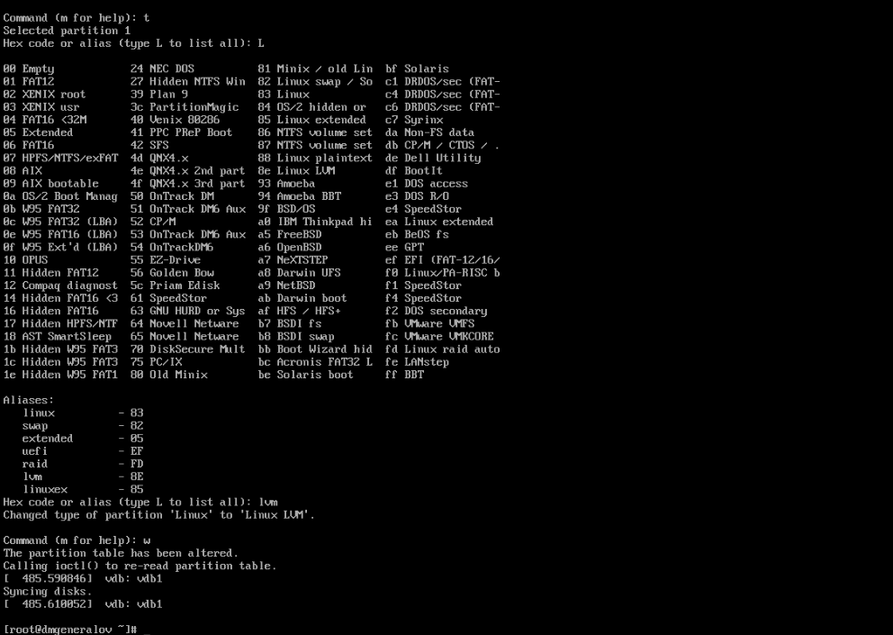
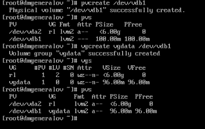
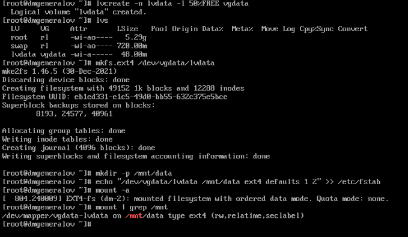
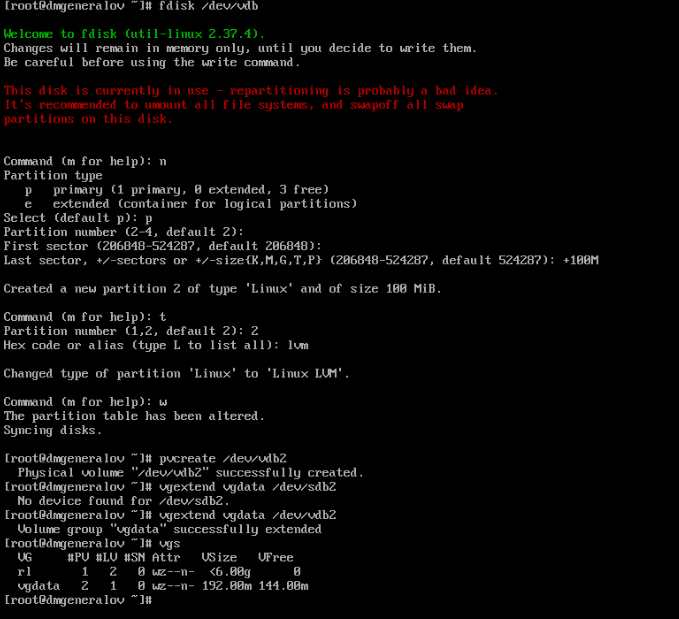
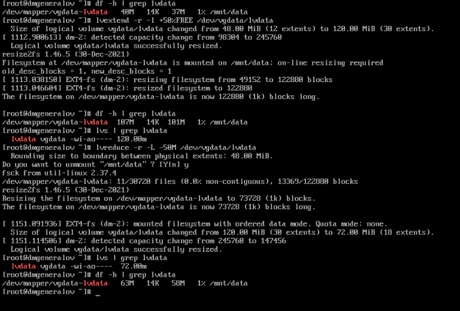
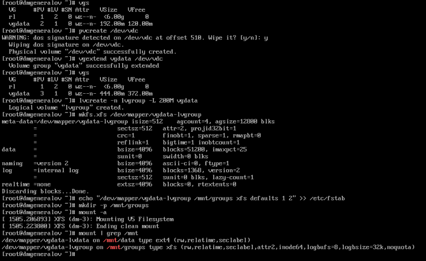
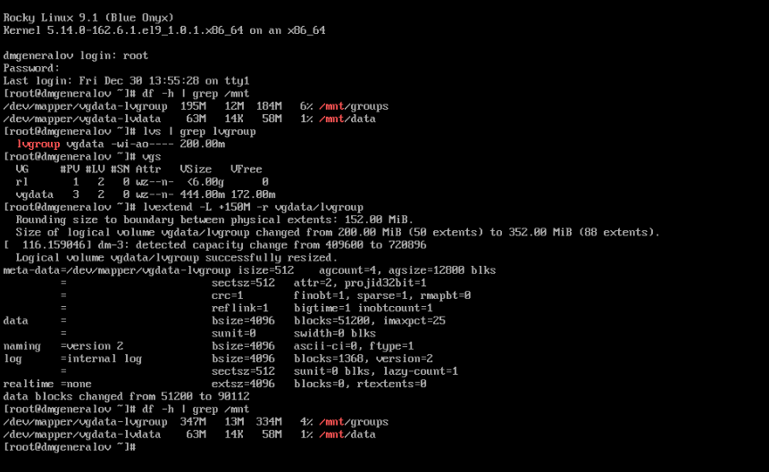

---
## firewall-cmd
lang: ru-RU
title: Лабораторная работа 15
author: |
  Генералов Даниил, НПИбд-01-21, 1032202280
institute: |
	\inst{1}RUDN University, Moscow, Russian Federation
date: 2022

## firewall-cmd
toc: false
slide_level: 2
theme: metropolis
header-includes: 
 - \metroset{progressbar=frametitle,sectionpage=progressbar,numbering=fraction}
 - '\makeatletter'
 - '\beamer@ignorenonframefalse'
 - '\makeatother'
aspectratio: 43
section-titles: true
---

# Задача

> 1. Продемонстрировать навыки создания физических томов на LVM (см. раз-
> дел 15.4.1).
> 2. Продемонстрировать навыки создания группы томов и логических томов на LVM
> (см. раздел 15.4.2).
> 3. Продемонстрировать навыки изменения размера логических томов на LVM (см.
> раздел 15.4.3).
> 4. Выполнить задание для самостоятельной работы (см. раздел 15.5)

# Выполнение 

## fdisk

## fdisk

## pvcreate

## lvcreate

## fdisk

## lvextend

## lvcreate

## lvextend

## Вывод

Я получил опыт работы с LVM в Linux.
