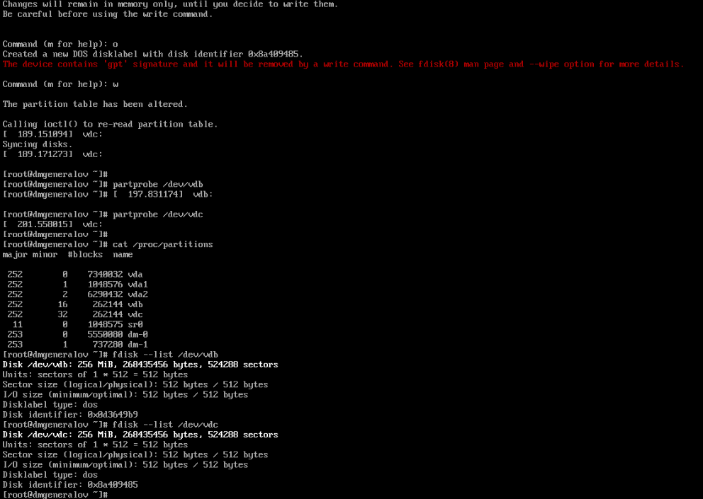
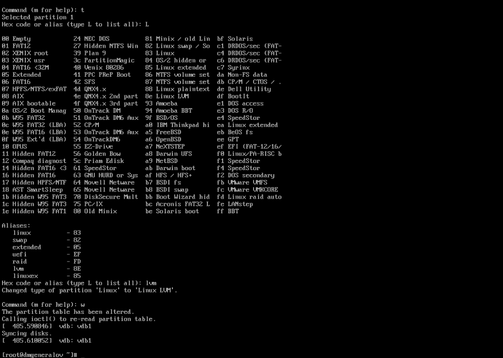
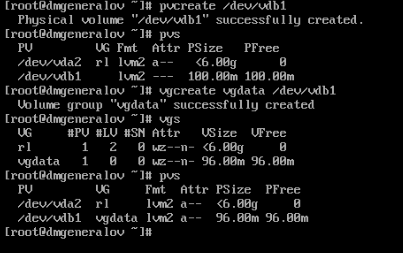
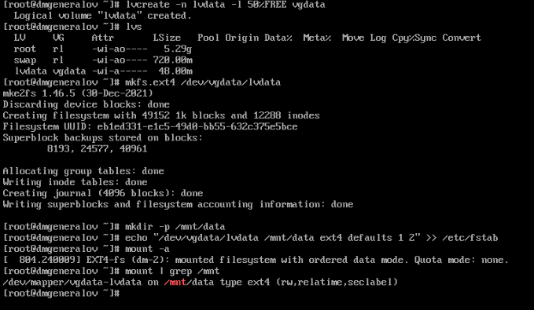
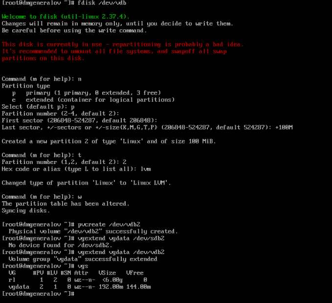
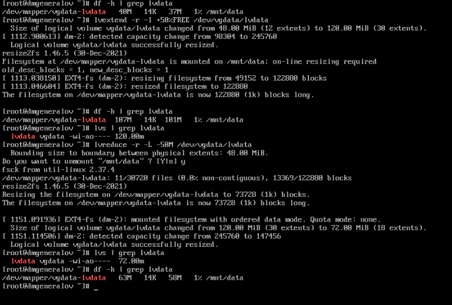
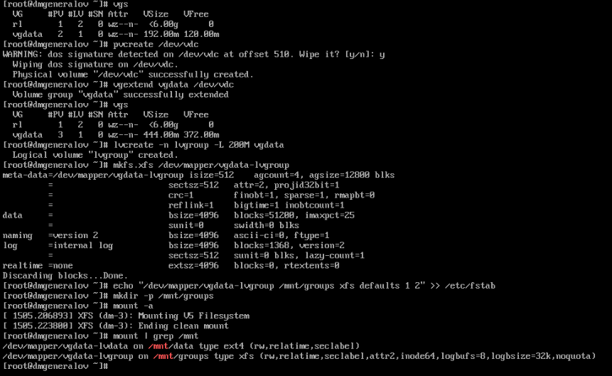
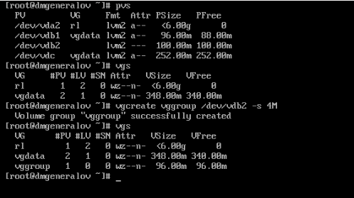
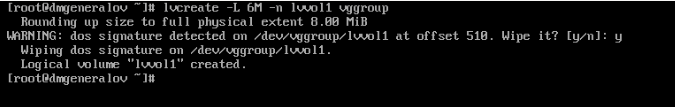
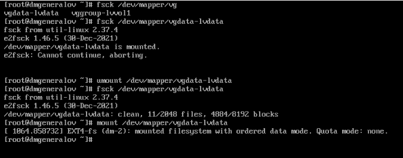

---
## Front matter
title: "Отчет по лабораторной работе 15"
subtitle: ""
author: "Генералов Даниил, НПИбд-01-21, 1032202280"

## Generic otions
lang: ru-RU
toc-title: "Содержание"

## Pdf output format
toc: true # Table of contents
toc-depth: 2
lof: true # List of figures
lot: true # List of tables
fontsize: 12pt
linestretch: 1.5
papersize: a4
documentclass: scrreprt
## I18n polyglossia
polyglossia-lang:
  name: russian
  options:
	- spelling=modern
	- babelshorthands=true
polyglossia-otherlangs:
  name: english
## I18n babel
babel-lang: russian
babel-otherlangs: english
## Fonts
mainfont: PT Serif
romanfont: PT Serif
sansfont: PT Sans
monofont: PT Mono
mainfontoptions: Ligatures=TeX
romanfontoptions: Ligatures=TeX
sansfontoptions: Ligatures=TeX,Scale=MatchLowercase
monofontoptions: Scale=MatchLowercase,Scale=0.9
## Biblatex
biblatex: true
biblio-style: "gost-numeric"
biblatexoptions:
  - parentracker=true
  - backend=biber
  - hyperref=auto
  - language=auto
  - autolang=other*
  - citestyle=gost-numeric
## Pandoc-crossref LaTeX customization
figureTitle: "Рис."
tableTitle: "Таблица"
listingTitle: "Листинг"
lofTitle: "Список иллюстраций"
lotTitle: "Список таблиц"
lolTitle: "Листинги"
## Misc options
indent: true
header-includes:
  - \usepackage{indentfirst}
  - \usepackage{float} # keep figures where there are in the text
  - \floatplacement{figure}{H} # keep figures where there are in the text
---

# Цель работы

В рамках этой лабораторной работы требуется выполнить операции по работе с томами LVM в Linux.

# Задание

> 1. Продемонстрировать навыки создания физических томов на LVM (см. раз-
> дел 15.4.1).
> 2. Продемонстрировать навыки создания группы томов и логических томов на LVM
> (см. раздел 15.4.2).
> 3. Продемонстрировать навыки изменения размера логических томов на LVM (см.
> раздел 15.4.3).
> 4. Выполнить задание для самостоятельной работы (см. раздел 15.5)

# Выполнение лабораторной работы

Сначала я удалил таблицу разделов с дисков /dev/vdb и /dev/vdc с помощью команды `fdisk`, а затем использовал команду `o` чтобы создать новую таблицу разделов и `w` чтобы записать изменения на диск.
После этого оба диска имеют пустую таблицу разделов.

Затем, на диске vdb я создал раздел длиной 100MB для использования в LVM,
обозначив тип этого раздела как Linux LVM.

После этого можно использовать созданый раздел для создания физического тома LVM,
используя команду `pvcreate`.
После этого он виден в списке системных LVM-физических томов,
и его можно добавить в группу томов LVM.

Когда группа томов создана, можно создавать логические тома в ней.
Например, мы создаем логический том размером в половину свободного места в группе томов,
а затем создаем файловую систему на нем и монтируем ее.

Если изменяется количество свободного места в группе томов, можно изменить размер логического тома.
Например, если мы добавили новый жесткий диск в систему, мы можем расширить группу томов,
и затем расширить логический том и его файловую систему.

Чтобы это сделать, сначала мы создаем новый раздел на vdb и добавляем его в группу томов.
Мы увидим, что размер группы томов увеличился.

Затем мы расширяем логический том, чтобы он занимал еще 50% из оставшегося свободного места в группе томов,
вместе с этим расширяя файловую систему на нем.
После этого мы можем обратно сжать файловую систему, чтобы она занимала меньше места, с помощью команды `lvreduce`.
Чтобы это сделать для файловой системы ext4, она должна быть временно отмонтирована на время выполнения этой команды.

Для выполнения самостоятельного задания, где нужно создать раздел размером в 200MB, нужно сначала расширить группу томов --
например за счет диска vdc. После этого можно создать логический том размером в 200MB, а затем создать файловую систему на нем,
и наконец добавить ее в `/etc/fstab`.

После перезагрузки системы мы можем увидеть, что файловая система была успешно смонтирована.
После этого мы расширяем том на 150MB, и видим, что размер файловой системы увеличился.

# Выводы

Я получил опыт работы с LVM в Linux.

# Контрольные вопросы

1. Какой тип раздела используется в разделе GUID для работы с LVM?

`E6D6D379-F507-44C2-A23C-238F2A3DF928`

2. Какой командой можно создать группу томов с именем vggroup, которая содержит
физическое устройство /dev/sdb3 и использует физический экстент 4 MiB?

`vgcreate vggroup /dev/sdb3 -s 4M`

3. Какая команда показывает краткую сводку физических томов в вашей системе,
а также группу томов, к которой они принадлежат?

`pvs`

4. Что вам нужно сделать, чтобы добавить весь жёсткий диск /dev/sdd в группу
томов группы?

Если /dev/sdd уже отмечен как LVM PV, то добавить его в группу томов можно командой `vgextend vggroup /dev/sdd`.
Если нет, то можно отформатировать его как LVM PV с помощью `pvcreate /dev/sdd`.

5. Какая команда позволяет вам создать логический том lvvol1 с размером 6 MiB?

`lvcreate -L 6M -n lvvol1 vggroup`.
Учтите, что при стандартном размере физического экстента 4 MiB, размер логического тома должен быть кратен 4 MiB,
поэтому эта команда создаст том размером 8 MiB.

6. Какая команда позволяет вам добавить 100 МБ в логический том lvvol1, если
предположить, что дисковое пространство доступно в группе томов?

`lvextend -L +100M /dev/vggroup/lvvol1`

7. Каков первый шаг, чтобы добавить ещё 200 МБ дискового пространства в логиче-
ский том, если требуемое дисковое пространство недоступно в группе томов?

Нужно добавить свободное пространство в группу томов.
Это можно сделать, купив и подключив новый диск, а затем добавив его в группу томов командой `vgextend vggroup /dev/hdd`.
Альтернативно, можно сжать один из существующих логичкских томов командой `lvreduce -L -100M /dev/vggroup/lvvol1`,
или удалить его командой `lvremove /dev/vggroup/lvvol1`.

8. Какую опцию нужно использовать с командой lvextend, чтобы также изменить
размер файловой системы?

`-r` или `--resizefs` вызовет команду `fsadm resize` для изменения размера файловой системы.
Это поддерживается только для определенных файловых систем.

9. Как посмотреть, какие логические тома доступны?

`lvs` или `lvdisplay`

10. Какую команду нужно использовать для проверки целостности файловой системы
на /dev/vgdata/lvdata?

Если эта файловая система имеет аналог команды `fsck`, то можно использовать её: `fsck /dev/vgdata/lvdata`
Учтите, что эта команда обычно требует того, чтобы связанная с ней файловая система была отмонтирована.

