---
## firewall-cmd
lang: ru-RU
title: Лабораторная работа 16
author: |
  Генералов Даниил, НПИбд-01-21, 1032202280
institute: |
	\inst{1}RUDN University, Moscow, Russian Federation
date: 2022

## firewall-cmd
toc: false
slide_level: 2
theme: metropolis
header-includes: 
 - \metroset{progressbar=frametitle,sectionpage=progressbar,numbering=fraction}
 - '\makeatletter'
 - '\beamer@ignorenonframefalse'
 - '\makeatother'
aspectratio: 43
section-titles: true
---

# Задача

> 1. Прочитайте руководство по работе с утилитами fdisk, sfdisk и mdadm.
> 2. Добавить три диска на виртуальную машину (объёмом от 512 MiB каждый).
> При помощи sfdisk создать на каждом из дисков по одной партиции, задав тип
> раздела для RAID (см. разделы 16.4.1, 16.4.2).
> 3. Создать массив RAID 1 из двух дисков, смонтировать его. Эмитировать сбой одно-
> го из дисков массива, удалить искусственно выведенный из строя диск, добавить
> в массив работающий диск (см. раздел 16.4.2).
> 4. Создать массив RAID 1 из двух дисков, смонтировать его. Добавить к массиву
> третий диск. Эмитировать сбой одного из дисков массива. Проанализировать
> состояние массива, указать различия по сравнению с предыдущим случаем (см.
> раздел 16.4.3).
> 5. Создать массив RAID 1 из двух дисков, смонтировать его. Добавить к массиву
> третий диск. Изменить тип массива с RAID1 на RAID5, изменить число дисков
> в массиве с 2 на 3. Проанализировать состояние массива, указать различия по
> сравнению с предыдущим случаем (см. раздел 16.4.4).

# Выполнение 

## virt-manager
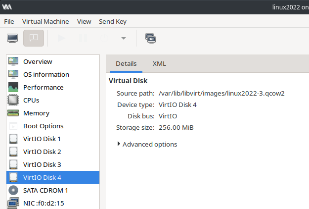

## sfdisk

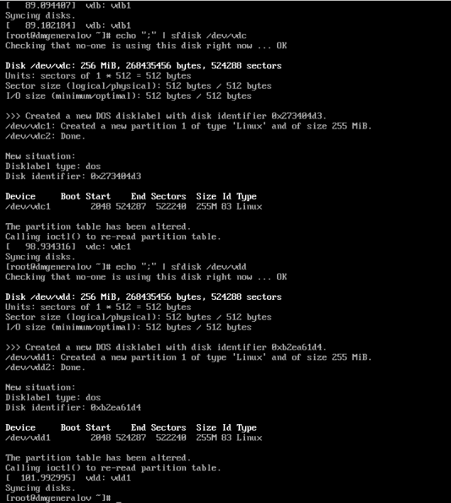

## sfdisk

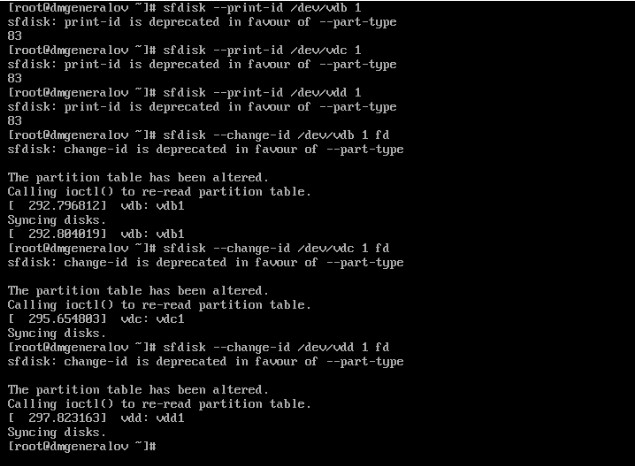

## sfdisk
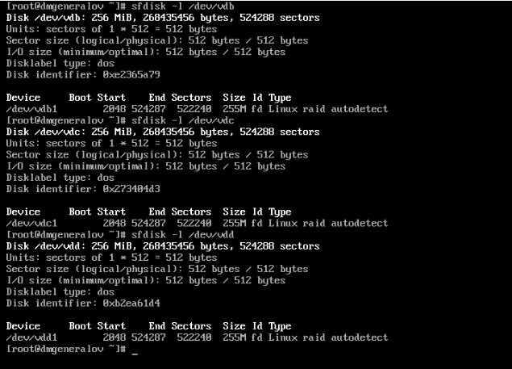

## mdadm

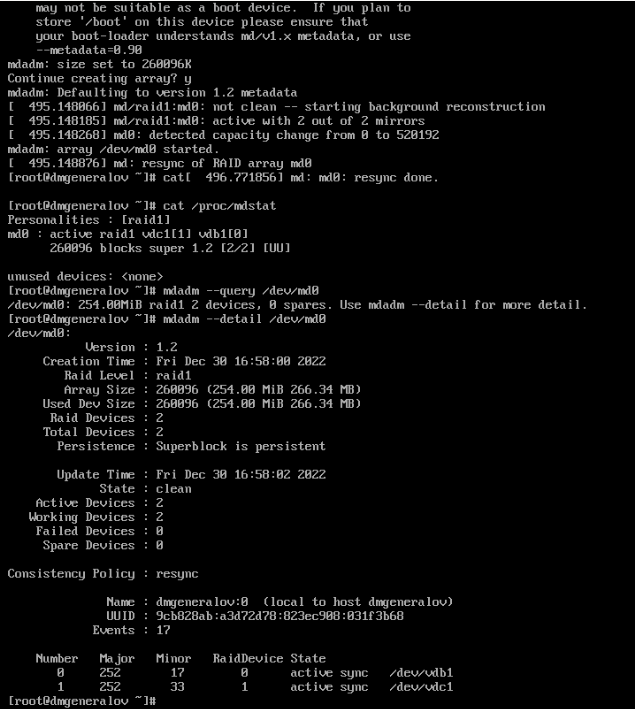

## mkfs

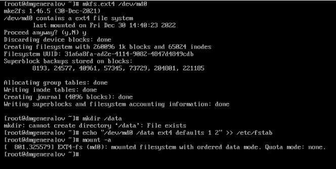

## mdadm

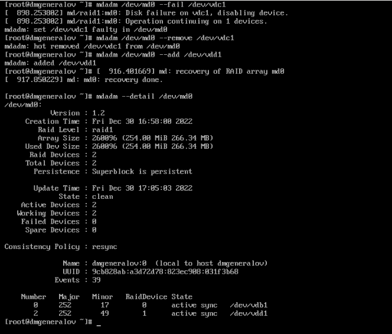

## mdadm

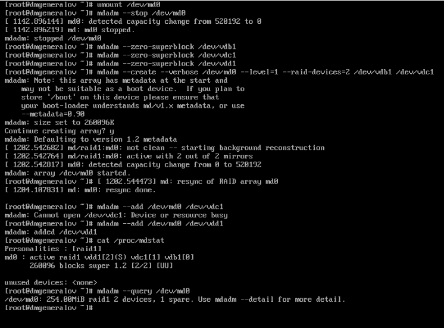

## mdadm

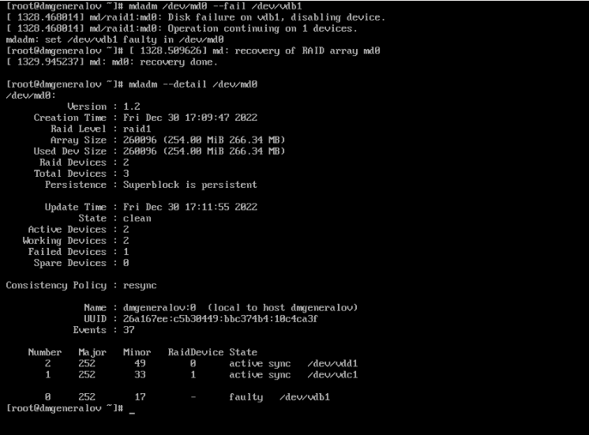

## mdadm

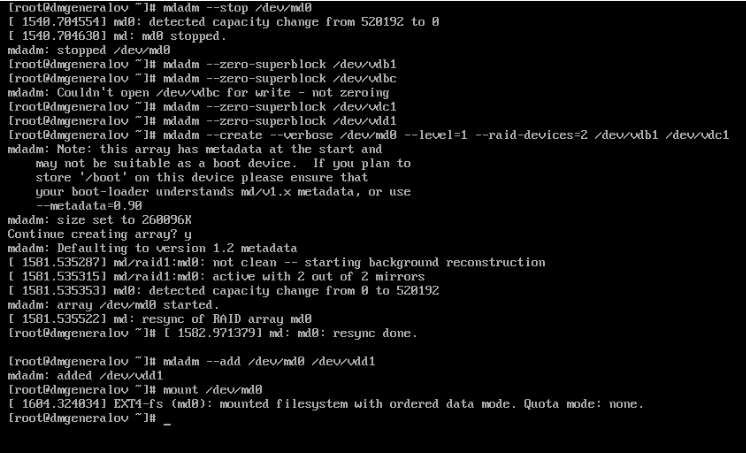

## mdadm

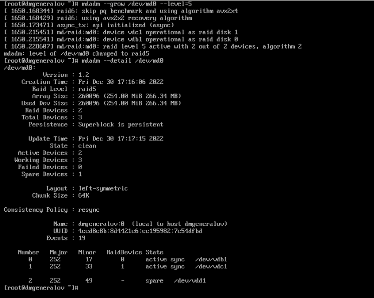

## mdadm

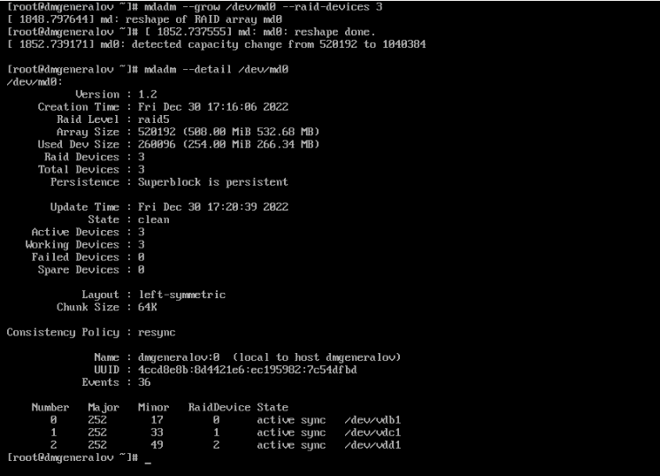

## Вывод

Я получил опыт работы с mdadm в Linux.
