---
## Front matter
title: "Отчет по лабораторной работе 16"
subtitle: ""
author: "Генералов Даниил, НПИбд-01-21, 1032202280"

## Generic otions
lang: ru-RU
toc-title: "Содержание"

## Pdf output format
toc: true # Table of contents
toc-depth: 2
lof: true # List of figures
lot: true # List of tables
fontsize: 12pt
linestretch: 1.5
papersize: a4
documentclass: scrreprt
## I18n polyglossia
polyglossia-lang:
  name: russian
  options:
	- spelling=modern
	- babelshorthands=true
polyglossia-otherlangs:
  name: english
## I18n babel
babel-lang: russian
babel-otherlangs: english
## Fonts
mainfont: PT Serif
romanfont: PT Serif
sansfont: PT Sans
monofont: PT Mono
mainfontoptions: Ligatures=TeX
romanfontoptions: Ligatures=TeX
sansfontoptions: Ligatures=TeX,Scale=MatchLowercase
monofontoptions: Scale=MatchLowercase,Scale=0.9
## Biblatex
biblatex: true
biblio-style: "gost-numeric"
biblatexoptions:
  - parentracker=true
  - backend=biber
  - hyperref=auto
  - language=auto
  - autolang=other*
  - citestyle=gost-numeric
## Pandoc-crossref LaTeX customization
figureTitle: "Рис."
tableTitle: "Таблица"
listingTitle: "Листинг"
lofTitle: "Список иллюстраций"
lotTitle: "Список таблиц"
lolTitle: "Листинги"
## Misc options
indent: true
header-includes:
  - \usepackage{indentfirst}
  - \usepackage{float} # keep figures where there are in the text
  - \floatplacement{figure}{H} # keep figures where there are in the text
---

# Цель работы

В рамках этой лабораторной работы требуется выполнить операции по работе с mdadm-RAID массивами.

# Задание

> 1. Прочитайте руководство по работе с утилитами fdisk, sfdisk и mdadm.
> 2. Добавить три диска на виртуальную машину (объёмом от 512 MiB каждый).
> При помощи sfdisk создать на каждом из дисков по одной партиции, задав тип
> раздела для RAID (см. разделы 16.4.1, 16.4.2).
> 3. Создать массив RAID 1 из двух дисков, смонтировать его. Эмитировать сбой одно-
> го из дисков массива, удалить искусственно выведенный из строя диск, добавить
> в массив работающий диск (см. раздел 16.4.2).
> 4. Создать массив RAID 1 из двух дисков, смонтировать его. Добавить к массиву
> третий диск. Эмитировать сбой одного из дисков массива. Проанализировать
> состояние массива, указать различия по сравнению с предыдущим случаем (см.
> раздел 16.4.3).
> 5. Создать массив RAID 1 из двух дисков, смонтировать его. Добавить к массиву
> третий диск. Изменить тип массива с RAID1 на RAID5, изменить число дисков
> в массиве с 2 на 3. Проанализировать состояние массива, указать различия по
> сравнению с предыдущим случаем (см. раздел 16.4.4).

# Выполнение лабораторной работы

Сначала я добавил диск к виртуальной машине: у меня уже было два диска, поэтому я добавил третий.
Все из них имеют размер 256 МБ, ввиду недостатка места на моем диске.

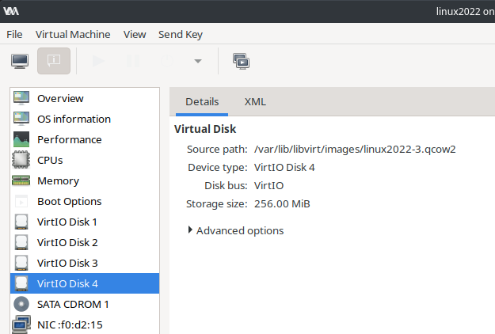

Те три диска, с которыми мы будем работать, называются соответственно vdb, vdc и vdd.
Нужно на каждом из них создать раздел, введя команду `;` в `sfdisk`.

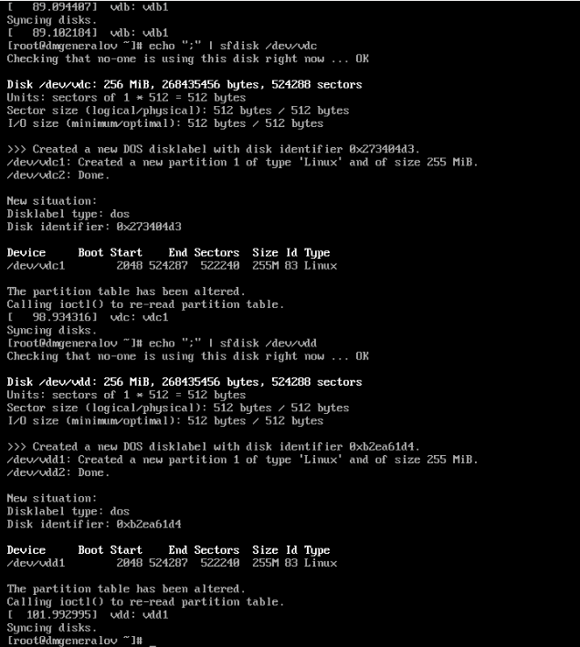

Если проверить информацию о первом разделе каждого диска, можно увидеть, что они имеют тип 83, что соответствует типу раздела Linux.
После этого мы меняем тип раздела на fd, что соответствует типу раздела Linux RAID с авто-обнаружением.

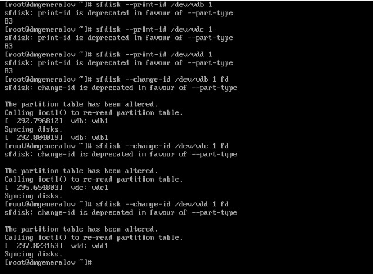

Наконец, мы смотрим состояние таблицы разделов и видим, что диски имеют один раздел с типом fd.

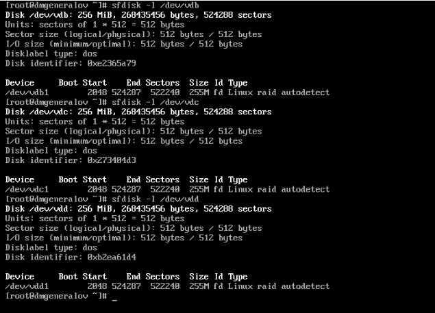

С помощью утилиты mdadm мы можем начать, создав RAID1-массив из двух дисков.
Затем можно посмотреть его состояние:
массив состоит из двух дисков и нуля запасных, имеет размер 254MiB,
активно 2 устройства, состояние clean, и произошло 17 событий.

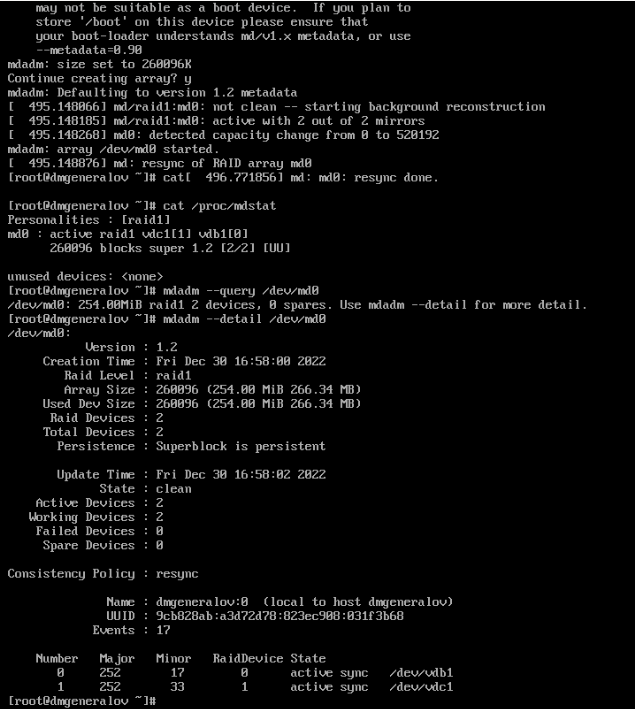

Теперь мы создаем файловую систему на массиве и подключаем диск к файловой системе.

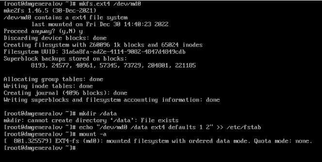

После этого мы можем пометить один из дисков как нерабочий, удалить его из массива, и добавить новый диск в массив.
Во время этого мы получаем сообщения в консоли о том, что с диском произошла ошибка, и когда мы добавляем новый диск, мы видим сообщения о том, что происходит синхронизация данных.
После того, как синхронизация завершена, массив имеет такое же рабочее состояние, как и до этого.

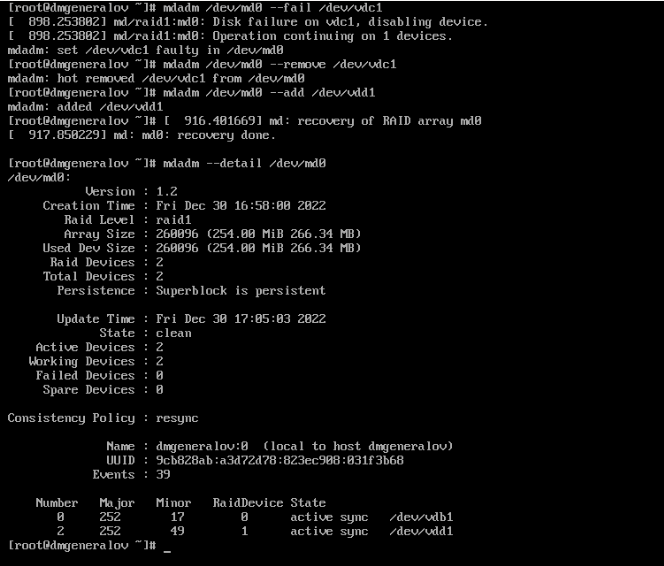

Наконец, мы удаляем массив, обнуляя суперблоки на дисках, чтобы подготовиться к следующему шагу: мы создаем RAID1-массив, в котором есть vdb и vdc, и добавляем в него vdd как запасной диск.

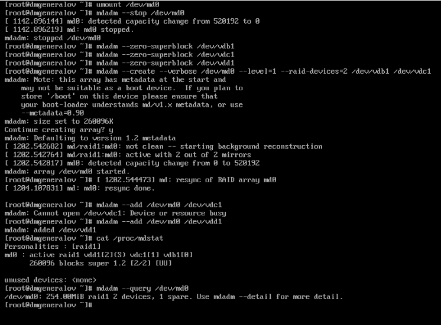

Теперь, когда диск vdb помечается как нерабочий, он автоматически заменяется диском vdd, который восстанавливается из данных диска vdc.

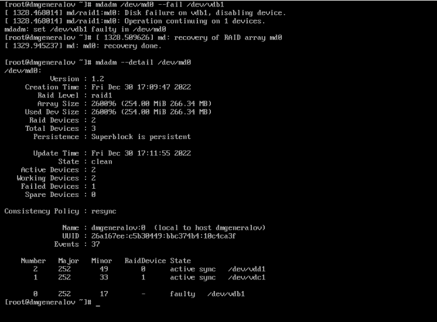

После этого мы опять сбрасываем массив, чтобы создать новый массив: RAID1, состоящий из vdb и vdc, а затем добавляем в него vdd как запасной диск.

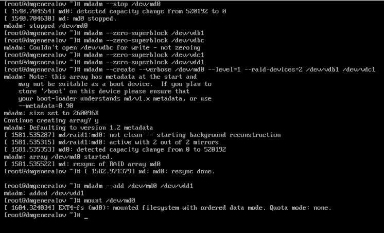

После этого мы помечаем, что этот массив теперь должен иметь тип RAID5. Это не изменяет массив, потому что RAID5 с двумя дисками -- это то же самое, что RAID1. Однако в массиве все еще есть один диск, который используется в качестве запасного.

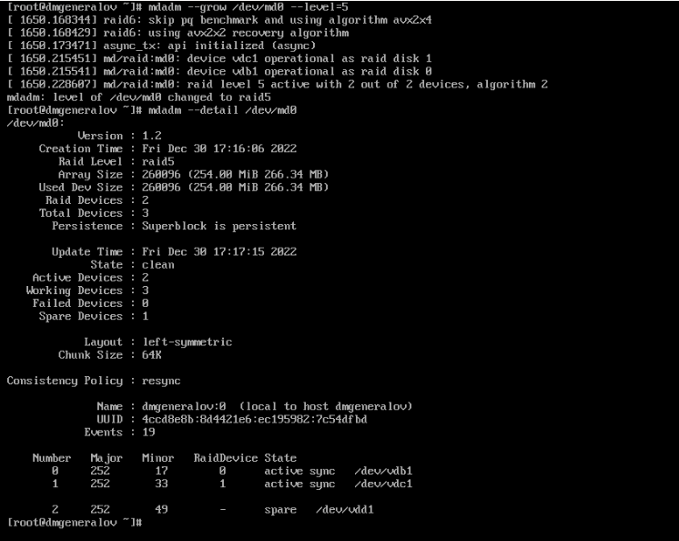

Если изменить, что массив должен иметь три диска в себе, то запасной диск используется, чтобы распределить на него данные четности.
Это изменило "форму" массива, и теперь он имеет в два раза больше объема, о чем мы получаем сообщение в консоли.

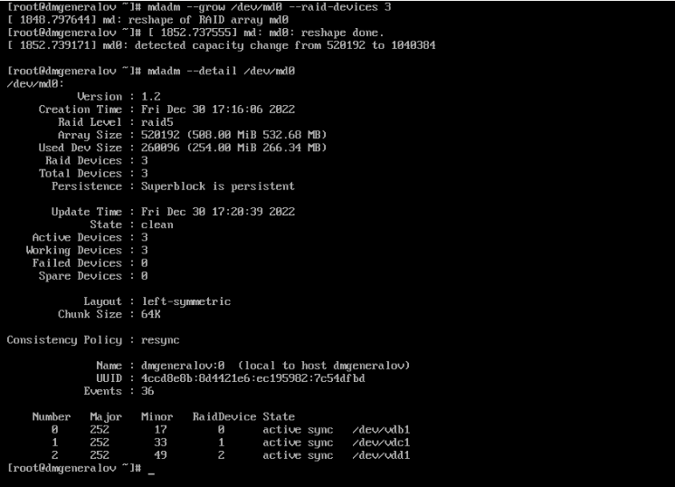

Наконец, мы удаляем массив, обнуляем суперблоки на дисках, и удаляем запись из fstab.

# Выводы

Я получил опыт работы с mdadm в Linux.

# Контрольные вопросы

1. Приведите определение RAID.

RAID -- метод объединения нескольких физических дисков в один логический, который обладает лучшими характеристиками производительности и/или надежности, чем каждый из дисков по отдельности.

2. Какие типы RAID-массивов существуют на сегодняшний день?

Чаще всего используют RAID0/striping, а также RAID1/mirroring, RAID5 или RAID6 -- причем, в комбинации с striping, их называют RAID10, RAID50 или RAID60.

3. Охарактеризуйте RAID 0, RAID 1, RAID 5, RAID 6, опишите алгоритм работы,
назначение, приведите примеры применения

RAID1 (mirroring) делает так, что два или более диска являются полными копиями друг друга.
Когда производится запись, она происходит на все диски, а когда выполняется чтение, оно может идти из любого из активных дисков (для производительности можно выбрать самый быстрый из них, или же сделать балансировку нагрузки).
Таким образом, RAID1 обеспечивает наилучшую надежность (потому что любого одного диска достаточно, чтобы восстановить данные),
но самую худшую производительность (потому что время записи не может быть меньше времени записи на самый медленный диск), а также самый большой объем занимаемого места (получается используемый объем одного диска, который требует двух таких физических объемов).

RAID0 (striping) делает так, что данные записываются на несколько дисков, но не копируются.
Самый простой способ это сделать -- логически склеить конец первого диска и начало второго, но на практике секторы диска перемежаются между двумя дисками.
Этот метод увеличивает производительность (потому что работа с блоком данных разбита на два диска, и поэтому время доступа делится на два),
и увеличивает используемый объем (потому что объем двух дисков складывается),
но понижает надежность (потому что если один из дисков выйдет из строя, то все данные на этом диске будут потеряны).

RAID5 (striping with parity) -- это улучшение более старой схемы RAID4.

В RAID4 все диски кроме одного содержат данные, а один диск содержит контрольную сумму (parity) для данных на других дисках.
Благодаря этой схеме увеличивается надежность, потому что можно восстановить потерю любого одного из дисков, и увеличивается объем,
потому что все кроме одного диска используются для хранения данных.

Однако у этой схемы есть недостаток в том, что для каждой записи требуется записать данные на диск, куда идет запись, а также на тот один диск контрольных сумм, поэтому производительность записи ограничена скоростью диска контрольных сумм.
RAID5 решает эту проблему: контрольные суммы вместо этого распределяются между всеми дисками.
Тогда производительность записи каждого блока ограничена самым медленным диском из пары (диск с блоком -- диск с контрольной суммой), что в среднем увеличивает производительность записи.

RAID6 -- это аналог RAID5, но в нем используется в два раза больше контрольных сумм.
Это сильнее ограничивает производительность, и снижает используемый объем,
но позволяет восстанавливать потерю любых двух дисков, а не только одного.

Каждый из этих RAID-уровней можно комбинировать с RAID0, чтобы получить RAID10, RAID50, RAID60 и т.д.
Если это сделать, то повышается надежность и скорость восстановления: если один из дисков выйдет из строя, то теряется только половина данных, и восстановление занимает половину времени.
Помимо этого, если выйдут из строя два диска, составляющие одну striping-пару, то это считается как потеря только одного диска, поэтому это не приведет к потере данных.

Например, рассмотрим RAID10 из четырех дисков, где есть диски 0, 1, 2 и 3,
и диск 0 и 1 -- это одна striping-пара, а диск 2 и 3 -- это другая striping-пара.
Потеря любого одного диска восстановима.
Если потерян диск 0, то потеря диска 1 не будет катастрофической.
Если потерян диск 0 и 2, то это уже приведет к потере данных.
Если потерян диск 0 и 3, и RAID-контроллер достаточно умный, то это также можно восстановить, потому что диск 1 и 2 будут содержать между собой содержимое диска 0 и 3.
Таким образом, RAID10 позволяет восстановить потерю любого одного диска, а также некоторые случаи потери двух дисков.