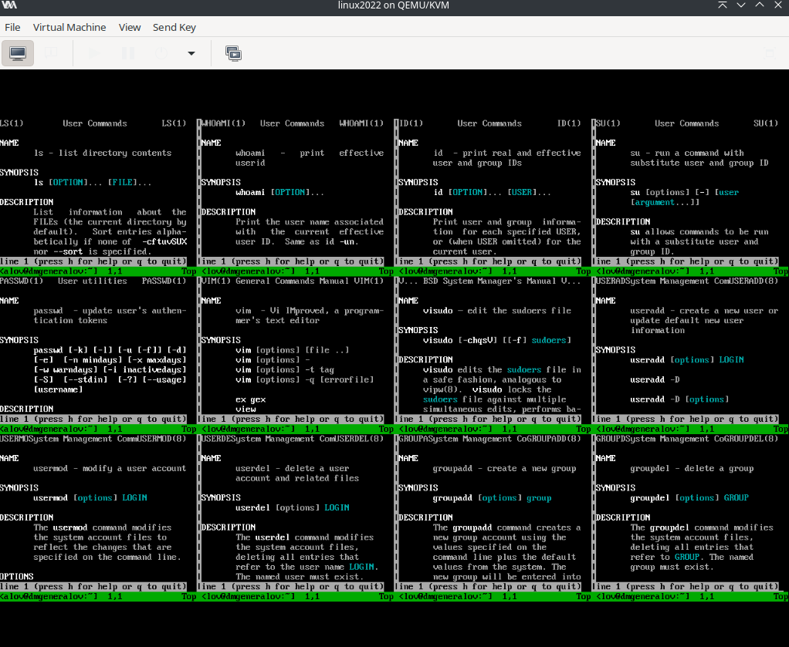
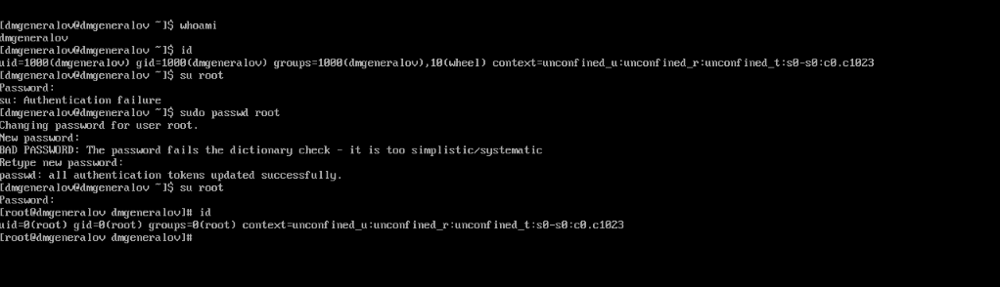
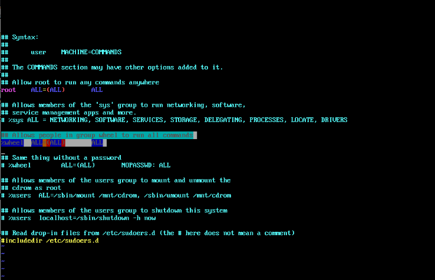
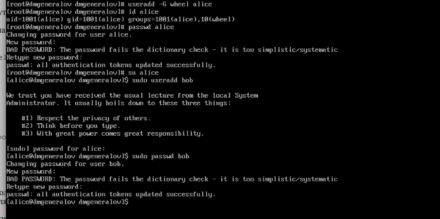
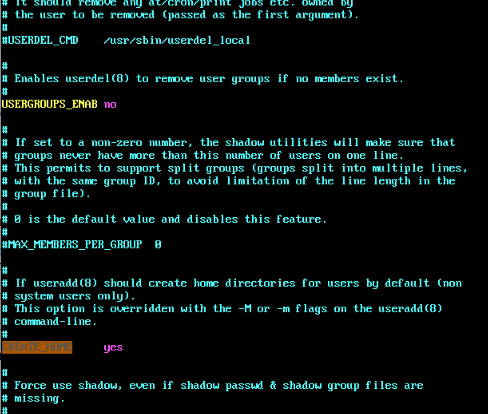
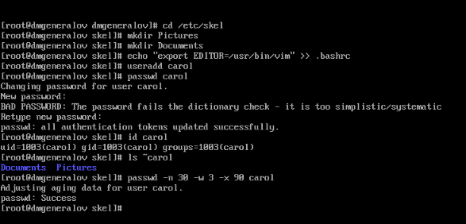
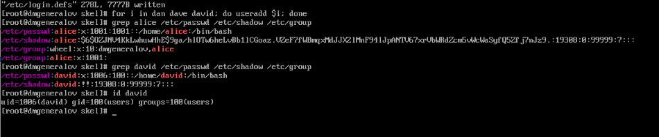
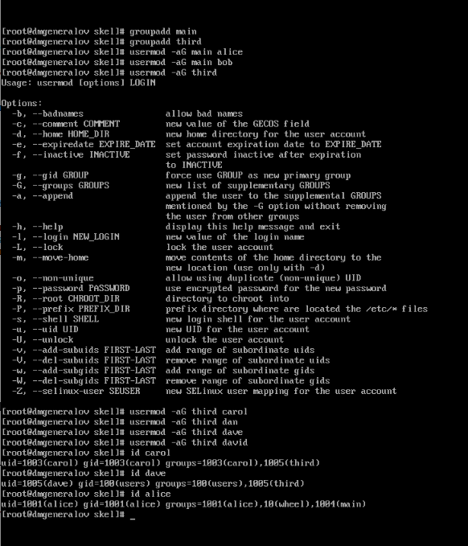

---
## Front matter
lang: ru-RU
title: Лабораторная работа 2
author: |
  Генералов Даниил, НПИбд-01-21, 1032202280
institute: |
	\inst{1}RUDN University, Moscow, Russian Federation
date: 2022

## Formatting
toc: false
slide_level: 2
theme: metropolis
header-includes: 
 - \metroset{progressbar=frametitle,sectionpage=progressbar,numbering=fraction}
 - '\makeatletter'
 - '\beamer@ignorenonframefalse'
 - '\makeatother'
aspectratio: 43
section-titles: true
---

# Задача

> 1. Прочитайте справочное описание man по командам ls, whoami, id, su, passwd,
> vi, visudo, useradd, usermod, userdel, groupadd, groupdel.
> 2. Выполните действия по переключению между учётными записями пользователей,
> по управлению учётными записями пользователей (раздел 2.4.1).
> 3. Выполните действия по созданию пользователей и управлению их учётными
> записями (раздел 2.4.2).
> 4. Выполните действия по работе с группами пользователей (раздел 2.4.3).

# Выполнение 

## man-страницы

## Переключение между учётными записями пользователей

## /etc/sudoers

## Создание пользователей

## /etc/login.defs

# /etc/skel

## /etc/passwd, /etc/group

## Создание групп

## Вывод

Я получил опыт работы с группами и пользователями в Linux.
