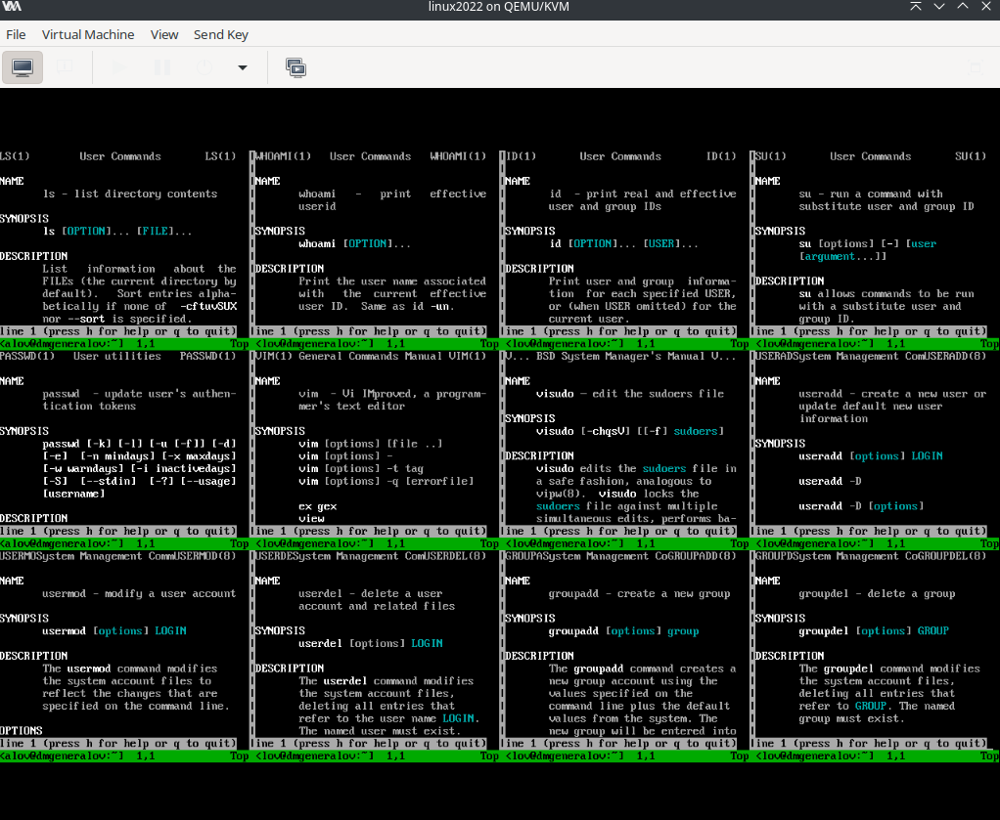
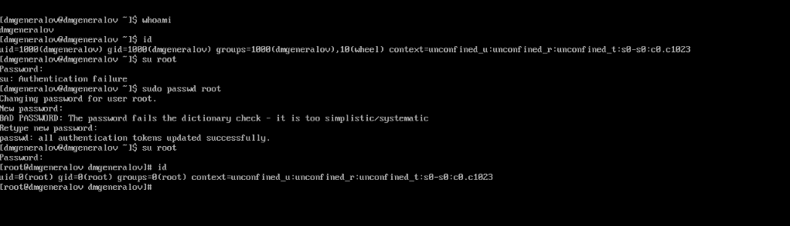
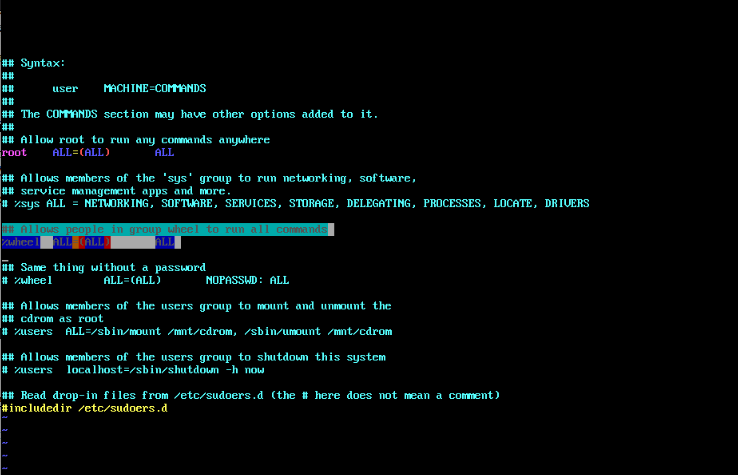
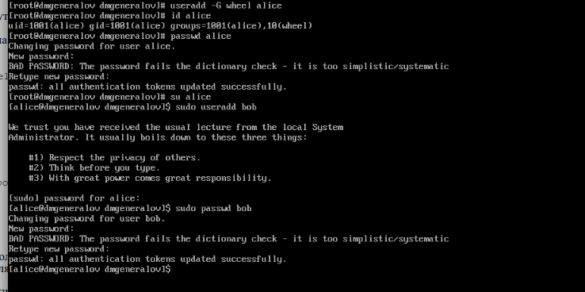
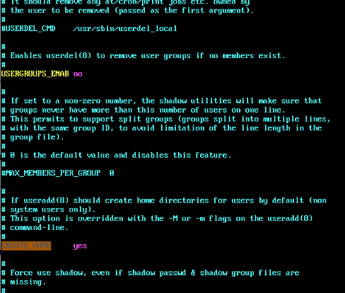
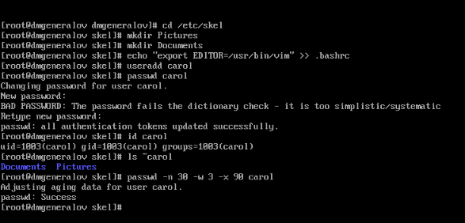
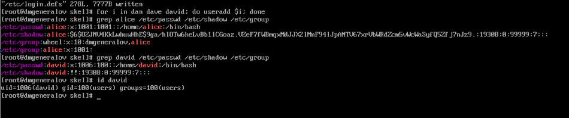
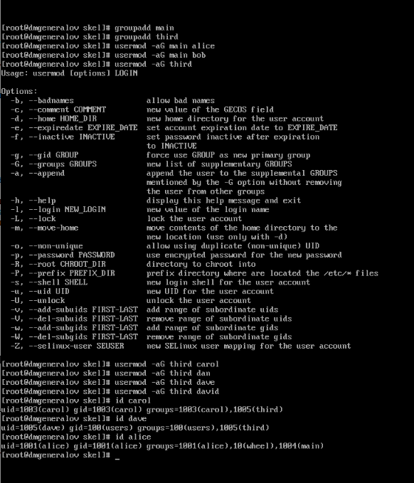

---
## Front matter
title: "Отчет по лабораторной работе 2"
subtitle: ""
author: "Генералов Даниил, НПИбд-01-21, 1032202280"

## Generic otions
lang: ru-RU
toc-title: "Содержание"

## Pdf output format
toc: true # Table of contents
toc-depth: 2
lof: true # List of figures
lot: true # List of tables
fontsize: 12pt
linestretch: 1.5
papersize: a4
documentclass: scrreprt
## I18n polyglossia
polyglossia-lang:
  name: russian
  options:
	- spelling=modern
	- babelshorthands=true
polyglossia-otherlangs:
  name: english
## I18n babel
babel-lang: russian
babel-otherlangs: english
## Fonts
mainfont: PT Serif
romanfont: PT Serif
sansfont: PT Sans
monofont: PT Mono
mainfontoptions: Ligatures=TeX
romanfontoptions: Ligatures=TeX
sansfontoptions: Ligatures=TeX,Scale=MatchLowercase
monofontoptions: Scale=MatchLowercase,Scale=0.9
## Biblatex
biblatex: true
biblio-style: "gost-numeric"
biblatexoptions:
  - parentracker=true
  - backend=biber
  - hyperref=auto
  - language=auto
  - autolang=other*
  - citestyle=gost-numeric
## Pandoc-crossref LaTeX customization
figureTitle: "Рис."
tableTitle: "Таблица"
listingTitle: "Листинг"
lofTitle: "Список иллюстраций"
lotTitle: "Список таблиц"
lolTitle: "Листинги"
## Misc options
indent: true
header-includes:
  - \usepackage{indentfirst}
  - \usepackage{float} # keep figures where there are in the text
  - \floatplacement{figure}{H} # keep figures where there are in the text
---

# Цель работы

В рамках этой лабораторной работы требуется выполнить действия по управлению пользователями и группами в ОС Linux.

# Задание

> 1. Прочитайте справочное описание man по командам ls, whoami, id, su, passwd,
> vi, visudo, useradd, usermod, userdel, groupadd, groupdel.
> 2. Выполните действия по переключению между учётными записями пользователей,
> по управлению учётными записями пользователей (раздел 2.4.1).
> 3. Выполните действия по созданию пользователей и управлению их учётными
> записями (раздел 2.4.2).
> 4. Выполните действия по работе с группами пользователей (раздел 2.4.3).

# Выполнение лабораторной работы

Сначала я открыл man-страницы по всем командам, которые были указаны в задании.
Это можно увидеть на скриншоте ниже.

После этого я узнал информацию про своего пользователя -- меня зовут `dmgeneralov`, я нахожусь в группах `dmgeneralov` и `wheel`, в SELinux-контексте `unconfined_u:unconfined_r:unconfined_t:s0-s0:c0.c1023`, мой UID -- 1000, GID -- 1000, и ID моих групп 1000 и 10.
Переключившись на пользователя `root` (предварительно указав его пароль), я узнал, что у него UID -- 0, GID -- 0, он принадлежит только к группе `root`, и его SELinux-контекст `unconfined_u:unconfined_r:unconfined_t:s0-s0:c0.c1023`.
Это все видно на скриншоте ниже.

После этого я посмотрел на файл `sudoers`. В нем указано, что пользователи из группы `wheel` могут выполнять любые команды с помощью `sudo`.
Группа `wheel`, таким образом, обозначает пользователей, которые имеют права администратора на этой системе.
Это можно увидеть на скриншоте ниже.

После этого я создал пользователя `alice`, который принадлежит к группе `wheel`. Затем, переключившись на нового пользователя, я использовал команду `sudo`, чтобы создать пользователя `bob`.

Затем я посмотрел на файл `/etc/login.defs`, в котором находятся настройки по умолчанию для создания новых пользователей.
Я подтвердил, что для новых пользователей создается домашняя директория (`CREATE_HOME`), и изменил настройку `USERGROUPS_ENAB`, чтобы для пользователей не создавалась отдельная группа.
К сожалению, я не сохранил эту настройку, прежде чем я выполнил следующий шаг -- из-за этого пользователь `carol` имеет отдельную группу.

Я увидел это, как только я выполнил команду `id carol`. К счастью, до этого я добавил папки в `/etc/skel`, чтобы у новых пользователей были папки `Pictures` и `Documents` в домашней директории.
После этого я успешно поменял правила истечения пароля для `carol` с помощью команды `passwd`.

Как только я исправил файл `login.defs`, я создал пользователей `dan`, `david` и `dave`, и они все корректно принадлежат группе `users` -- группа `alice` существует, а группы `david` нет.
Это можно увидеть на скриншоте ниже.

Напоследок я сделал группы `main` и `third`, которые я назначил пользователям, и это можно подтвердить по выводу команды `id`.

# Выводы

Я получил опыт работы с группами и пользователями в Linux.

# Контрольные вопросы
1. При помощи какой команды можно получить информацию о номере, назначенном
пользователю Linux, о группах, в которые включён пользователь?

В рамках этой лабораторной работы мы использовали команду `id` именно для этой цели.

2. Какой UID имеет пользователь root?

Пользователь, который имеет название `root` на многих системах, имеет UID 0.
Именно этот UID, а не название `root`, дают право на любые действия.
На некоторых системах этот пользователь называется иначе, например `admin` или `avatar`.

3. В чём состоит различие между командами su и sudo?

Команда `su` запускает новую командную оболочку от имени другого пользователя, и позволяет выполнять любые действия от имени этого пользователя. Команда `sudo`, напротив, выполняет только одну команду от имени другого пользователя, и можно настраивать, какие именно команды разрешается выполнять каким пользователям.

4. В каком конфигурационном файле определяются параметры sudo?

`/etc/sudoers`.

5. Какую команду следует использовать для безопасного изменения конфигурации
sudo?

`visudo`.

6. Если вы хотите предоставить пользователю доступ ко всем командам админи-
стратора через sudo, членом какой группы он должен быть?

Обычно эта группа называется `sudo` или `wheel` -- в нашем случае это `wheel`.

7. Какие файлы/каталоги можно использовать для определения параметров, которые
будут использоваться при создании учётных записей пользователей?

`/etc/login.defs` определяет некоторые параметры для создания новых пользователей, но некоторые другие находятся в `/etc/default/useradd`.

8. В каких файлах хранятся пароли пользователей, учётные записи групп?

Пароли пользователей традиционно хранились в `/etc/passwd`, но сейчас они шифруются и хранятся в `/etc/shadow`. Информация о группах хранятся в `/etc/group`.

9. Какие команды вы можете использовать для изменения информации о пароле
пользователя?

`passwd` обновляет пароль и возраст пароля для одного пользователя, а `chpasswd` и `chage` соответственно могут быть использованы для изменения нескольких пользователей одновременно.

10. Сколько групп вы можете создать в файле /etc/passwd? Поясните свой ответ.

Файл `/etc/passwd` используется для описания пользователей, и каждый пользователь может иметь только одну главную группу, которая задается в этом файле.
`/etc/group`, напротив, описывает группы, а также список пользователей, которые принадлежат этой группе.

11. Какую команду следует использовать для изменения файла /etc/group вручную?

Для безопасного редактирования файлов `/etc/passwd`, `/etc/group`, `/etc/shadow` и `/etc/gshadow` следует использовать команду `vipw`.