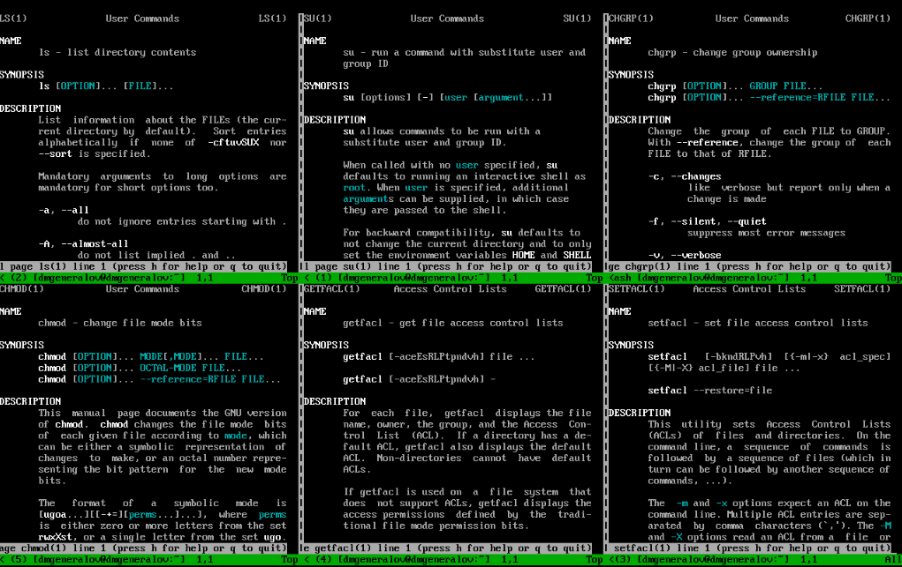
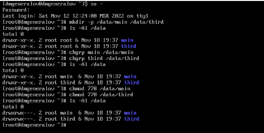
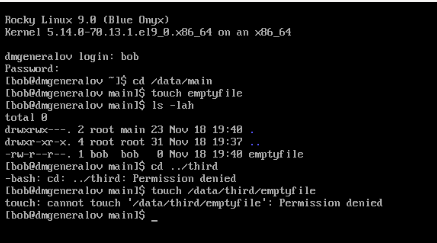
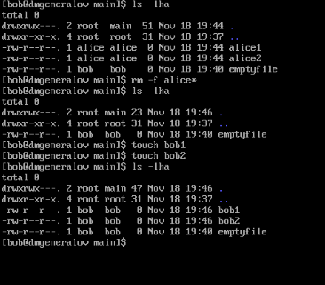
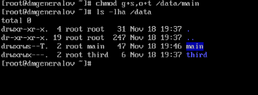
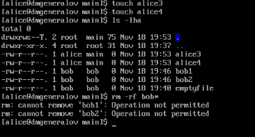
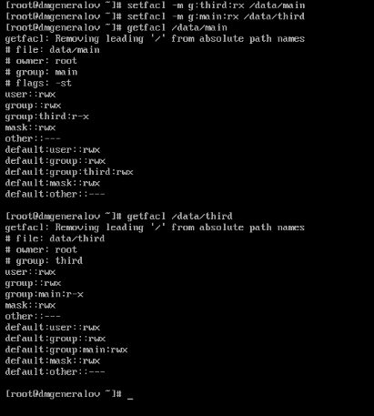
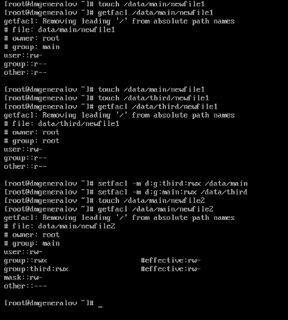
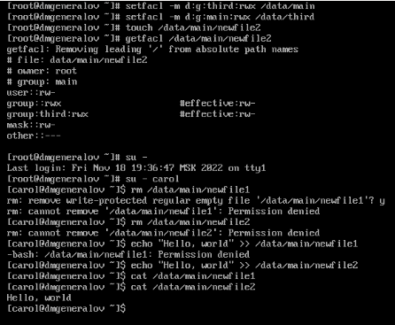

---
## Front matter
lang: ru-RU
title: Лабораторная работа 3
author: |
  Генералов Даниил, НПИбд-01-21, 1032202280
institute: |
	\inst{1}RUDN University, Moscow, Russian Federation
date: 2022

## Formatting
toc: false
slide_level: 2
theme: metropolis
header-includes: 
 - \metroset{progressbar=frametitle,sectionpage=progressbar,numbering=fraction}
 - '\makeatletter'
 - '\beamer@ignorenonframefalse'
 - '\makeatother'
aspectratio: 43
section-titles: true
---

# Задача

> 1. Прочитайте справочное описание man по командам ls, su, chgrp, chmod,
> getfacl, setfacl.
> 2. Выполните действия по управлению базовыми разрешениями для групп пользо-
> вателей (раздел 3.3.1).
> 3. Выполните действия по управлению специальными разрешениями для групп
> пользователей (раздел 3.3.2).
> 4. Выполните действия по управлению расширенными разрешениями с использова-
> нием списков ACL для групп пользователей (раздел 3.3.3).

# Выполнение 

## man-страницы

## Смена группы для директории

## Проверка доступа к директориям

## Удаление чужих файлов

## Задание sticky bit

## Проверка sticky bit

## Установка ACL для директории

## Установка ACL по умолчанию

## Проверка ACL

## Вывод

Я получил опыт работы с разрешениями файлов и директорий в Linux.
