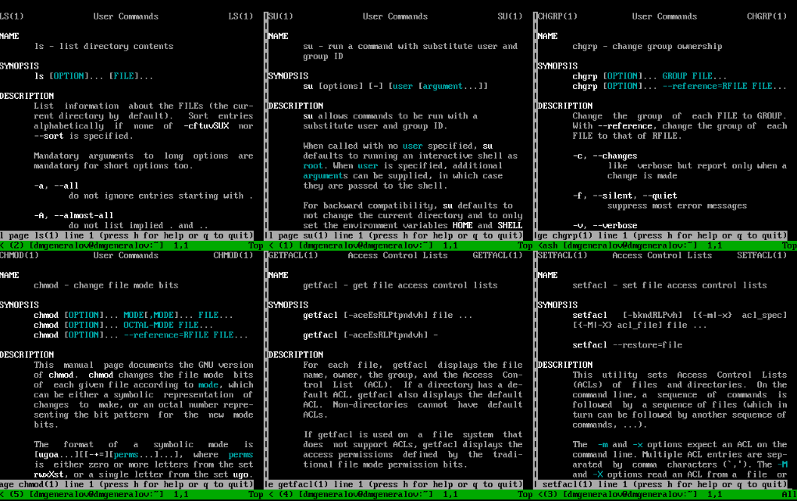

---
## Front matter
title: "Отчет по лабораторной работе 3"
subtitle: ""
author: "Генералов Даниил, НПИбд-01-21, 1032202280"

## Generic otions
lang: ru-RU
toc-title: "Содержание"


## Pdf output format
toc: true # Table of contents
toc-depth: 2
lof: true # List of figures
lot: true # List of tables
fontsize: 12pt
linestretch: 1.5
papersize: a4
documentclass: scrreprt
## I18n polyglossia
polyglossia-lang:
  name: russian
  options:
	- spelling=modern
	- babelshorthands=true
polyglossia-otherlangs:
  name: english
## I18n babel
babel-lang: russian
babel-otherlangs: english
## Fonts
mainfont: PT Serif
romanfont: PT Serif
sansfont: PT Sans
monofont: PT Mono
mainfontoptions: Ligatures=TeX
romanfontoptions: Ligatures=TeX
sansfontoptions: Ligatures=TeX,Scale=MatchLowercase
monofontoptions: Scale=MatchLowercase,Scale=0.9
## Biblatex
biblatex: true
biblio-style: "gost-numeric"
biblatexoptions:
  - parentracker=true
  - backend=biber
  - hyperref=auto
  - language=auto
  - autolang=other*
  - citestyle=gost-numeric
## Pandoc-crossref LaTeX customization
figureTitle: "Рис."
tableTitle: "Таблица"
listingTitle: "Листинг"
lofTitle: "Список иллюстраций"
lotTitle: "Список таблиц"
lolTitle: "Листинги"
## Misc options
indent: true
header-includes:
  - \usepackage{indentfirst}
  - \usepackage{float} # keep figures where there are in the text
  - \floatplacement{figure}{H} # keep figures where there are in the text
---

# Цель работы

В рамках этой лабораторной работы требуется выполнить действия по управлению правами доступа к файлам и папкам.

# Задание

> 1. Прочитайте справочное описание man по командам ls, su, chgrp, chmod,
> getfacl, setfacl.
> 2. Выполните действия по управлению базовыми разрешениями для групп пользо-
> вателей (раздел 3.3.1).
> 3. Выполните действия по управлению специальными разрешениями для групп
> пользователей (раздел 3.3.2).
> 4. Выполните действия по управлению расширенными разрешениями с использова-
> нием списков ACL для групп пользователей (раздел 3.3.3).

# Выполнение лабораторной работы

Сначала я открыл man-страницы по всем командам, которые были указаны в задании.
Это можно увидеть на скриншоте ниже.



После этого я создал папки /data/main и /data/third, владельцем которых по умолчанию стал root.
Затем мы сменили их группы: /data/main теперь стал принадлежать группе main, а /data/third - группе third.
Наконец, я добавил группе все разрешения на эти папки, а остальным пользователям -- никаких.


После этого я осуществил вход под пользователем bob, который принадлежит к группе main.
Из-за этого я смог зайти в директорию /data/main и создать в ней файл, принадлежащий bob и main.
Аналогично, я не смог зайти в директорию /data/third или создать в ней файл, так как bob не принадлежит к группе third.


После этого мы открываем еще один терминал под пользователем alice, и создаем файлы alice1 и alice2 в директории /data/main.


После этого мы снова входим под пользователем bob, и видим, что эти файлы можно удалить, так как bob принадлежит к группе main и поэтому имеет права редактирования этой директории.


Теперь мы под пользователем root задаем sticky-бит, что запрещает удаление файлов, если они не принадлежат пользователю, который их удаляет. Мы также устанавливаем setgid-бит, из-за которого новые файлы в директории будут принадлежать группе, к которой принадлежит директория, а не группе пользователя, который создал файл.


Теперь мы создаем файлы alice3 и alice4 в директории /data/main, и видим, что они принадлежат группе main, а не alice.
Файлы bob1 и bob2 также нельзя удалить, потому что они не принадлежат alice.


После этого мы выполняем более тонкую настройку прав доступа к файлам и директориям с помощью команды `setfacl`.
В частности, мы добавляем возможность группе main читать файлы в директории /data/third, а группе third читать файлы в директории /data/main.
Проверив разрешения, мы видим, что обе директории имеют полные права доступа для пользователя root и своей группы, а также права rx для другой группы.

Затем мы создали два файла, /data/main/newfile1 и /data/third/newfile1.
Файл в third принадлежит root:root, потому что эта директория не имеет setgid-бита, а файл в main принадлежит root:main, потому что эта директория имеет setgid-бит.
Помимо этого, файлы по умолчанию доступны для чтения и записи своему пользователю, и для чтения всем остальным.


Наконец, мы пробуем удалить, а затем записать в файлы newfile1 и newfile2 от имени пользователя carol.
Файл newfile1 не получается удалить или записать, потому что он принадлежит root:root и доступен только для чтения.
Файл newfile2 не получается удалить, потому что он находится в директории с установленным sticky-битом, и пользователь carol не является владельцем файла, но он может записать в него, потому что для группы third установлены права на запись с помощью setfacl.


# Выводы

Я получил опыт работы с разрешениями файлов и директорий в Linux.


# Контрольные вопросы
1. Как следует использовать команду chown, чтобы установить владельца группы
для файла? Приведите пример.

Можно передать название группы после символа `:`, как показано на скриншоте.


2. С помощью какой команды можно найти все файлы, принадлежащие конкретному
пользователю? Приведите пример.

`find / -user <username>`


3. Как применить разрешения на чтение, запись и выполнение для всех файлов
в каталоге /data для пользователей и владельцев групп, не устанавливая никаких
прав для других? Приведите пример.

`chmod -R 770 /data`


4. Какая команда позволяет добавить разрешение на выполнение для файла, который
необходимо сделать исполняемым?

`chmod +x <filename>`


5. Какая команда позволяет убедиться, что групповые разрешения для всех новых
файлов, создаваемых в каталоге, будут присвоены владельцу группы этого катало-
га? Приведите пример.

`chmod g+s <directory>`


6. Необходимо, чтобы пользователи могли удалять только те файлы, владельцами
которых они являются, или которые находятся в каталоге, владельцами которого
они являются. С помощью какой команды можно это сделать? Приведите пример.

`chmod o+t <directory>`


7. Какая команда добавляет ACL, который предоставляет членам группы права
доступа на чтение для всех существующих файлов в текущем каталоге?

```
setfacl -m g:groupname:rx <directory>
setfacl -m g:groupname:r <directory>/*
```


8. Что нужно сделать для гарантии того, что члены группы получат разрешения на
чтение для всех файлов в текущем каталоге и во всех его подкаталогах, а также
для всех файлов, которые будут созданы в этом каталоге в будущем? Приведите
пример.

```
setfacl -dm g:groupname:rx <directory>
```


9. Какое значение umask нужно установить, чтобы «другие» пользователи не полу-
чали какие-либо разрешения на новые файлы? Приведите пример.

`umask 007`


10. Какая команда гарантирует, что никто не сможет удалить файл myfile случайно?

`chattr +i myfile`

