---
## Front matter
lang: ru-RU
title: Лабораторная работа 4
author: |
  Генералов Даниил, НПИбд-01-21, 1032202280
institute: |
	\inst{1}RUDN University, Moscow, Russian Federation
date: 2022

## Formatting
toc: false
slide_level: 2
theme: metropolis
header-includes: 
 - \metroset{progressbar=frametitle,sectionpage=progressbar,numbering=fraction}
 - '\makeatletter'
 - '\beamer@ignorenonframefalse'
 - '\makeatother'
aspectratio: 43
section-titles: true
---

# Задача

> 1. Изучите, как и в каких файлах подключаются репозитории для установки про-
> граммного обеспечения; изучите основные возможности (поиск, установка,
> обновление, удаление пакета, работа с историей действий) команды dnf (см.
> раздел 4.4.1).
> 2. Изучите и повторите процесс установки/удаления определённого пакета с исполь-
> зованием возможностей dnf (см. раздел 4.4.1).
> 3. Изучите и повторите процесс установки/удаления определённого пакета с исполь-
> зованием возможностей rpm (см. раздел 4.4.2).

# Выполнение 

## Список репозиториев

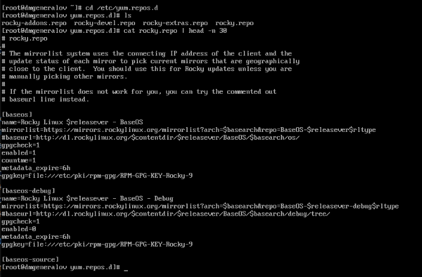

## Список репозиториев

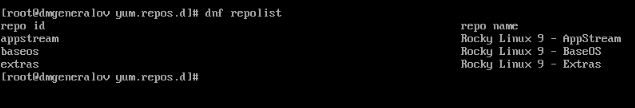

## Пакеты с "user"

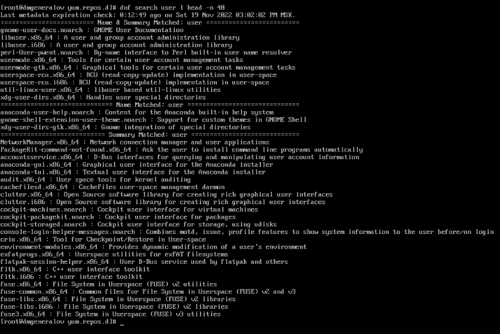

## Пакеты nmap

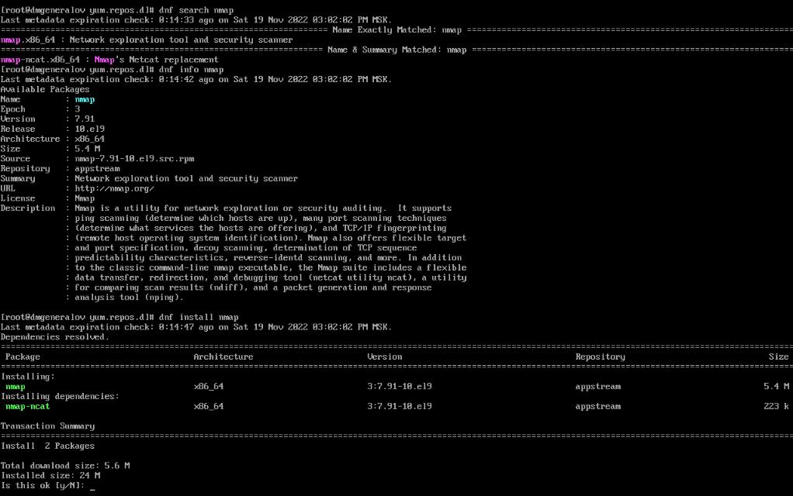

## Удаление пакетов

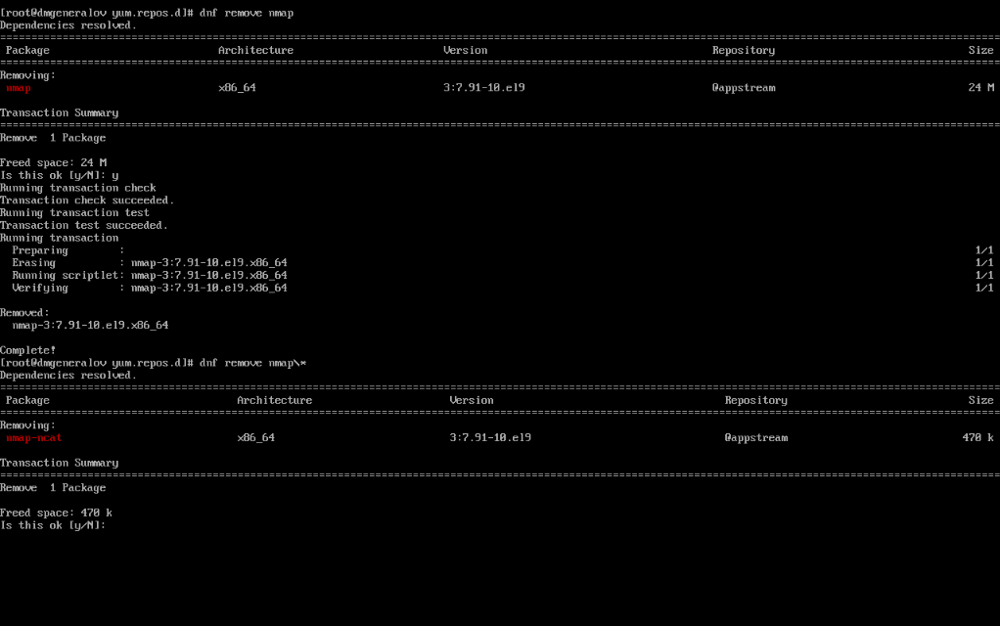

# Группы пакетов

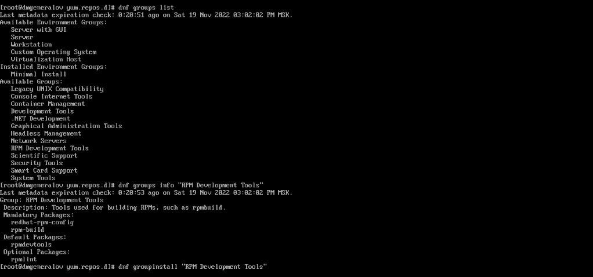

## Удаление группы

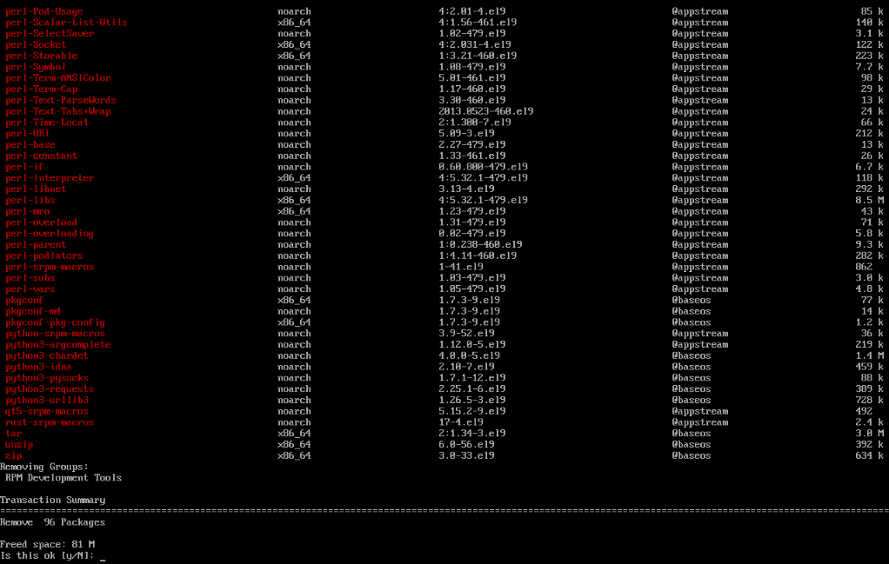

## Отмена действия dnf

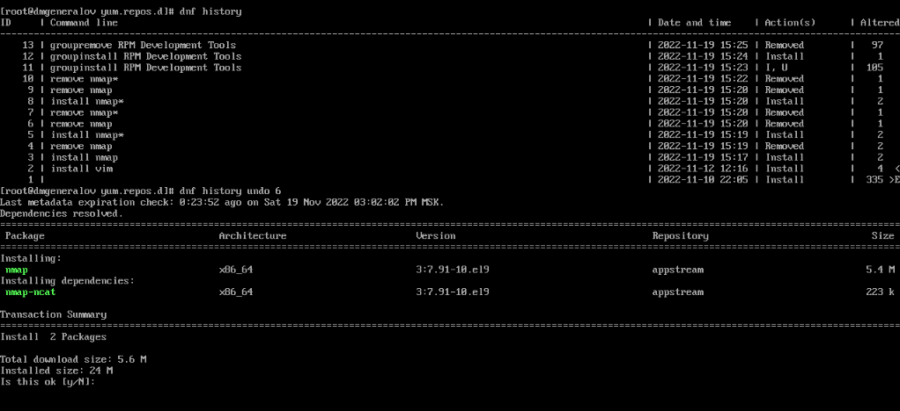

## Установка пакета с помощью rpm

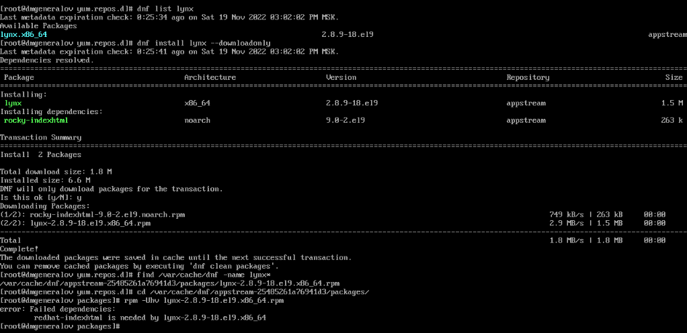

## Информация о пакете

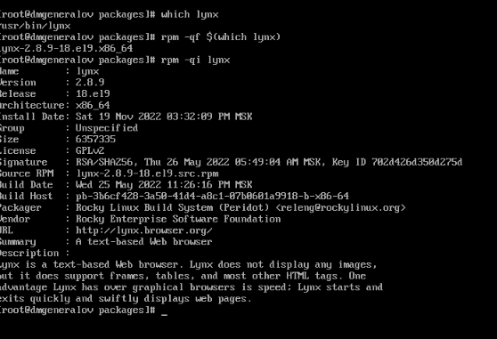

## Файлы пакета

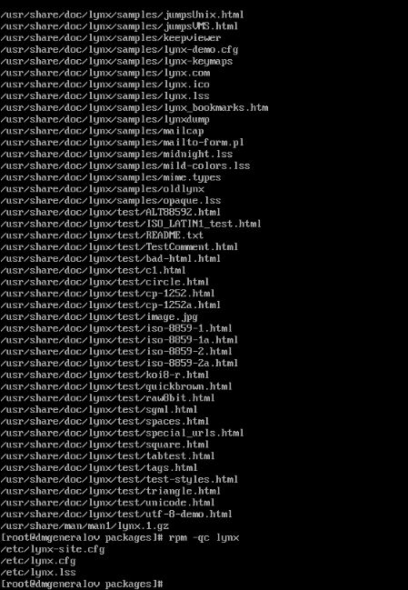

## Скрипты пакета

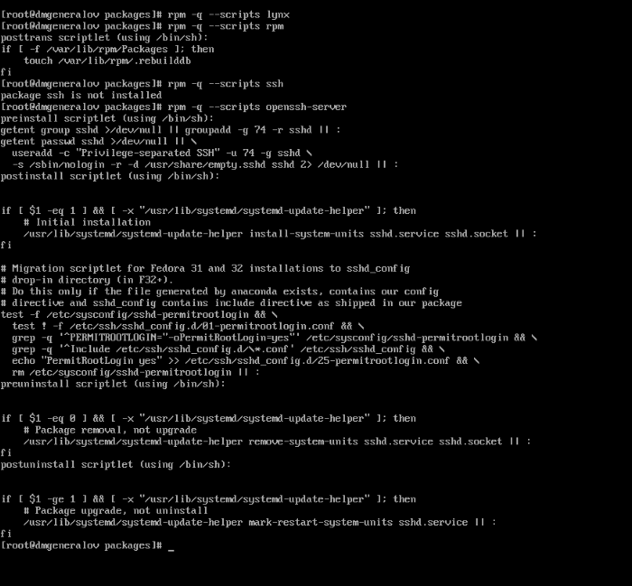

## lynx

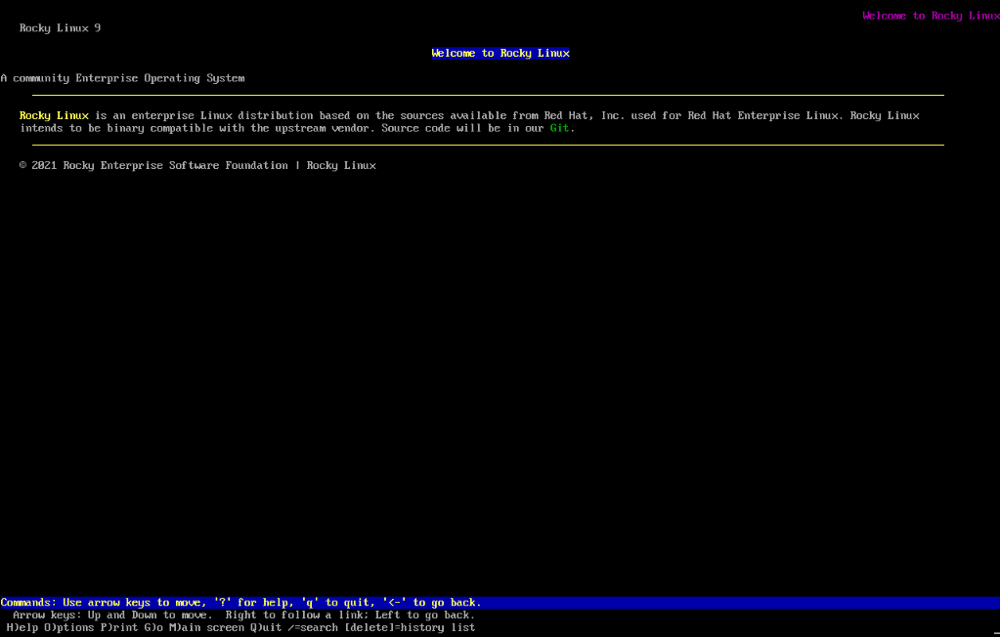

## Информация о пакете dnsmasq

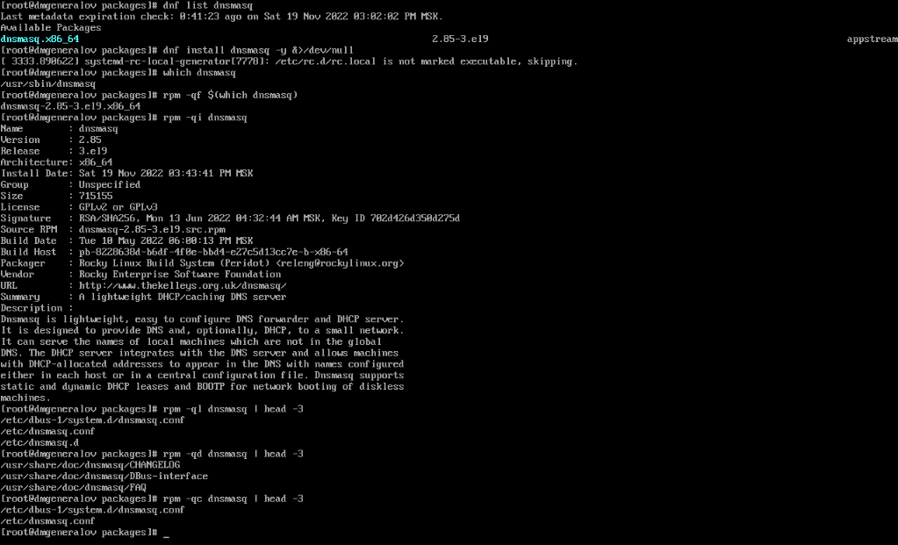

## Скрипты пакета dnsmasq

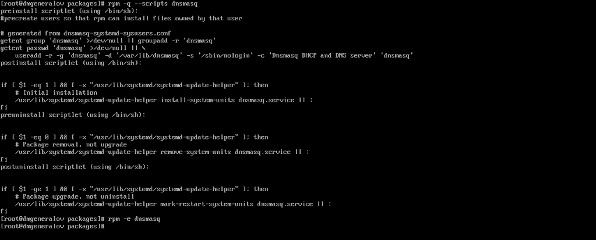

## Вывод

Я получил опыт работы с пакетами в RPM-основанных дистрибутивах Linux.
