---
## Front matter
title: "Отчет по лабораторной работе 4"
subtitle: ""
author: "Генералов Даниил, НПИбд-01-21, 1032202280"

## Generic otions
lang: ru-RU
toc-title: "Содержание"

## Pdf output format
toc: true # Table of contents
toc-depth: 2
lof: true # List of figures
lot: true # List of tables
fontsize: 12pt
linestretch: 1.5
papersize: a4
documentclass: scrreprt
## I18n polyglossia
polyglossia-lang:
  name: russian
  options:
	- spelling=modern
	- babelshorthands=true
polyglossia-otherlangs:
  name: english
## I18n babel
babel-lang: russian
babel-otherlangs: english
## Fonts
mainfont: PT Serif
romanfont: PT Serif
sansfont: PT Sans
monofont: PT Mono
mainfontoptions: Ligatures=TeX
romanfontoptions: Ligatures=TeX
sansfontoptions: Ligatures=TeX,Scale=MatchLowercase
monofontoptions: Scale=MatchLowercase,Scale=0.9
## Biblatex
biblatex: true
biblio-style: "gost-numeric"
biblatexoptions:
  - parentracker=true
  - backend=biber
  - hyperref=auto
  - language=auto
  - autolang=other*
  - citestyle=gost-numeric
## Pandoc-crossref LaTeX customization
figureTitle: "Рис."
tableTitle: "Таблица"
listingTitle: "Листинг"
lofTitle: "Список иллюстраций"
lotTitle: "Список таблиц"
lolTitle: "Листинги"
## Misc options
indent: true
header-includes:
  - \usepackage{indentfirst}
  - \usepackage{float} # keep figures where there are in the text
  - \floatplacement{figure}{H} # keep figures where there are in the text
---

# Цель работы

В рамках этой лабораторной работы требуется выполнить операции по управлению пакетами с помощью пакетного менеджера `dnf` и `rpm`.

# Задание

> 1. Изучите, как и в каких файлах подключаются репозитории для установки про-
> граммного обеспечения; изучите основные возможности (поиск, установка,
> обновление, удаление пакета, работа с историей действий) команды dnf (см.
> раздел 4.4.1).
> 2. Изучите и повторите процесс установки/удаления определённого пакета с исполь-
> зованием возможностей dnf (см. раздел 4.4.1).
> 3. Изучите и повторите процесс установки/удаления определённого пакета с исполь-
> зованием возможностей rpm (см. раздел 4.4.2).

# Выполнение лабораторной работы

Сначала я рассмотрел содержимое файлов .repo в директории `/etc/yum.repos.d/`.
Эти файлы описывают репозитории, которые можно использовать для установки пакетов.
В них указана ссылка на список зеркал каждого репозитория, а также GPG-ключи для проверки подлинности пакетов.

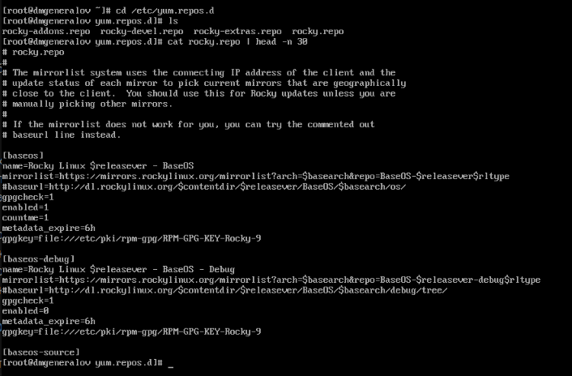

После этого я посмотрел на список репозиториев, про которые знает dnf: appstream, baseos и extras.
В них содержатся разные категории пакетов -- в baseos, например, находятся пакеты, которые обязательны для работы системы,
вроде обновлений ядра, загрузчика или systemd.

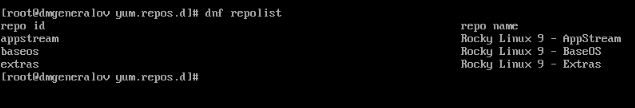

Затем я посмотрел на пакеты, в названии или описании которых есть слово "user".
Совпадения группируются по близости схождения -- отдельно те, которые имеют слово в названии и описании,
и отдельно те которые имеют слово только в названии или только в описании.

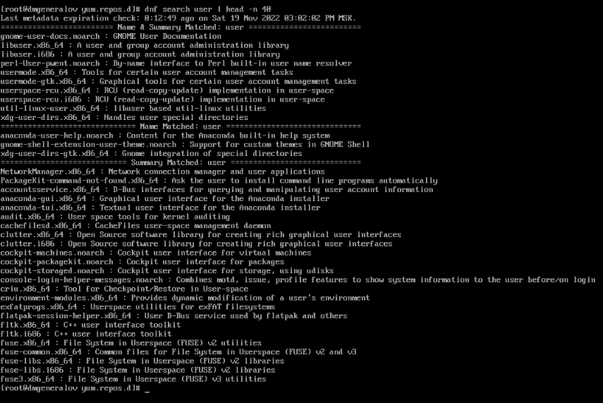

Теперь мы устанавливаем пакет `nmap`, а также все пакеты, чье название начинается на `nmap`.
Нас предупреждают, что установка займет 24МБ дискового пространства.

Установка с помощью `dnf install nmap\*` устанавливает все пакеты, соответствующие маске: все те, имя которых начинается на `nmap`. Аналогично, удаление `nmap` удалит только один этот пакет, а удаление `nmap\*` удалит все пакеты, соответствующие маске (в нашем случае такой пакет еще один: `nmap-ncat`).

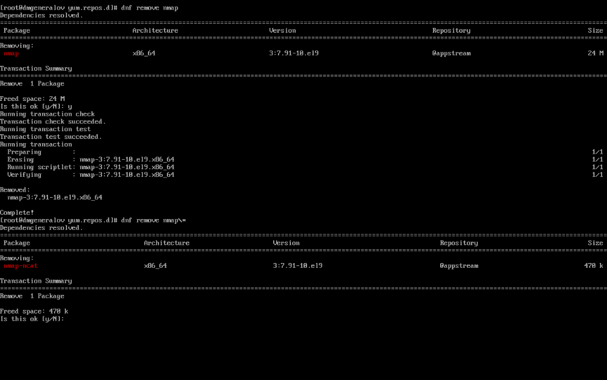

С помощью `dnf` можно также установить группу пакетов, которые связаны между собой, например все пакеты для работы с RPM-пакетами.

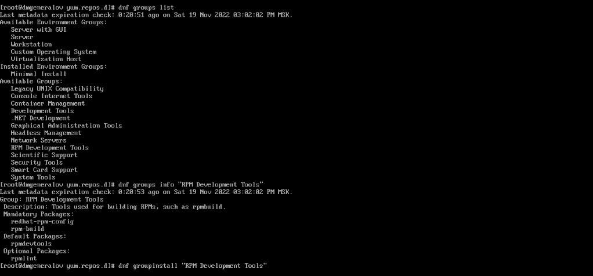

Эти группы также можно удалять.

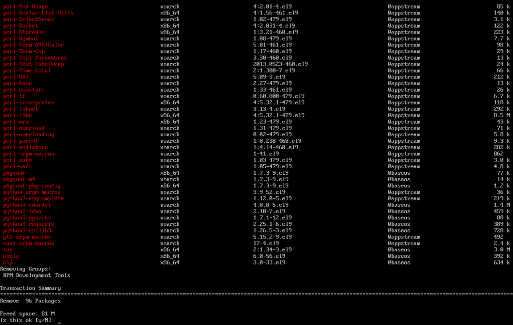

В системе хранится история изменения пакетов, которую можно просмотреть, и также можно отменить определенные операции из истории.

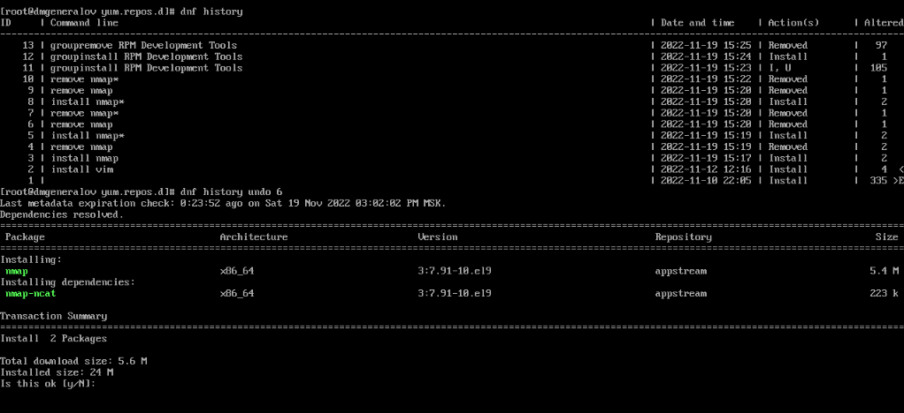

Программа dnf является интерфейсом для взаимодействия с программой rpm, которая устанавливает и удаляет пакеты.
Можно использовать rpm вручную, если есть RPM-файлы.
Однако она не разрешает зависимости; это нужно делать вручную.
Так, мы не можем установить `lynx`, потому что он зависит от `redhat-indexhtml`, которого нет в системе.

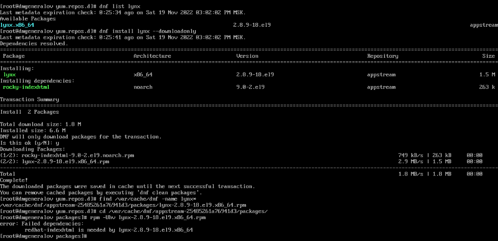

Команда rpm также позволяет определить, к какому пакету относится файл, и наоборот, какие файлы входят в пакет, а также детальную информацию о пакете.

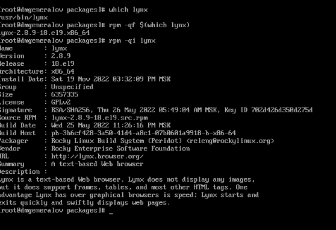

Помимо этого rpm знает про то, где находятся отдельные категории файлов, например файлы документации или файлы настроек.

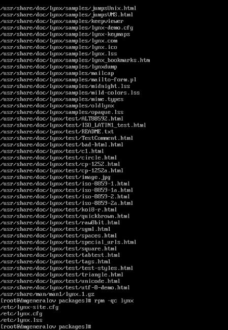

RPM-пакеты содержат две важные части: файлы пакета, которые копируются в файловую систему или удаляются из нее, и скрипты, которые выполняются при установке или удалении пакета.
Например, для пакета `lynx` нет скриптов, для пакета `rpm` есть один скрипт, а для пакета `openssh-server` есть несколько скриптов.
Эти скрипты могут выполнять начальную настройку, или добавлять/удалять записи в конфигурационных файлах, которые ссылаются на пакет, который устанавливают или удаляют.

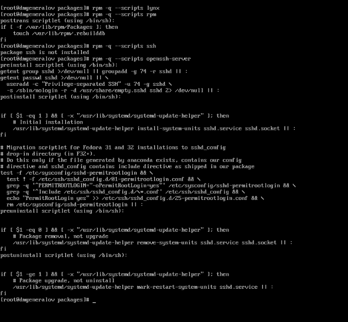

Поскольку мы успешно установили пакет `lynx`, то теперь мы можем использовать эту программу.

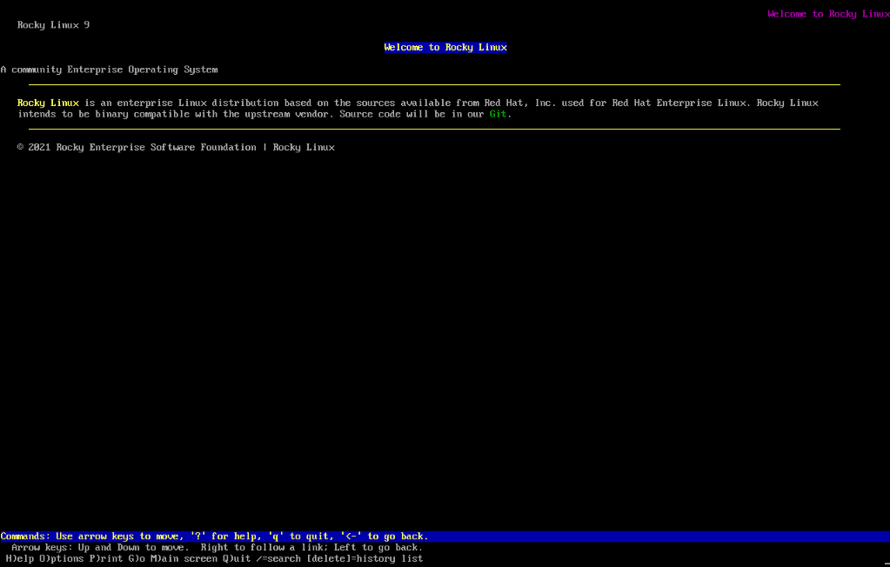

Теперь мы устанавливаем и проверяем файлы для `dnsmasq`.

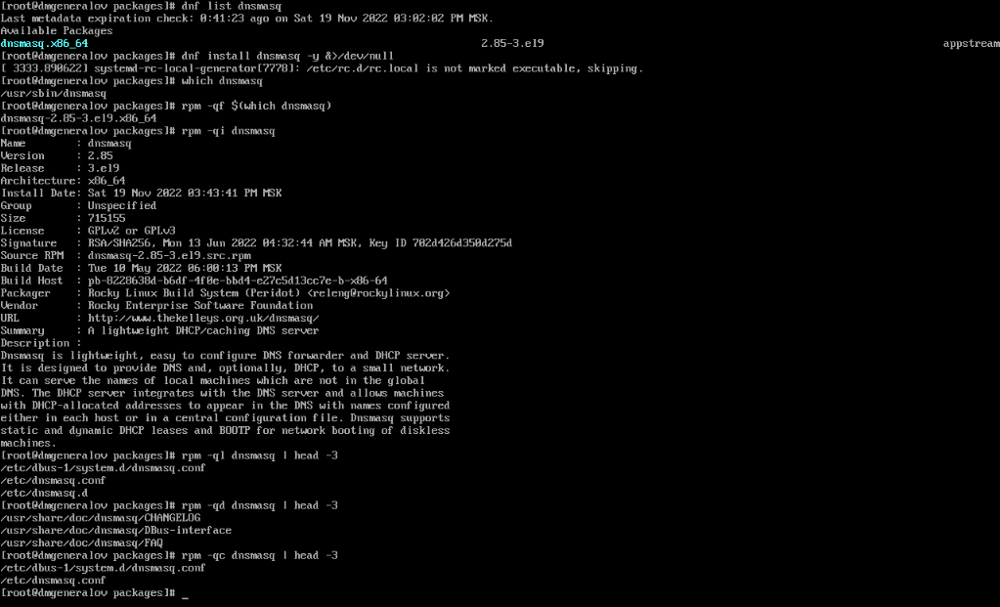

Вместе с `dnsmasq` идут скрипты: перед установкой создается пользователь для dnsmasq, а после установки и удаления systemd информируется об изменении в списке запускаемых служб.

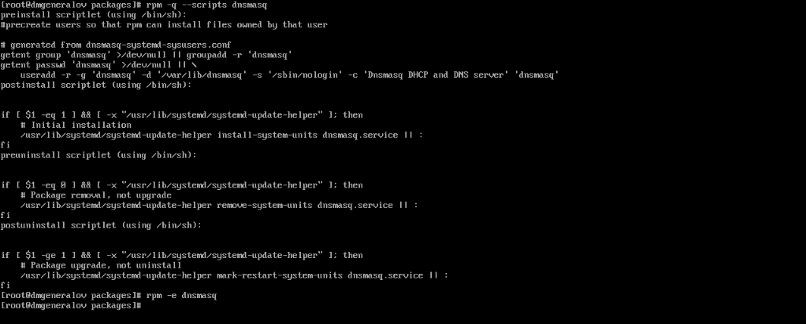

# Выводы

Я получил опыт работы с пакетами в RPM-основанных дистрибутивах Linux.

# Контрольные вопросы
1. Какая команда позволяет вам искать пакет rpm, содержащий файл useradd?

`rpm -qf /usr/sbin/useradd`

2. Какие команды вам нужно использовать, чтобы показать имя группы dnf, которая
содержит инструменты безопасности и показывает, что находится в этой группе?

`dnf group info "Security Tools"`

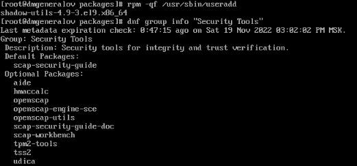

3. Какая команда позволяет вам установить rpm, который вы загрузили из Интернета
и который не находится в репозиториях?

`rpm -i /path/to/rpm/file`

4. Вы хотите убедиться, что пакет rpm, который вы загрузили, не содержит никакого
опасного кода сценария. Какая команда позволяет это сделать?

`rpm -Vp /path/to/rpm/file`

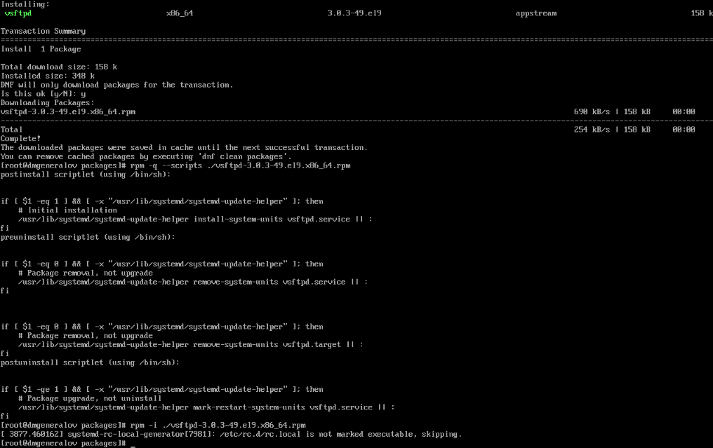

5. Какая команда показывает всю документацию в rpm?

`rpm -qd rpm`

6. Какая команда показывает, какому пакету rpm принадлежит файл?

`rpm -qf /path/to/file`

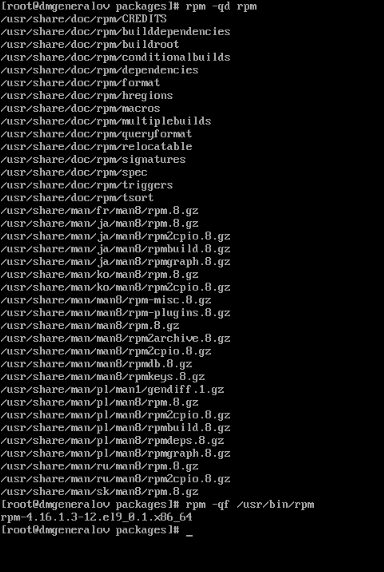
