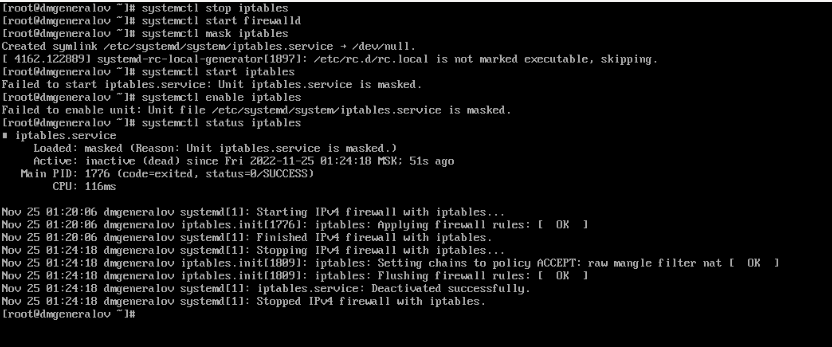

---
## Front matter
lang: ru-RU
title: Лабораторная работа 5
author: |
  Генералов Даниил, НПИбд-01-21, 1032202280
institute: |
	\inst{1}RUDN University, Moscow, Russian Federation
date: 2022

## Formatting
toc: false
slide_level: 2
theme: metropolis
header-includes: 
 - \metroset{progressbar=frametitle,sectionpage=progressbar,numbering=fraction}
 - '\makeatletter'
 - '\beamer@ignorenonframefalse'
 - '\makeatother'
aspectratio: 43
section-titles: true
---

# Задача

> 1. Выполните основные операции по запуску (останову), определению статуса,
> добавлению (удалению) в автозапуск и пр. службы Very Secure FTP (раздел 5.4.1).
> 2. Продемонстрируйте навыки по разрешению конфликтов юнитов для служб
> firewalld и iptables (раздел 5.4.2).
> 3. Продемонстрируйте навыки работы с изолированными целями (разделы 5.4.3,
> 5.4.4).

# Выполнение 

## Запуск, включение и отключение службы 

## multi-user.target.wants

## list-dependencies

## list-dependencies

## dnf install iptables

## Конфликт с firewalld

## firewalld.service

## systemctl mask

## AllowIsolate

## systemctl isolate

## Вывод

Я получил опыт работы с `systemd` и научился управлять сервисами.
