---
## Front matter
title: "Отчет по лабораторной работе 5"
subtitle: ""
author: "Генералов Даниил, НПИбд-01-21, 1032202280"

## Generic otions
lang: ru-RU
toc-title: "Содержание"


## Pdf output format
toc: true # Table of contents
toc-depth: 2
lof: true # List of figures
lot: true # List of tables
fontsize: 12pt
linestretch: 1.5
papersize: a4
documentclass: scrreprt
## I18n polyglossia
polyglossia-lang:
  name: russian
  options:
	- spelling=modern
	- babelshorthands=true
polyglossia-otherlangs:
  name: english
## I18n babel
babel-lang: russian
babel-otherlangs: english
## Fonts
mainfont: PT Serif
romanfont: PT Serif
sansfont: PT Sans
monofont: PT Mono
mainfontoptions: Ligatures=TeX
romanfontoptions: Ligatures=TeX
sansfontoptions: Ligatures=TeX,Scale=MatchLowercase
monofontoptions: Scale=MatchLowercase,Scale=0.9
## Biblatex
biblatex: true
biblio-style: "gost-numeric"
biblatexoptions:
  - parentracker=true
  - backend=biber
  - hyperref=auto
  - language=auto
  - autolang=other*
  - citestyle=gost-numeric
## Pandoc-crossref LaTeX customization
figureTitle: "Рис."
tableTitle: "Таблица"
listingTitle: "Листинг"
lofTitle: "Список иллюстраций"
lotTitle: "Список таблиц"
lolTitle: "Листинги"
## Misc options
indent: true
header-includes:
  - \usepackage{indentfirst}
  - \usepackage{float} # keep figures where there are in the text
  - \floatplacement{figure}{H} # keep figures where there are in the text
---

# Цель работы

В рамках этой лабораторной работы требуется выполнить операции по управлению сервисами `systemd`.


# Задание

> 1. Выполните основные операции по запуску (останову), определению статуса,
> добавлению (удалению) в автозапуск и пр. службы Very Secure FTP (раздел 5.4.1).
> 2. Продемонстрируйте навыки по разрешению конфликтов юнитов для служб
> firewalld и iptables (раздел 5.4.2).
> 3. Продемонстрируйте навыки работы с изолированными целями (разделы 5.4.3,
> 5.4.4).

# Выполнение лабораторной работы

Сначала мы проверяем состояние юнита `vsftpd.service`.
Он не запущен, но присутствует -- это потому, что с предыдущей лабораторной работы он был установлен.
Чтобы запустить его, нам нужно выполнить команду `systemctl start vsftpd.service`.
Затем можно добавить или убрать его из автозапуска с помощью команд `systemctl enable vsftpd.service` и `systemctl disable vsftpd.service` соответственно.

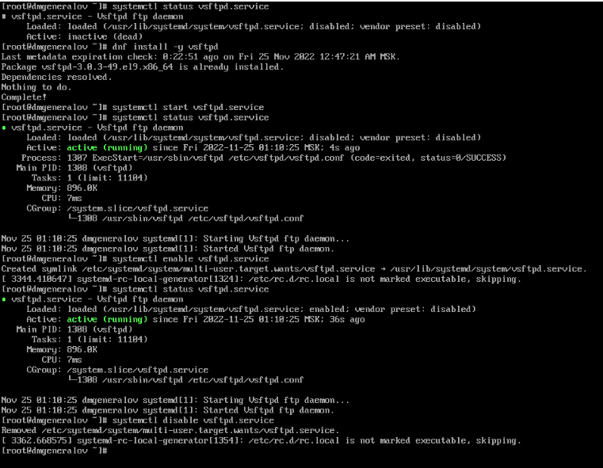

Команды `systemctl enable`/`disable` добавляют/убирают юнит из `/etc/systemd/system/multi-user.target.wants/`.

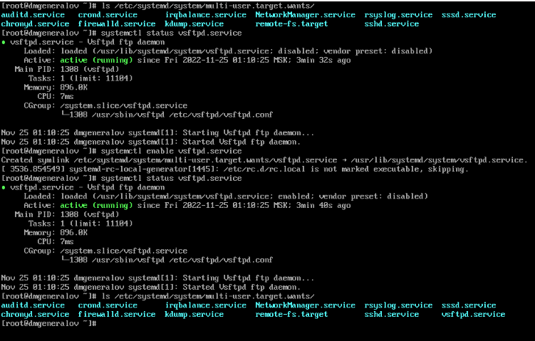

С помощью команды `systemctl list-dependencies` можно посмотреть, от каких юнитов зависит данный, и от каких зависят его зависимости.

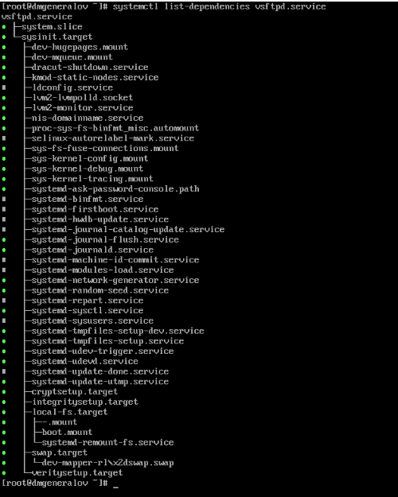

Также можно увидеть, какие юниты зависят от данного -- если служба включена, то `multi-user.target` зависит от неё.

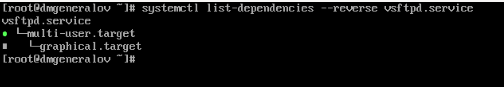

Некоторые юниты обозначены как конфликтующие, например, `firewalld.service` и `iptables.service`.
Чтобы увидеть это, сначала мы устанавливаем все `iptables`.

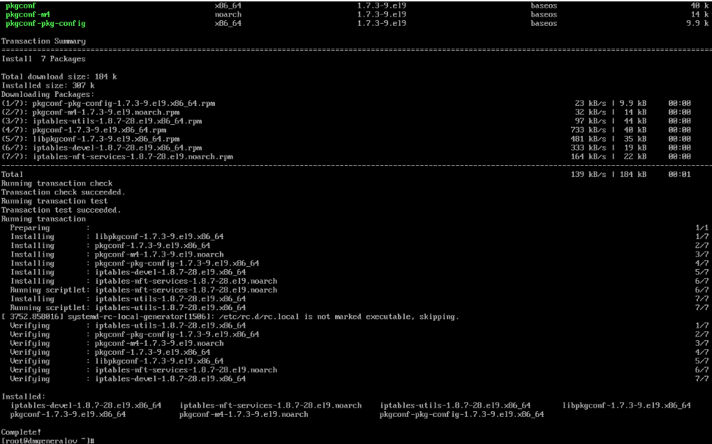

Затем мы проверяем статус `firewalld` и `iptables`, и пробуем их запустить.
Сначала `firewalld` был запущен, но при попытке запустить `iptables` он остановился, а `iptables` запустился.

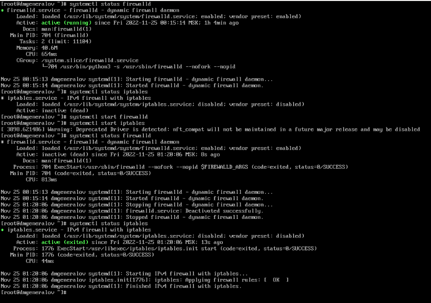

Если посмотреть в файлы этих двух юнитов, то видно, что `firewalld` обозначает, что он конфликтует с `iptables`.
Наоборот, `iptables` не содержит информации, что он конфликтует с `firewalld`.
Эта запись в файле `firewalld` означает, что `firewalld` просит `systemd` остановить себя, если `iptables` запущен.

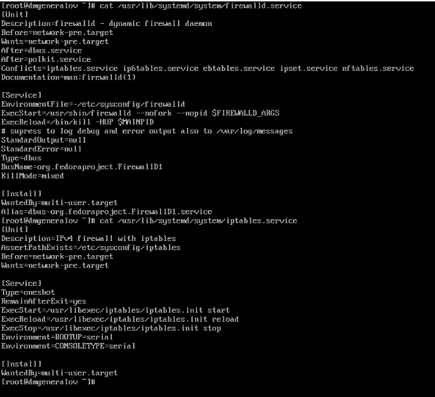

Чтобы какой-то юнит нельзя было запустить, можно его замаскировать.
Это можно сделать с помощью команды `systemctl mask`.
Тогда при попытке запустить этот юнит или добавить его в автозапуск, будет выдана ошибка.

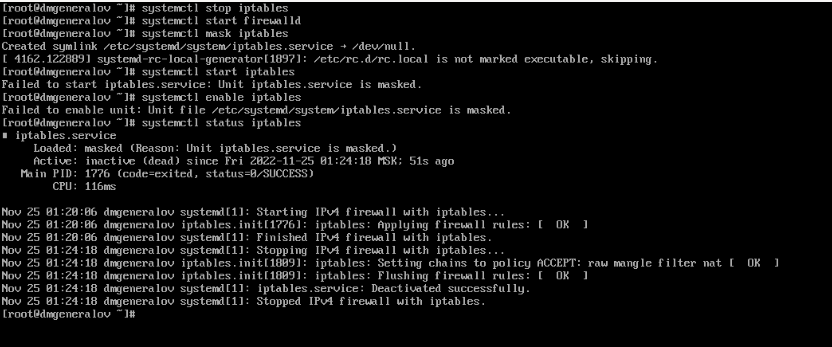

Некоторые юниты отмечены как изолируемые -- такие юниты называются целями.
Например, цель по умолчанию -- `multi-user.target` -- запускает множество служб, которые нужны для работы системы в обычном режиме.
Цель `graphical.target` запускает множество служб, которые нужны для работы системы в графическом режиме.
Цель `reboot.target` запускает множество служб, которые нужны для перезагрузки системы -- на практике это значит, что большинство служб, находящихся в `multi-user.target`, останавливаются.
Каждая цель имеет запись `AllowIsolate=yes`.

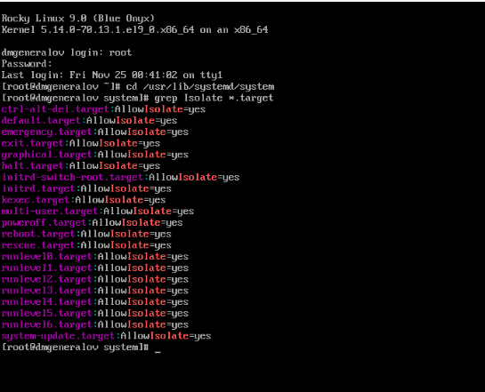

Если изолировать цель `rescue.target`, то можно перейти в режим восстановления.
Если изолировать цель `reboot.target`, то можно перезагрузить систему.

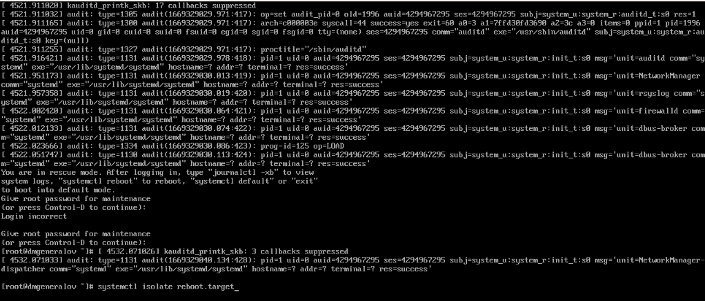

Существует цель по умолчанию, которая запускается при обычной загрузке системы.
Например, в графических системах по умолчанию запускается цель `graphical.target`.
Если графический интерфейс не нужен, то используется цель `multi-user.target`.
Переключение между целями можно сделать с помощью команды `systemctl set-default`.
(К сожалению, я не могу показать это на практике, так как на моей установке нет графического интерфейса.)


# Выводы

Я получил опыт работы с `systemd` и научился управлять сервисами.


# Контрольные вопросы
1. Что такое юнит (unit)? Приведите примеры.

Юнит -- это сущность, которой управляет `systemd`.
Один из самых часто используемых видов юнитов -- это сервисы; они описывают фоновые процессы, которые должны работать в системе.
В этой работе мы также затронули цели, которые описывают группы сервисов, которые должны работать вместе.
Помимо этого существуют юниты, описывающие устройства, сетевые интерфейсы, сокеты, таймеры и многое другое.

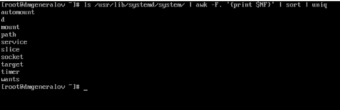

2. Какая команда позволяет вам убедиться, что цель больше не входит в список
автоматического запуска при загрузке системы?

`systemctl list-dependencies --reverse service.service | grep $(systemctl get-default)`

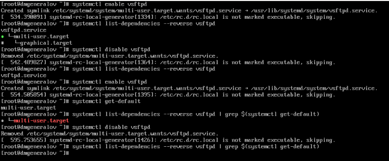

3. Какую команду вы должны использовать для отображения всех сервисных юнитов,
которые в настоящее время загружены?

Если "загружены" имеется в виду "запущены", то `systemctl list-units --type=service`, иначе `systemctl list-units --all --type=service`.

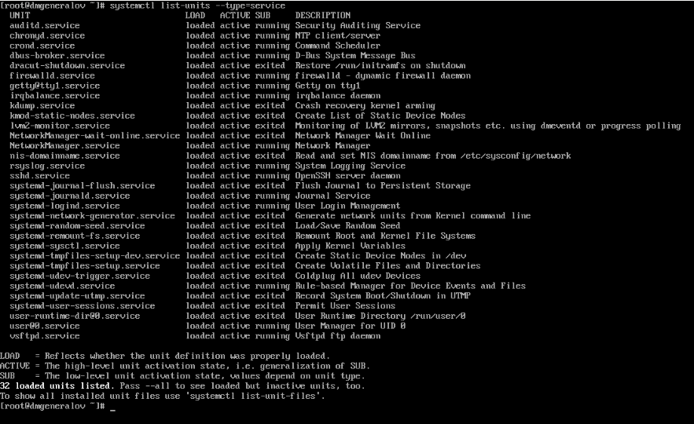

4. Как создать потребность (wants) в сервисе?

Чтобы цель требовала сервиса, когда сервис включен (с помощью `systemctl enable`), в файле юнита должна быть секция `[Install]` с ключом `WantedBy`.

```toml
[Unit]
Description=OpenSSH Daemon
Wants=sshdgenkeys.service
After=sshdgenkeys.service
After=network.target

[Service]
ExecStart=/usr/bin/sshd -D
ExecReload=/bin/kill -HUP $MAINPID
KillMode=process
Restart=always

[Install]
WantedBy=multi-user.target
```

Чтобы цель требовала сервиса, это также можно указать внутри цели с помощью ключа `Requires` (или `Wants`, если этот юнит не обязателен)

```toml
[Unit]
Description=Graphical Interface
Documentation=man:systemd.special(7)
Requires=multi-user.target
Wants=display-manager.service
Conflicts=rescue.service rescue.target
After=multi-user.target rescue.service rescue.target display-manager.service
AllowIsolate=yes
```

5. Как переключить текущее состояние на цель восстановления (rescue target)?

`systemctl isolate rescue.target`


6. Поясните причину получения сообщения о том, что цель не может быть изолиро-
вана.

Некоторые юниты не могут быть изолированы, потому что они не имеют ключа `AllowIsolate=yes` в секции `[Unit]`.
Это нужно задавать явно, чтобы нельзя было оказаться в ситуации, когда система исполняет только одну службу или только один сокет, и не делает ничего другого.

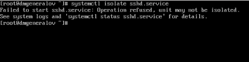

7. Вы хотите отключить службу systemd, но, прежде чем сделать это, вы хоти-
те узнать, какие другие юниты зависят от этой службы. Какую команду вы бы
использовали?

`systemctl list-dependencies --reverse service.service`

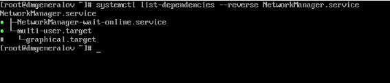