---
## Front matter
lang: ru-RU
title: Лабораторная работа 6
author: |
  Генералов Даниил, НПИбд-01-21, 1032202280
institute: |
	\inst{1}RUDN University, Moscow, Russian Federation
date: 2022

## Formatting
toc: false
slide_level: 2
theme: metropolis
header-includes: 
 - \metroset{progressbar=frametitle,sectionpage=progressbar,numbering=fraction}
 - '\makeatletter'
 - '\beamer@ignorenonframefalse'
 - '\makeatother'
aspectratio: 43
section-titles: true
---

# Задача

> 1. Продемонстрируйте навыки управления заданиями операционной системы (см.
> раздел 6.4.1).
> 2. Продемонстрируйте навыки управления процессами операционной системы (см.
> раздел 6.4.2).
> 3. Выполните задания для самостоятельной работы (см. раздел 6.5)

# Выполнение 

## jobs 

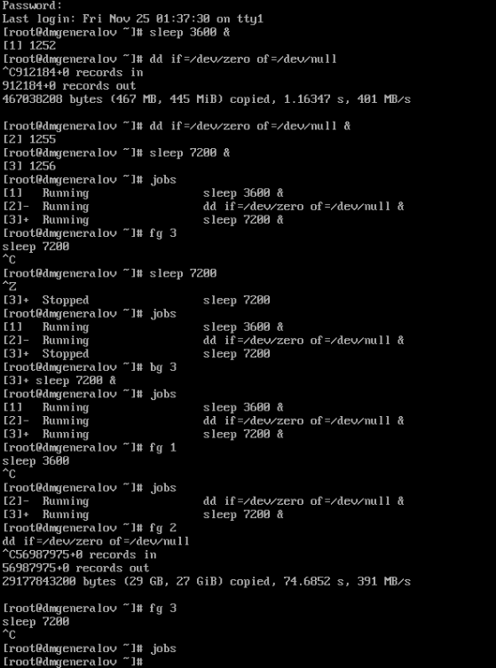

## bg

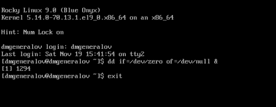

## top

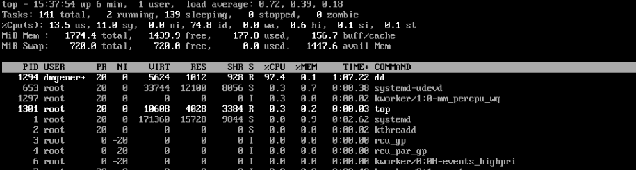

## top-k

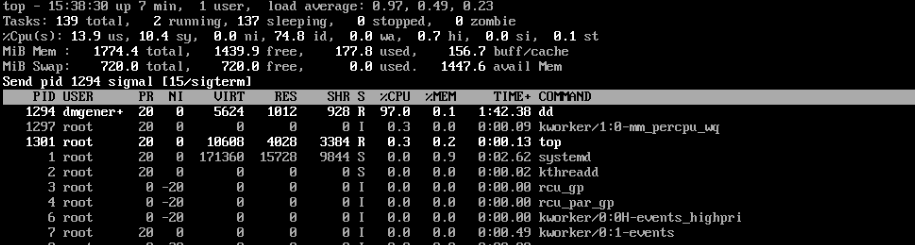

## ps aux

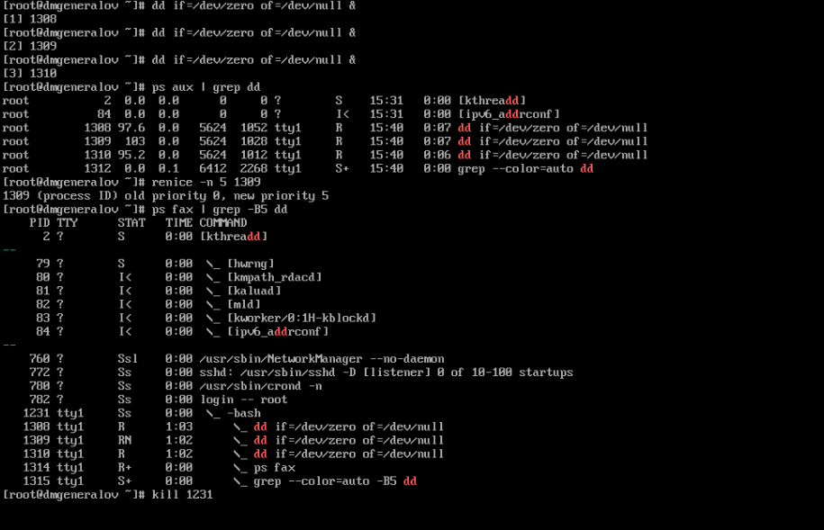

## renice

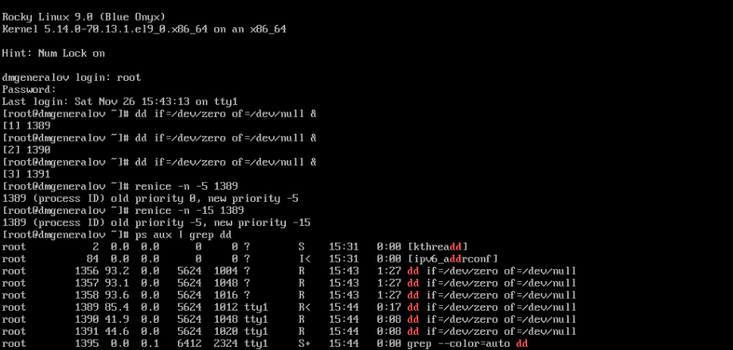

## yes

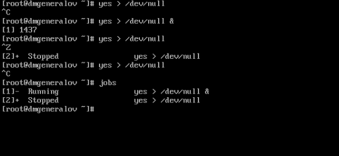

## bg

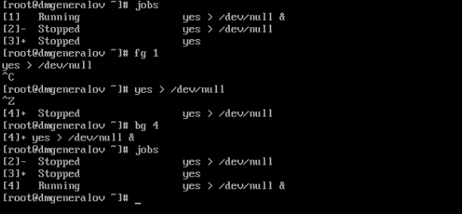

## nohup

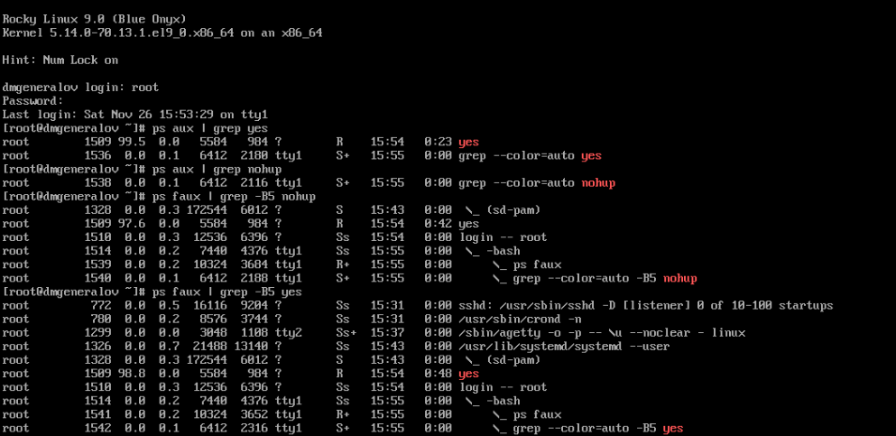

## kill

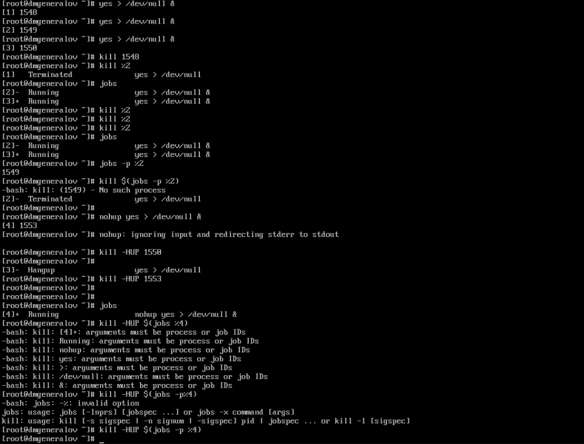

## renice

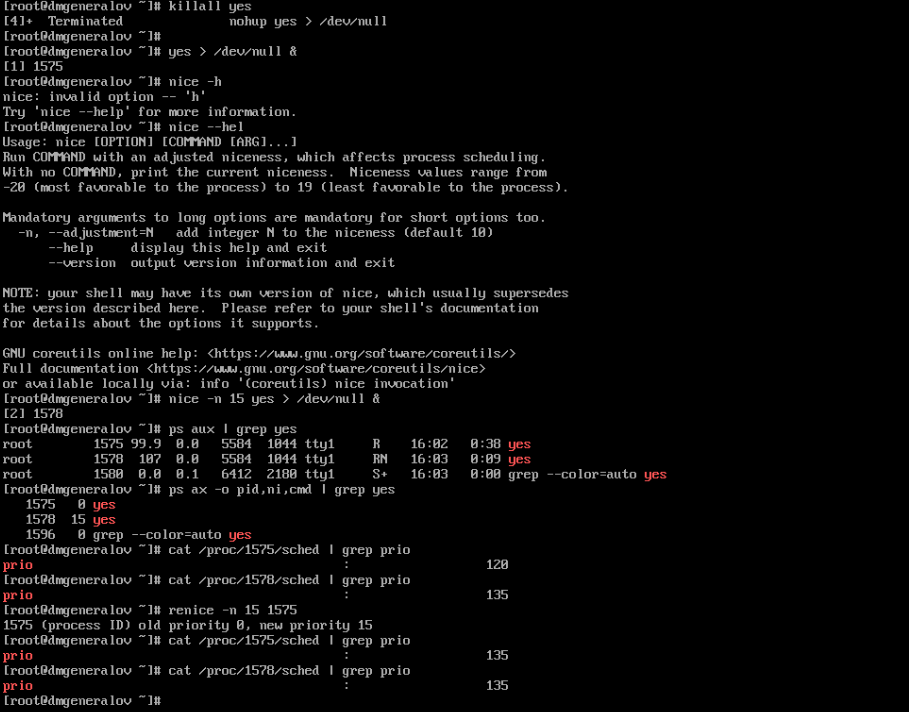

## Вывод

Я получил опыт работы с процессами операционной системы.
