---
## Front matter
title: "Отчет по лабораторной работе 6"
subtitle: ""
author: "Генералов Даниил, НПИбд-01-21, 1032202280"

## Generic otions
lang: ru-RU
toc-title: "Содержание"

## Pdf output format
toc: true # Table of contents
toc-depth: 2
lof: true # List of figures
lot: true # List of tables
fontsize: 12pt
linestretch: 1.5
papersize: a4
documentclass: scrreprt
## I18n polyglossia
polyglossia-lang:
  name: russian
  options:
	- spelling=modern
	- babelshorthands=true
polyglossia-otherlangs:
  name: english
## I18n babel
babel-lang: russian
babel-otherlangs: english
## Fonts
mainfont: PT Serif
romanfont: PT Serif
sansfont: PT Sans
monofont: PT Mono
mainfontoptions: Ligatures=TeX
romanfontoptions: Ligatures=TeX
sansfontoptions: Ligatures=TeX,Scale=MatchLowercase
monofontoptions: Scale=MatchLowercase,Scale=0.9
## Biblatex
biblatex: true
biblio-style: "gost-numeric"
biblatexoptions:
  - parentracker=true
  - backend=biber
  - hyperref=auto
  - language=auto
  - autolang=other*
  - citestyle=gost-numeric
## Pandoc-crossref LaTeX customization
figureTitle: "Рис."
tableTitle: "Таблица"
listingTitle: "Листинг"
lofTitle: "Список иллюстраций"
lotTitle: "Список таблиц"
lolTitle: "Листинги"
## Misc options
indent: true
header-includes:
  - \usepackage{indentfirst}
  - \usepackage{float} # keep figures where there are in the text
  - \floatplacement{figure}{H} # keep figures where there are in the text
---

# Цель работы

В рамках этой лабораторной работы требуется выполнить операции по управлению процессами ОС.

# Задание

> 1. Продемонстрируйте навыки управления заданиями операционной системы (см.
> раздел 6.4.1).
> 2. Продемонстрируйте навыки управления процессами операционной системы (см.
> раздел 6.4.2).
> 3. Выполните задания для самостоятельной работы (см. раздел 6.5)

# Выполнение лабораторной работы

Сначала я запустил несколько программ в фоне,
и проверил их состояние с помощью команды `jobs`,
а затем остановил их с помощью команды `fg` и `Ctrl+C`.

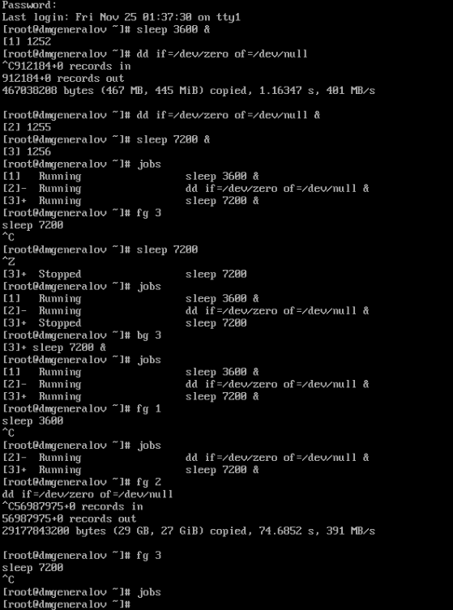

После этого я открыл другой терминал, запустил программу в фоне, а затем закрыл терминал.

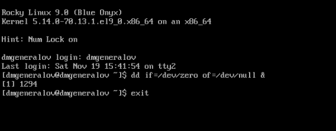

Если запустить `top`, то можно увидеть, что процесс продолжает работать.

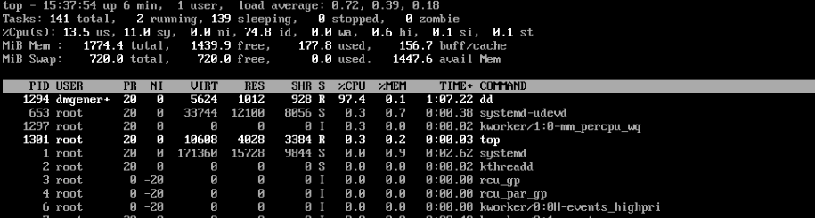

С помощью команды `k` в `top` можно убить процесс.

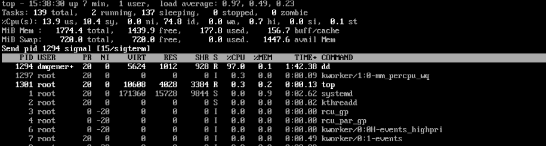

После этого я запустил три копии программы `dd` в фоне и увидел их в списке процессов `ps aux`.
Затем я изменил приоритет одного из них, а затем я остановил процесс, который их создал -- `bash`.

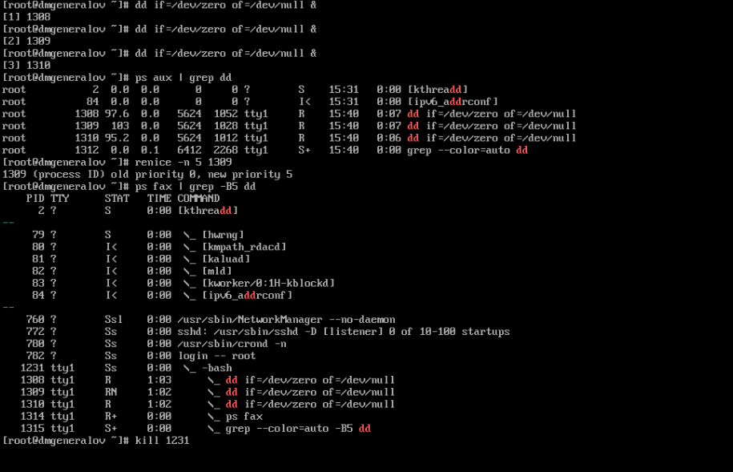

После этого я запустил dd в фоне, и затем изменил приоритет одного из них на -5 и -15.
Отрицательные приоритеты -- это приоритеты выше нормального, поэтому этот один процесс будет выполняться раньше остальных.
Команда `renice` выводит старый и новый приоритет процесса.

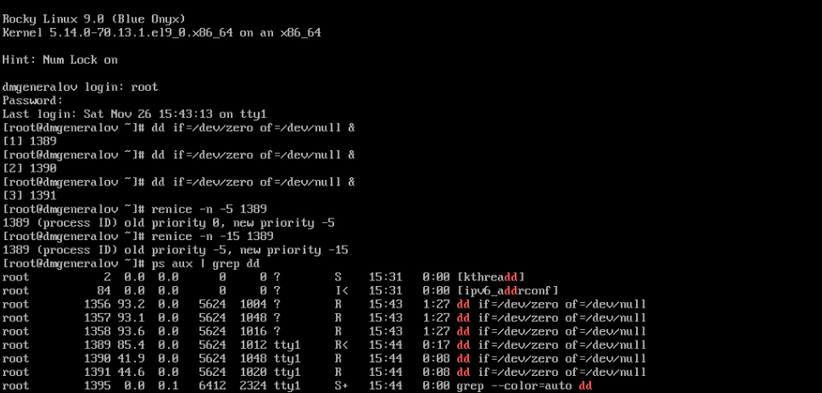

Затем я выполнил некоторые операции с запуском и остановкой копий программы `yes`.

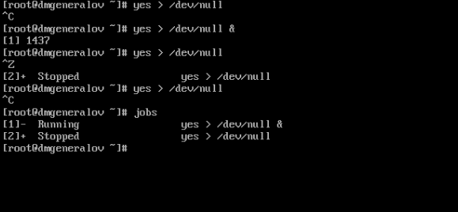

Процессы могут оставаться работающими в фоновом режиме, если они были запущены с помощью `&` или возобновлены с помощью `bg`.

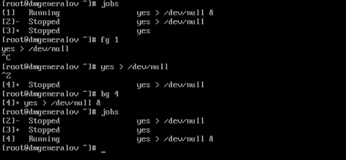

Я запустил процесс с помощью `nohup`, и убедился, что он продолжает работать даже после закрытия терминала -- хотя программа `nohup` не остается в фоне, а только та программа, которую она запустила.

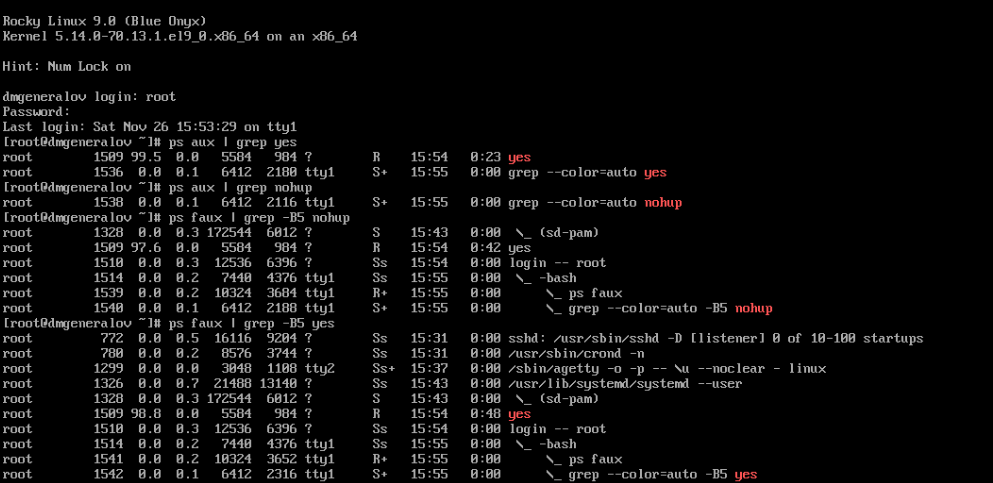

После этого я попробовал посылать сигналы процессам по их PID и идентификатору задачи.
Процесс, запущенный через nohup, не закрывается от сигнала `SIGHUP`.

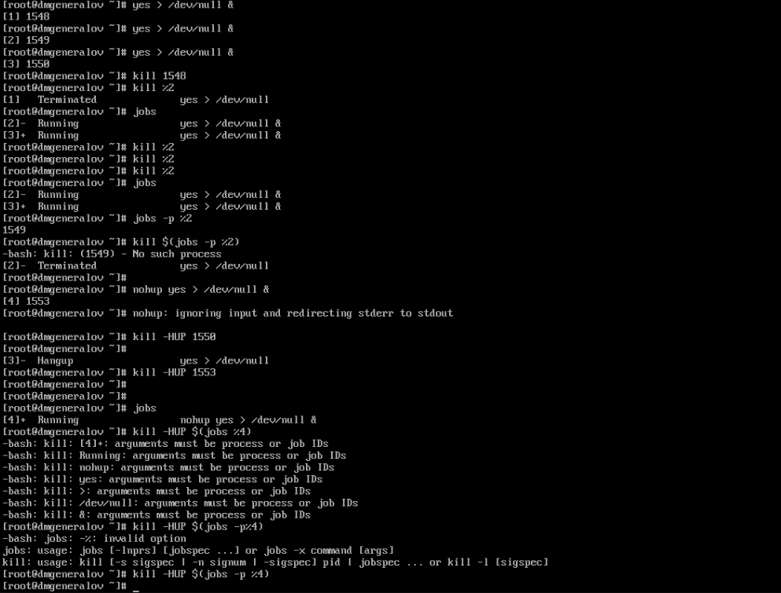

Я запустил две программы, и одну из них запустил с nice-значением 15. Это можно увидеть в выводе команды `ps`, где вторая программа имеет приоритет 15, а первая -- 0. Итоговый приоритет, который можно прочитать в `/proc/PID/stat`, для первой программы -- 120, а для второй -- 135.
Затем я использовал renice, чтобы сделать эти два приоритета такими же.

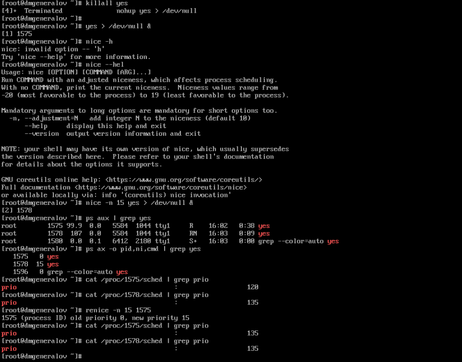

# Выводы

Я получил опыт работы с процессами опперационной системы.

# Контрольные вопросы
1. Какая команда даёт обзор всех текущих заданий оболочки?

`jobs`

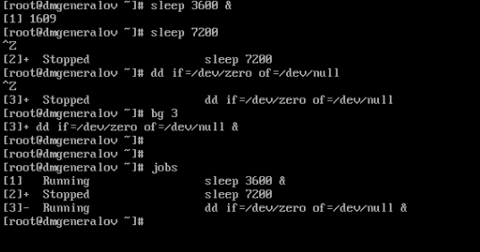

2. Как остановить текущее задание оболочки, чтобы продолжить его выполнение
в фоновом режиме?

`Ctrl+Z` + `bg`

3. Какую комбинацию клавиш можно использовать для отмены текущего задания
оболочки?

`Ctrl+C`

4. Необходимо отменить одно из начатых заданий. Доступ к оболочке, в которой
в данный момент работает пользователь, невозможен. Что можно сделать, чтобы
отменить задание?

`ps a` + `kill PID`

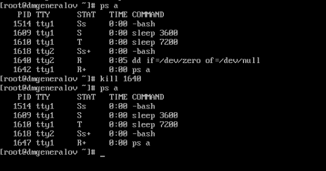

5. Какая команда используется для отображения отношений между родительскими
и дочерними процессами?

`pstree`

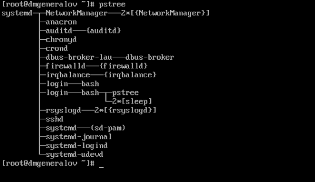

6. Какая команда позволит изменить приоритет процесса с идентификатором 1234
на более высокий?

`renice -n 10 -p 1234`

7. В системе в настоящее время запущено 20 процессов dd. Как проще всего оста-
новить их все сразу?

`killall dd`

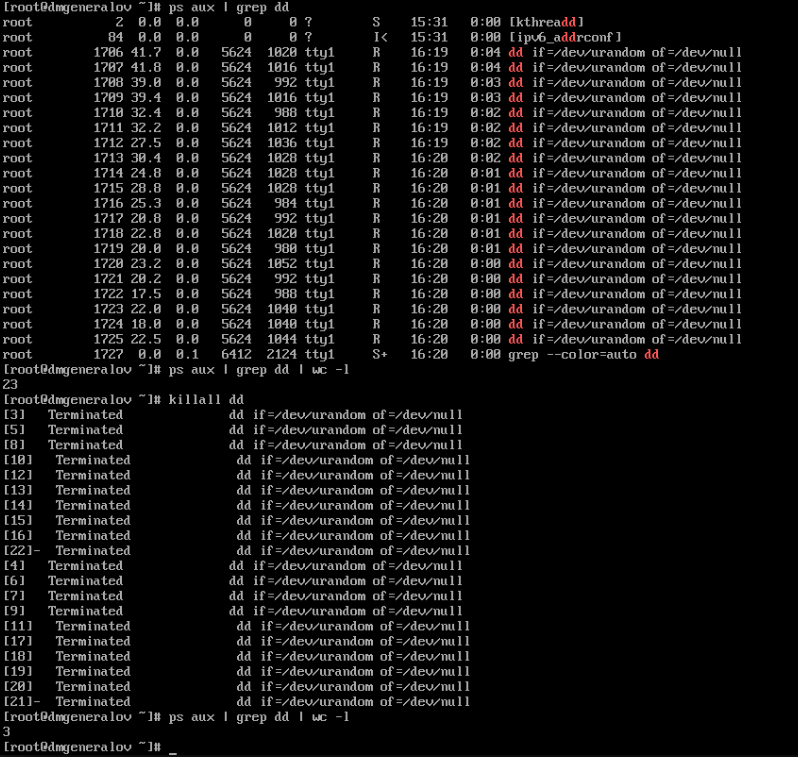

8. Какая команда позволяет остановить команду с именем mycommand?

`killall mycommand`

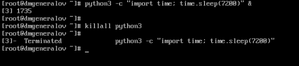

9. Какая команда используется в top, чтобы убить процесс?

`k`

10. Как запустить команду с достаточно высоким приоритетом, не рискуя, что не
хватит ресурсов для других процессов?

`nice -n 10 mycommand`

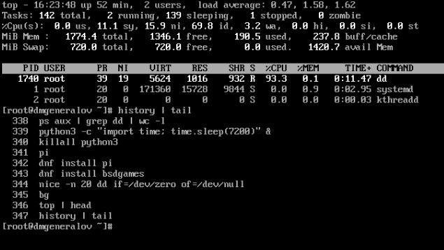