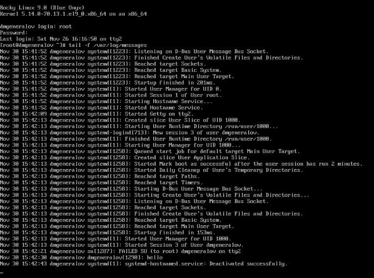
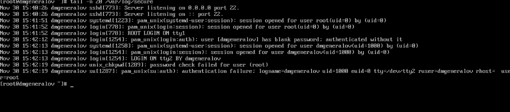
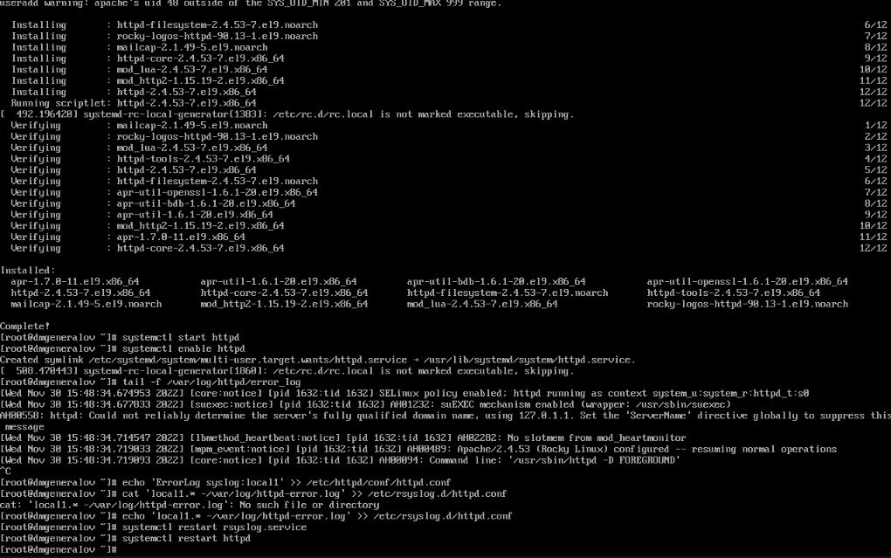
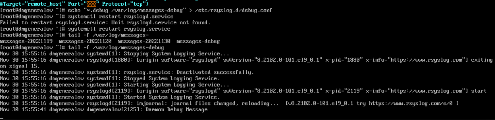
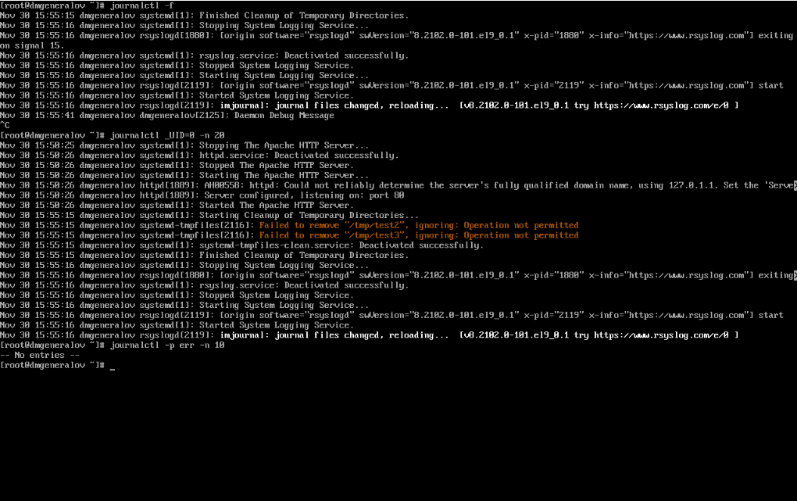
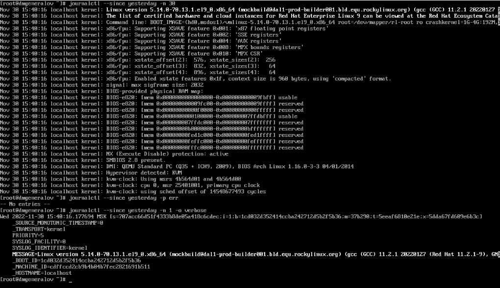
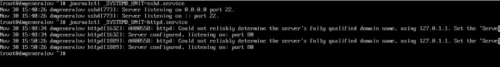
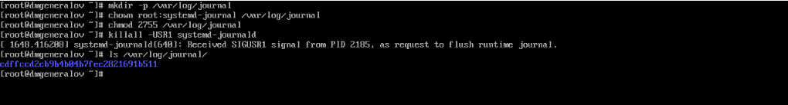

---
## Front matter
lang: ru-RU
title: Лабораторная работа 7
author: |
  Генералов Даниил, НПИбд-01-21, 1032202280
institute: |
	\inst{1}RUDN University, Moscow, Russian Federation
date: 2022

## Formatting
toc: false
slide_level: 2
theme: metropolis
header-includes: 
 - \metroset{progressbar=frametitle,sectionpage=progressbar,numbering=fraction}
 - '\makeatletter'
 - '\beamer@ignorenonframefalse'
 - '\makeatother'
aspectratio: 43
section-titles: true
---

# Задача

> 1. Продемонстрируйте навыки работы с журналом мониторинга событий в реальном
> времени (см. раздел 7.4.1).
> 2. Продемонстрируйте навыки создания и настройки отдельного файла конфигура-
> ции мониторинга отслеживания событий веб-службы (см. раздел 7.4.2).
> 3. Продемонстрируйте навыки работы с journalctl (см. раздел 7.4.3).
> 4. Продемонстрируйте навыки работы с journald (см. раздел 7.4.4).

# Выполнение 

## /var/log/messages

## /var/log/secure

## httpd и syslog

## *.debug

## journalctl

## journalctl 

## journalctl

## journalctl

## Вывод

Я получил опыт работы с rsyslogd и journald.
