---
## Front matter
title: "Отчет по лабораторной работе 7"
subtitle: ""
author: "Генералов Даниил, НПИбд-01-21, 1032202280"

## Generic otions
lang: ru-RU
toc-title: "Содержание"

## Pdf output format
toc: true # Table of contents
toc-depth: 2
lof: true # List of figures
lot: true # List of tables
fontsize: 12pt
linestretch: 1.5
papersize: a4
documentclass: scrreprt
## I18n polyglossia
polyglossia-lang:
  name: russian
  options:
	- spelling=modern
	- babelshorthands=true
polyglossia-otherlangs:
  name: english
## I18n babel
babel-lang: russian
babel-otherlangs: english
## Fonts
mainfont: PT Serif
romanfont: PT Serif
sansfont: PT Sans
monofont: PT Mono
mainfontoptions: Ligatures=TeX
romanfontoptions: Ligatures=TeX
sansfontoptions: Ligatures=TeX,Scale=MatchLowercase
monofontoptions: Scale=MatchLowercase,Scale=0.9
## Biblatex
biblatex: true
biblio-style: "gost-numeric"
biblatexoptions:
  - parentracker=true
  - backend=biber
  - hyperref=auto
  - language=auto
  - autolang=other*
  - citestyle=gost-numeric
## Pandoc-crossref LaTeX customization
figureTitle: "Рис."
tableTitle: "Таблица"
listingTitle: "Листинг"
lofTitle: "Список иллюстраций"
lotTitle: "Список таблиц"
lolTitle: "Листинги"
## Misc options
indent: true
header-includes:
  - \usepackage{indentfirst}
  - \usepackage{float} # keep figures where there are in the text
  - \floatplacement{figure}{H} # keep figures where there are in the text
---

# Цель работы

В рамках этой лабораторной работы требуется выполнить операции по управлению сервисом ведения логов rsyslogd.

# Задание

> 1. Продемонстрируйте навыки работы с журналом мониторинга событий в реальном
> времени (см. раздел 7.4.1).
> 2. Продемонстрируйте навыки создания и настройки отдельного файла конфигура-
> ции мониторинга отслеживания событий веб-службы (см. раздел 7.4.2).
> 3. Продемонстрируйте навыки работы с journalctl (см. раздел 7.4.3).
> 4. Продемонстрируйте навыки работы с journald (см. раздел 7.4.4).

# Выполнение лабораторной работы

Сначала я открыл для чтения файл `/var/log/messages`. Затем, сделав в другом терминале действия, я увидел, как сообщения об этих действиях были добавлены в конец этого файла.

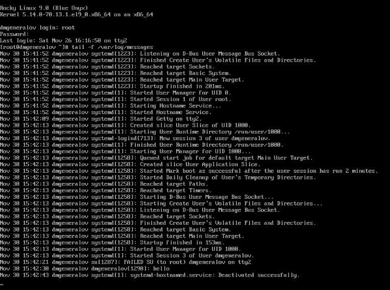

Аналогично, в файле `/var/log/secure` хранятся сообщения о событиях, связанных с безопасностью: например, о попытках входа в систему или использовании команды `su`.

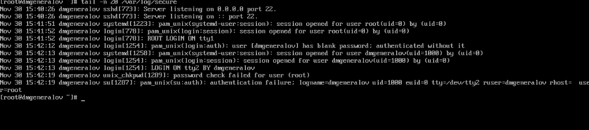

Можно настроить службы, чтобы они записывали свои события в системный лог.
Например, веб-сервер `httpd` по умолчанию записывает свои события в файл `/var/log/httpd/access_log` и `/var/log/httpd/error_log`,
но в настройках можно указать, чтобы он записывал их в системный лог.
После этого нужно добавить в `/etc/rsyslog.d` файл, который бы описывал, что делать с записями в системный лог --
в нашем случае, мы хотим сохранить их в файле `/var/log/httpd-error.log`

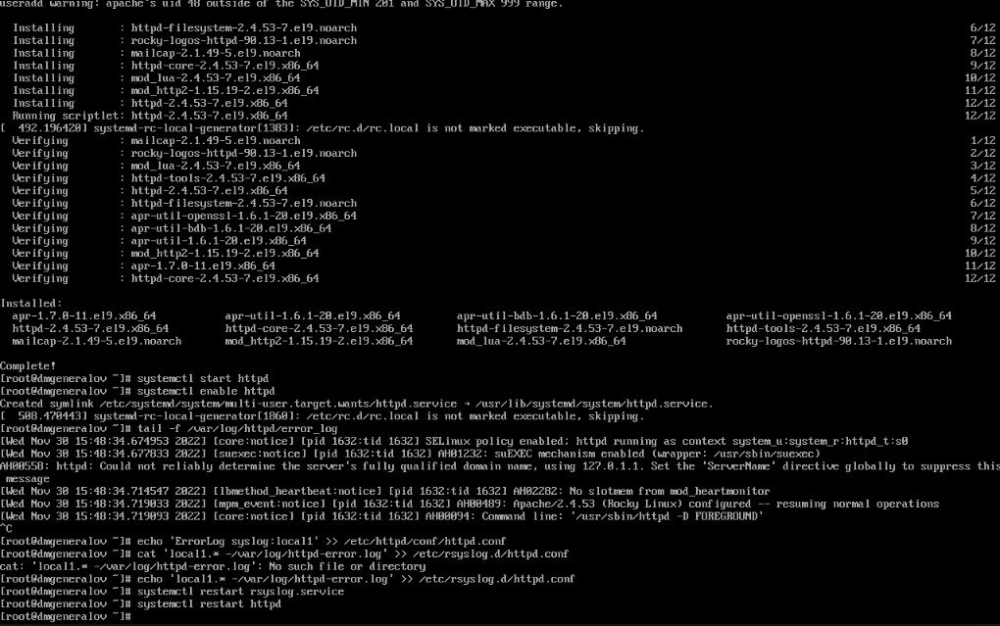

Файлы конфигурации rsyslog описывают, какие сообщения следует записывать в какие файлы.
Например, можно создать правило, которое будет сохранять все сообщения уровня `debug` в файл `/var/log/messages-debug`.

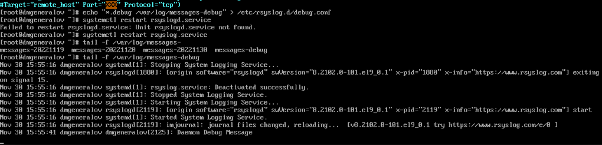

Программа journalctl позволяет просматривать журнал всех системных событий, 
а также фильтровать те события которые выводятся.
Например, можно следить в реальном времени за событиями, которые созданы процессом под пользователем `root` с важностью `err`.

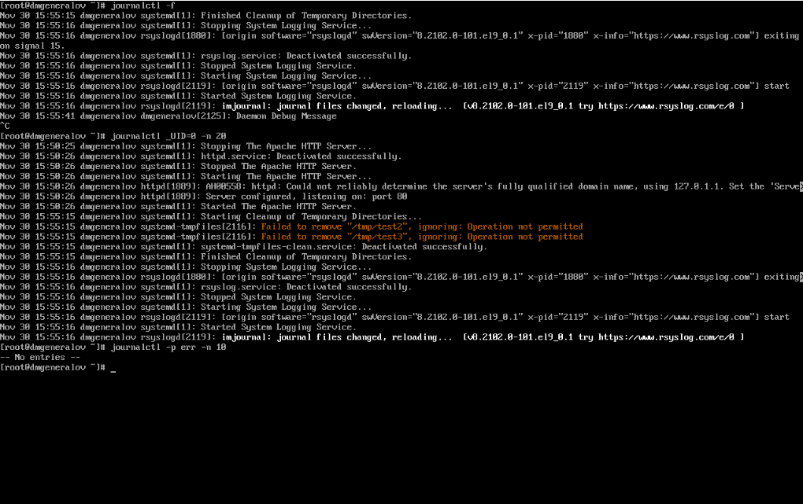

Можно также выделить только те сообщения, которые были добавлены со вчерашнего дня (которые, в случае этой виртуальной машины, -- это сообщения начиная с загрузки системы), которые имеют важность `err`.
Можно также посмотреть каждое сообщение более подробно, используя опцию `-o verbose`.

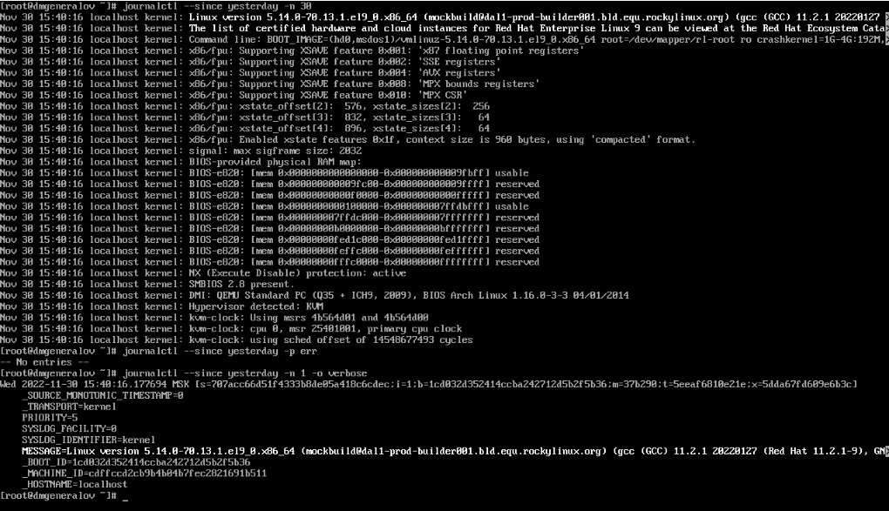

Наконец, можно выделить сообщения от какого-то конкретного сервиса, например, `sshd` или `httpd`.

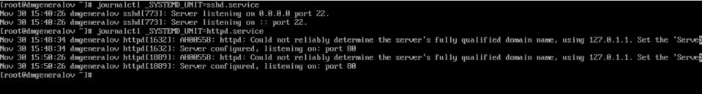

По умолчанию журнал journald сохраняется в памяти, но можно настроить его сохранение на диск.
Для этого нужно, чтобы существовала директория `/var/log/journal`, чтобы ей владел `root:systemd-journal`, и чтобы у нее были права на чтение и запись для группы `systemd-journal`.
После этого там будут храниться журналы для каждой загрузки системы.

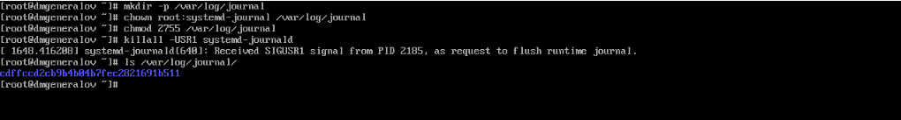

# Выводы

Я получил опыт работы с rsyslogd и journald.

# Контрольные вопросы
1. Какой файл используется для настройки rsyslogd?

`/etc/rsyslog.conf`, который подключает файлы из директории `/etc/rsyslog.d/`.

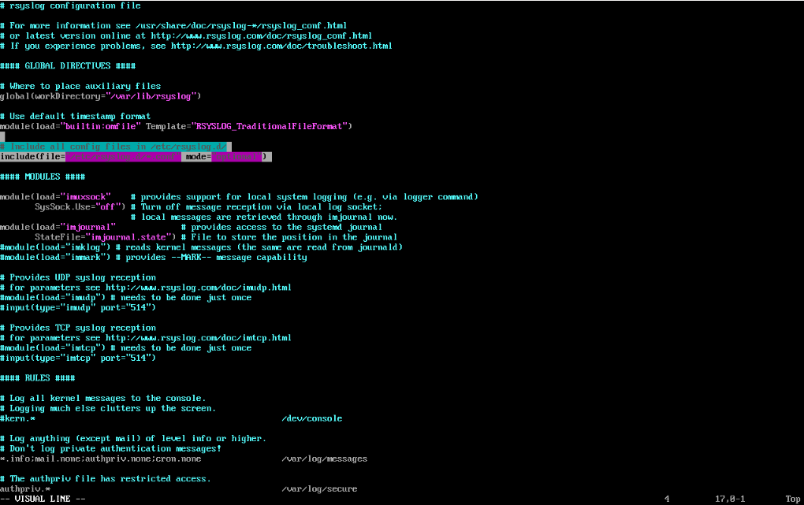

2. В каком файле журнала rsyslogd содержатся сообщения, связанные с аутенти-
фикацией?

`/var/log/secure`

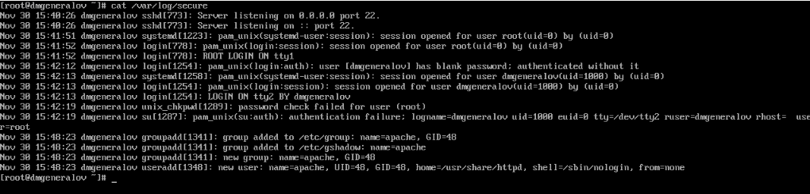

3. Если вы ничего не настроите, то сколько времени потребуется для ротации файлов
журналов?

Одна неделя.

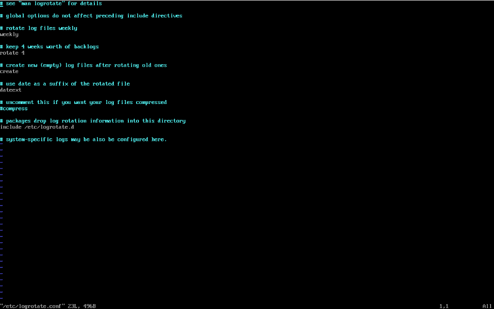

4. Какую строку следует добавить в конфигурацию для записи всех сообщений
с приоритетом info в файл /var/log/messages.info?

`*.info /var/log/messages.info`

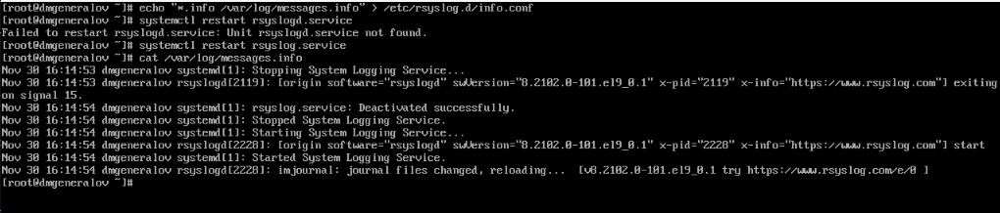

5. Какая команда позволяет вам видеть сообщения журнала в режиме реального
времени?

`journalctl -f`

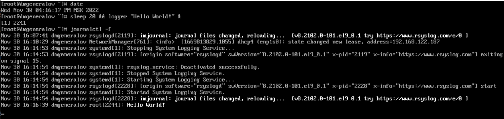

6. Какая команда позволяет вам видеть все сообщения журнала, которые были напи-
саны для PID 1 между 9:00 и 15:00?

`journalctl _PID=1 --since "9:00" --until "15:00"`

7. Какая команда позволяет вам видеть сообщения journald после последней пере-
загрузки системы?

`journalctl -b`

8. Какая процедура позволяет сделать журнал journald постоянным?

Создать директорию `/var/log/journal`, сделать ее владельцем `root:systemd-journal`, и дать права на чтение и запись для группы `systemd-journal`.

