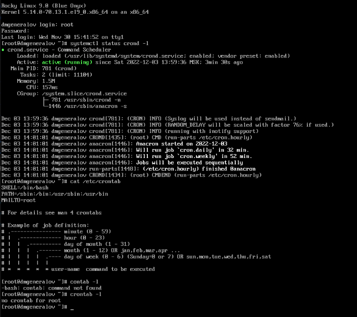
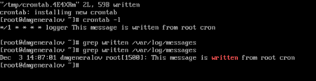
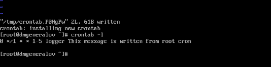
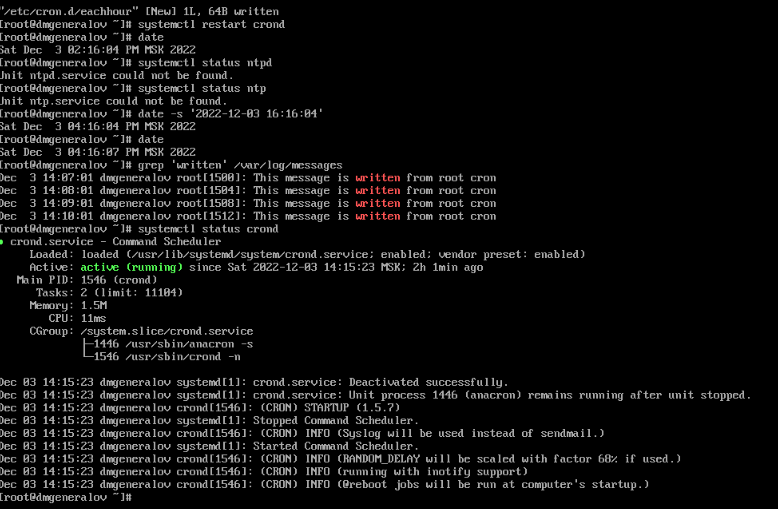
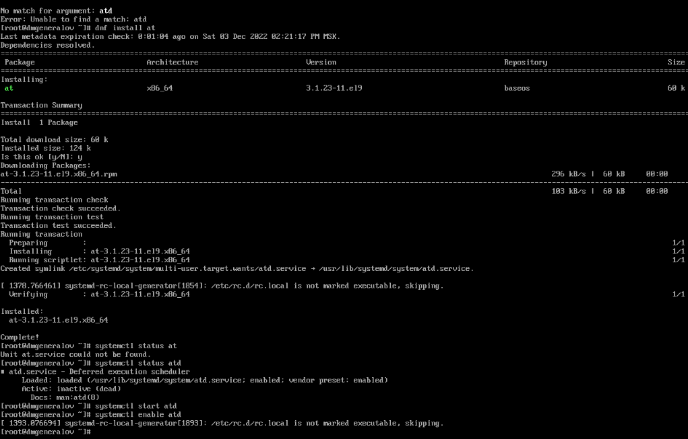
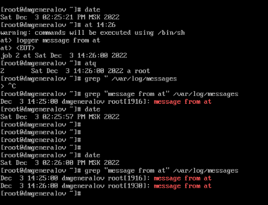
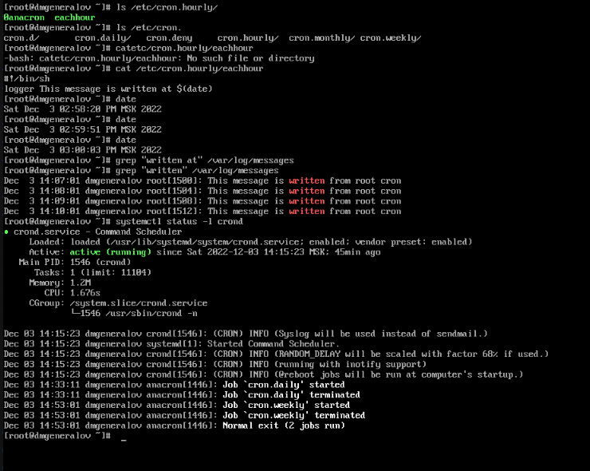
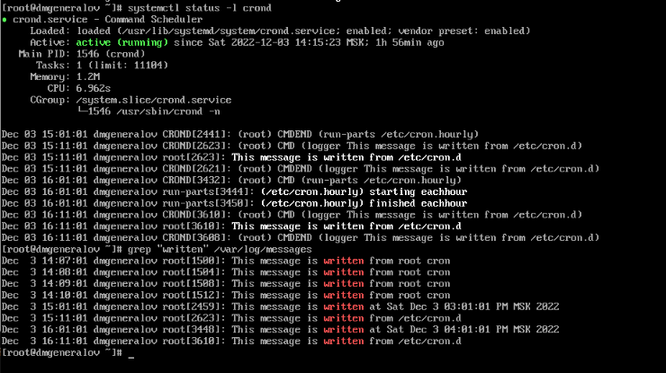

---
## Front matter
lang: ru-RU
title: Лабораторная работа 8
author: |
  Генералов Даниил, НПИбд-01-21, 1032202280
institute: |
	\inst{1}RUDN University, Moscow, Russian Federation
date: 2022

## Formatting
toc: false
slide_level: 2
theme: metropolis
header-includes: 
 - \metroset{progressbar=frametitle,sectionpage=progressbar,numbering=fraction}
 - '\makeatletter'
 - '\beamer@ignorenonframefalse'
 - '\makeatother'
aspectratio: 43
section-titles: true
---

# Задача

> 1. Выполните задания по планированию задач с помощью crond (см. раздел 8.4.1).
> 2. Выполните задания по планированию задач с помощью atd (см. раздел 8.4.2).

# Выполнение 

## crond

## crontab -e

## /var/log/messages

## 0 */1 * * 1-5

## date

## atd 

## at

## cron.hourly

## cron.hourly

## Вывод

Я получил опыт работы с cron и atd.
