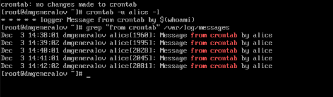

---
## Front matter
title: "Отчет по лабораторной работе 8"
subtitle: ""
author: "Генералов Даниил, НПИбд-01-21, 1032202280"

## Generic otions
lang: ru-RU
toc-title: "Содержание"

## Pdf output format
toc: true # Table of contents
toc-depth: 2
lof: true # List of figures
lot: true # List of tables
fontsize: 12pt
linestretch: 1.5
papersize: a4
documentclass: scrreprt
## I18n polyglossia
polyglossia-lang:
  name: russian
  options:
	- spelling=modern
	- babelshorthands=true
polyglossia-otherlangs:
  name: english
## I18n babel
babel-lang: russian
babel-otherlangs: english
## Fonts
mainfont: PT Serif
romanfont: PT Serif
sansfont: PT Sans
monofont: PT Mono
mainfontoptions: Ligatures=TeX
romanfontoptions: Ligatures=TeX
sansfontoptions: Ligatures=TeX,Scale=MatchLowercase
monofontoptions: Scale=MatchLowercase,Scale=0.9
## Biblatex
biblatex: true
biblio-style: "gost-numeric"
biblatexoptions:
  - parentracker=true
  - backend=biber
  - hyperref=auto
  - language=auto
  - autolang=other*
  - citestyle=gost-numeric
## Pandoc-crossref LaTeX customization
figureTitle: "Рис."
tableTitle: "Таблица"
listingTitle: "Листинг"
lofTitle: "Список иллюстраций"
lotTitle: "Список таблиц"
lolTitle: "Листинги"
## Misc options
indent: true
header-includes:
  - \usepackage{indentfirst}
  - \usepackage{float} # keep figures where there are in the text
  - \floatplacement{figure}{H} # keep figures where there are in the text
---

# Цель работы

В рамках этой лабораторной работы требуется выполнить операции по управлению сервисами планировщиками `cron` и `atd`.

# Задание

> 1. Выполните задания по планированию задач с помощью crond (см. раздел 8.4.1).
> 2. Выполните задания по планированию задач с помощью atd (см. раздел 8.4.2).

# Выполнение лабораторной работы

Сначала я проверил, что сервис `crond` запущен, и что у него нет задач в расписании.

После этого я добавил в crontab задание, которое выводит сообщение в системный лог каждую минуту.

Дождавшись наступления следующей минуты, я проверил, что сообщение появилось в системном логе.

Затем я изменил запись в crontab, чтобы она выполнялась на нулевой минуте каждого часа между первым и пятым днем недели.

Затем я создал файл `/etc/cron.hourly/eachhour` и добавил в него команду, которая выводит сообщение в системный лог каждый час. Я также создал файл в `/etc/cron.d`, который имеет синтаксис, идентичный crontab, за исключением отдельного поля -- имени пользователя, от имени которого выполняется задание.

Для того, чтобы увидеть изменения, я перевел время в виртуальной машине на 2 часа вперед.
К сожалению, это не сделало ожидаемого эффекта, поэтому я перевел время обратно и продолжил работу.

Дальше я начал работу с `atd`, сначала проверив, что он запущен.
Это оказалось не так; он также не был установлен.

Исправив это, я добавил задание, которое выводит сообщение в системный лог через одну минуту.
Затем я проверил, что сообщение появилось в системном логе.

Когда наступил следующий час, я проверил, выполнилось ли задание, которое я добавил в /etc/cron.hourly/eachhour. Оказалось, что оно не выполнилось.
Возможно это связано с переводом времени, но это не точно.
Другие задания в `/etc/cron.daily` и `/etc/cron.weekly` выполнились, о чем написано в логе anacron.
Скорее всего, через несколько часов это задание выполнится хотя бы один раз.

Проверив это через несколько часов, я увидел, что задание выполнилось.

# Выводы

Я получил опыт работы с cron и atd.

# Контрольные вопросы

1. Как настроить задание cron, чтобы оно выполнялось раз в 2 недели?

`37 13 */2 * 1 command`

Объяснение: команда будет выполняться каждый четный понедельник. Поскольку неделя имеет 7 дней, то каждый четный понедельник -- это каждый второй понедельник, значит задание будет выполняться каждые 14 дней.

2. Как настроить задание cron, чтобы оно выполнялось 1-го и 15-го числа каждого
месяца в 2 часа ночи?

`0 2 1,15 * * command`

Объяснение: команда будет выполняться в 02:00, если сегодня 1-е или 15-е число месяца.

3. Как настроить задание cron, чтобы оно выполнялось каждые 2 минуты каждый
день?

`*/2 * * * * command`

Объяснение: команда будет выполняться, когда номер минуты кратен 2, то есть через 2 минуты от предыдущего запуска.

4. Как настроить задание cron, чтобы оно выполнялось 19 сентября ежегодно?

`37 13 19 9 * command`

Объяснение: команда будет выполняться, когда число 19, а номер месяца 9.

5. Как настроить задание cron, чтобы оно выполнялось каждый четверг сентября
ежегодно?

`37 13 * 9 4 command`

Объяснение: команда будет выполняться, когда номер месяца 9, а номер дня недели 4, при этом не важно, какое число месяца.

6. Какая команда позволяет вам назначить задание cron для пользователя alice?
Приведите подтверждающий пример.

`crontab -u alice -e`

7. Как указать, что пользователю bob никогда не разрешено назначать задания через
cron? Приведите подтверждающий пример.

`crontab -u bob -r`

8. Вам нужно убедиться, что задание выполняется каждый день, даже если сервер
во время выполнения временно недоступен. Как это сделать?

Чтобы это сделать, нужно добавить это задание в /etc/cron.daily.
Задания в этой директории исполняются как `cron`, так и `anacron`;
если `cron` не выполнил это задание вовремя, то `anacron` выполнит его позже.

9. Какая команда позволяет узнать, запланированы ли какие-либо задания на выпол-
нение планировщиком atd?

`atq`

