---
## Front matter
lang: ru-RU
title: Лабораторная работа 9
author: |
  Генералов Даниил, НПИбд-01-21, 1032202280
institute: |
	\inst{1}RUDN University, Moscow, Russian Federation
date: 2022

## Formatting
toc: false
slide_level: 2
theme: metropolis
header-includes: 
 - \metroset{progressbar=frametitle,sectionpage=progressbar,numbering=fraction}
 - '\makeatletter'
 - '\beamer@ignorenonframefalse'
 - '\makeatother'
aspectratio: 43
section-titles: true
---

# Задача

> 1. Продемонстрируйте навыки по управлению режимами SELinux (см. раздел 9.4.1).
> 2. Продемонстрируйте навыки по восстановлению контекста безопасности SELinux
> (см. раздел 9.4.2).
> 3. Настройте контекст безопасности для нестандартного расположения файлов веб-
> службы (см. раздел 9.4.3).
> 4. Продемонстрируйте навыки работы с переключателями SELinux (см. раздел 9.4.4).

# Выполнение 

## sestatus

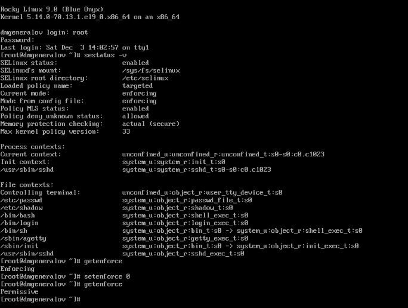

## getenforce

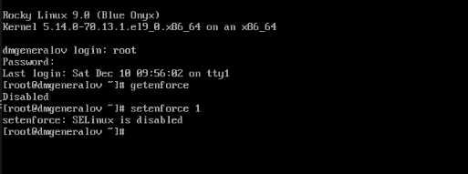

## selinux-autorelabel

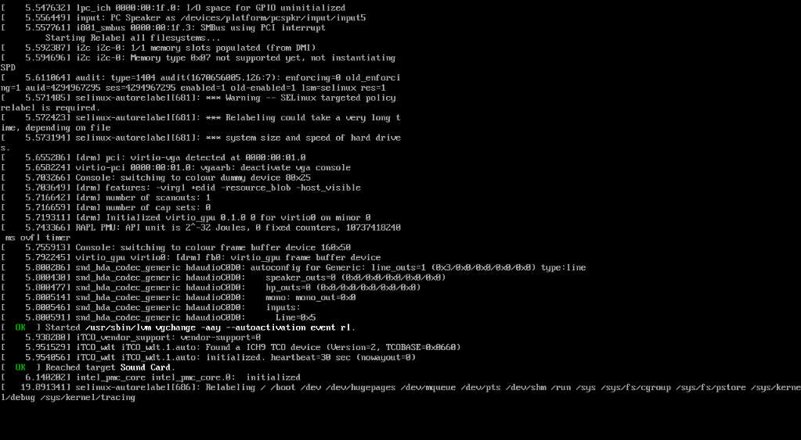

## restorecon

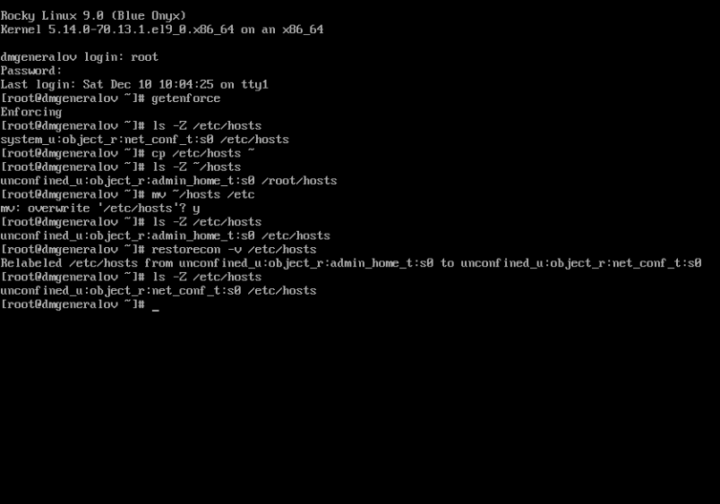

## dnf

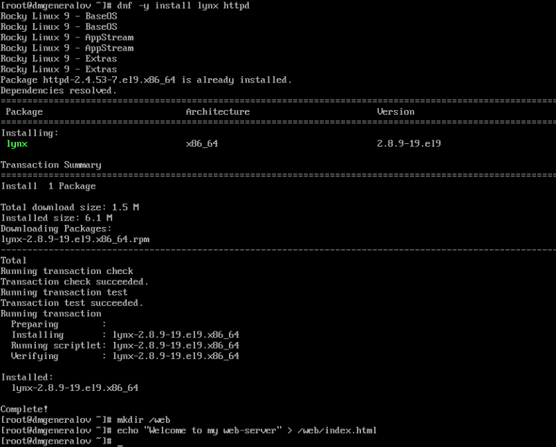

## DocumentRoot

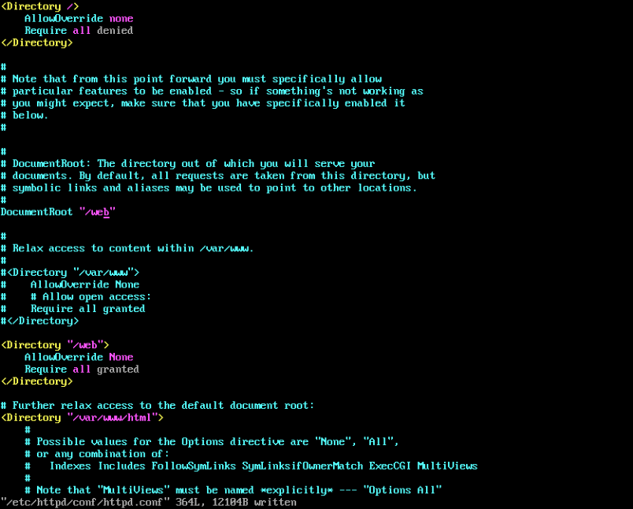

## lynx

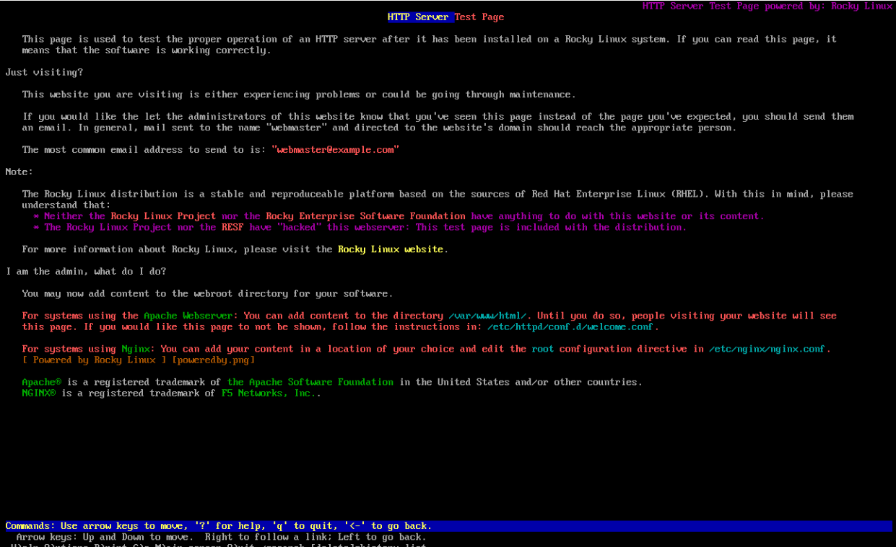

## semanage

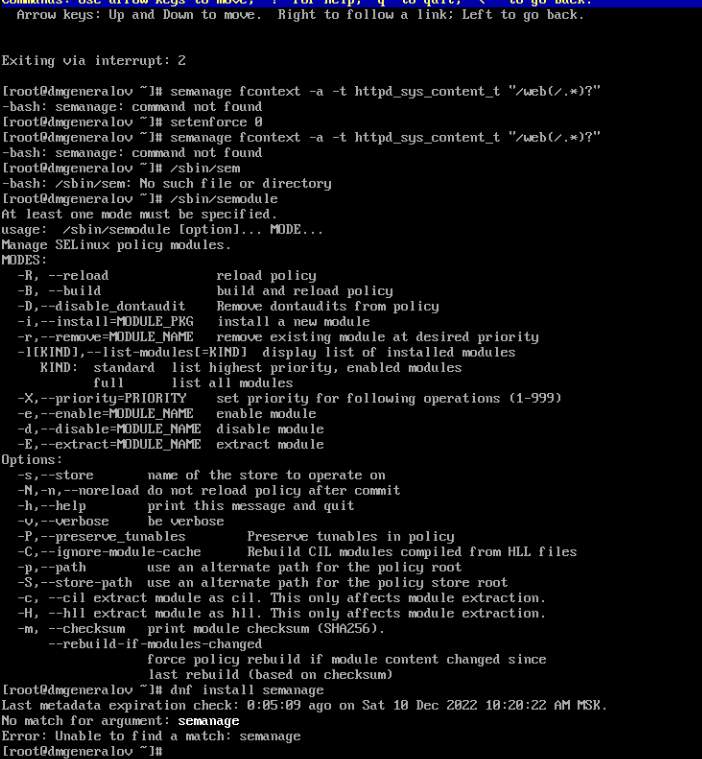

## dnf

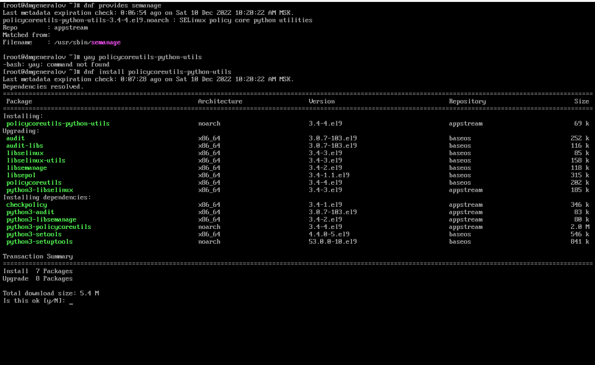

## curl 

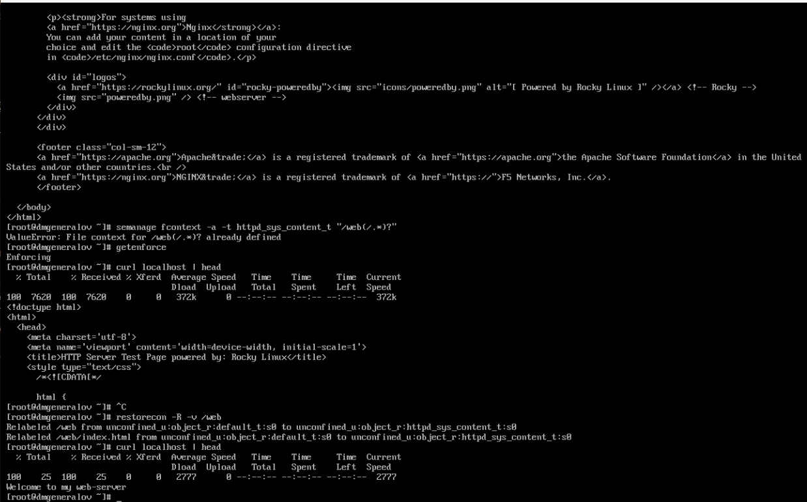

## setsebool

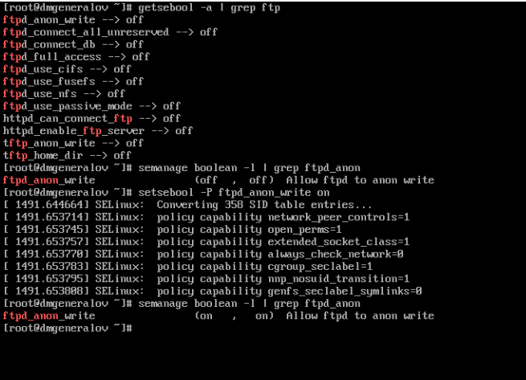

## Вывод

Я получил опыт работы с SELinux.
