---
## Front matter
title: "Отчет по лабораторной работе 9"
subtitle: ""
author: "Генералов Даниил, НПИбд-01-21, 1032202280"

## Generic otions
lang: ru-RU
toc-title: "Содержание"

## Pdf output format
toc: true # Table of contents
toc-depth: 2
lof: true # List of figures
lot: true # List of tables
fontsize: 12pt
linestretch: 1.5
papersize: a4
documentclass: scrreprt
## I18n polyglossia
polyglossia-lang:
  name: russian
  options:
	- spelling=modern
	- babelshorthands=true
polyglossia-otherlangs:
  name: english
## I18n babel
babel-lang: russian
babel-otherlangs: english
## Fonts
mainfont: PT Serif
romanfont: PT Serif
sansfont: PT Sans
monofont: PT Mono
mainfontoptions: Ligatures=TeX
romanfontoptions: Ligatures=TeX
sansfontoptions: Ligatures=TeX,Scale=MatchLowercase
monofontoptions: Scale=MatchLowercase,Scale=0.9
## Biblatex
biblatex: true
biblio-style: "gost-numeric"
biblatexoptions:
  - parentracker=true
  - backend=biber
  - hyperref=auto
  - language=auto
  - autolang=other*
  - citestyle=gost-numeric
## Pandoc-crossref LaTeX customization
figureTitle: "Рис."
tableTitle: "Таблица"
listingTitle: "Листинг"
lofTitle: "Список иллюстраций"
lotTitle: "Список таблиц"
lolTitle: "Листинги"
## Misc options
indent: true
header-includes:
  - \usepackage{indentfirst}
  - \usepackage{float} # keep figures where there are in the text
  - \floatplacement{figure}{H} # keep figures where there are in the text
---

# Цель работы

В рамках этой лабораторной работы требуется выполнить операции по управлению SELinux.

# Задание

> 1. Продемонстрируйте навыки по управлению режимами SELinux (см. раздел 9.4.1).
> 2. Продемонстрируйте навыки по восстановлению контекста безопасности SELinux
> (см. раздел 9.4.2).
> 3. Настройте контекст безопасности для нестандартного расположения файлов веб-
> службы (см. раздел 9.4.3).
> 4. Продемонстрируйте навыки работы с переключателями SELinux (см. раздел 9.4.4).

# Выполнение лабораторной работы

Сначала я проверил текущую конфигурацию SELinux.
Я увидел, что:

- SELinux включен
- Виртуальная файловая система SELinux находится по адресу `/sys/fs/selinux`
- корень настроек SELinux находится по адресу `/etc/selinux`
- текущая политика SELinux называется `targeted`
- текущий режим SELinux называется `enforcing`
- режим, прописанный в config-file -- `enforcing`
- Multi-Layer Security включен
- политика для запрещения доступа к объектам неизвестных категорий разрешена
- проверка безопасности памяти включена
- ядро поддерживает версии политик до 33

После этого я переключил SELinux из режима Enforcing в Permissive.

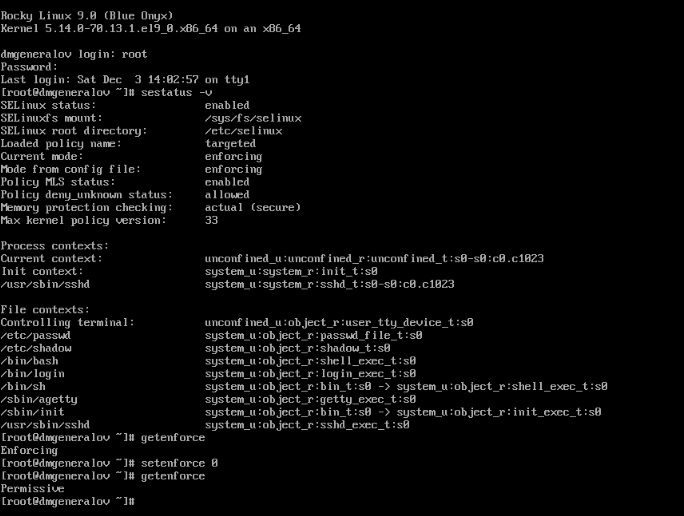

Затем я выключил SELinux в файле настройки `/etc/sysconfig/selinux`
и перезагрузил систему, после чего `getenforce`
показывает, что SELinux не только Permissive, но и Disabled.

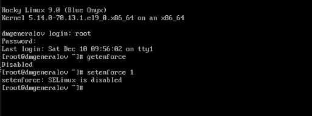

После еще одного изменения и перезагрузки система сначала сделала повторное создание меток SELinux,
а затем после перезагрузки SELinux был опять включен.

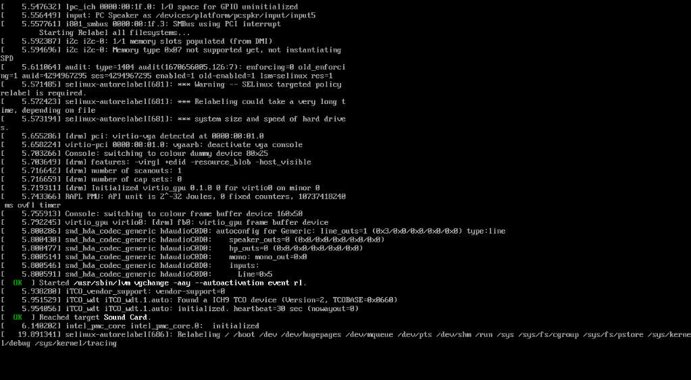

Затем я посмотрел, как изменяется контекст файла `/etc/hosts`:
сначала он был в контексте `net_conf_t`,
затем я скопировал его в `/root` и он стал `admin_home_t`,
а затем я скопировал его обратно и использовал `restorecon`,
чтобы вернуть его в `net_conf_t`.

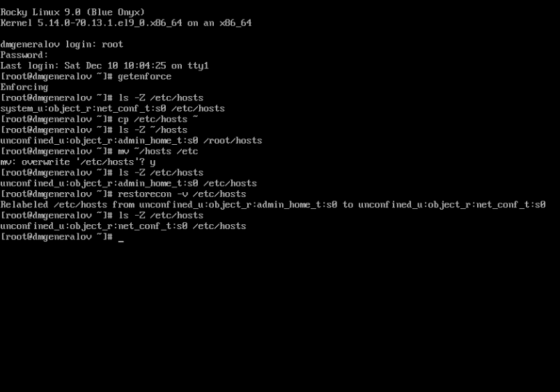

Я создал `/web/index.html` и поставил httpd и lynx.

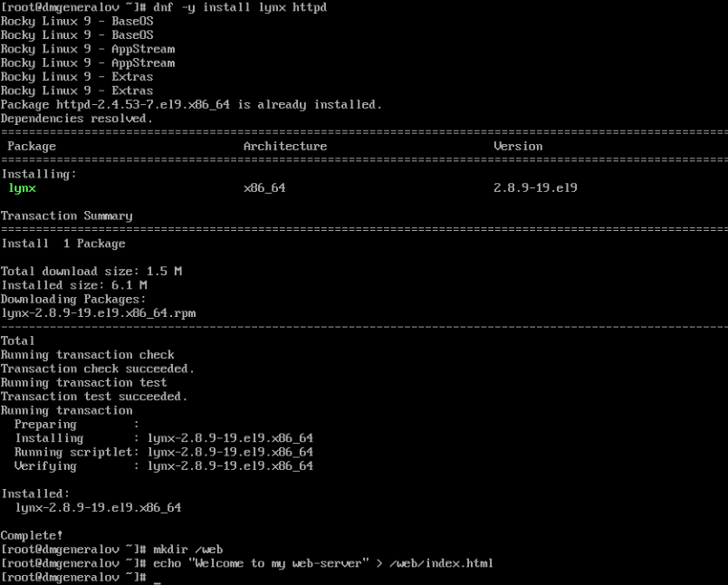

Я дал разрешение на использование /web как корня сервера.

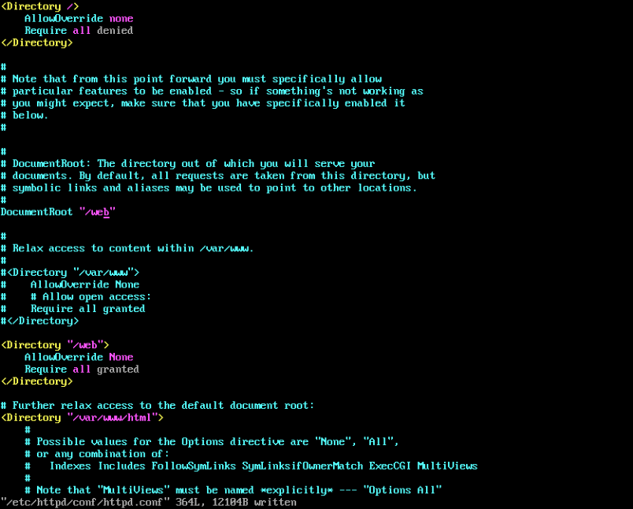

Видно, что доступна страница по умолчанию с кодом 403.
Значит, SELinux не разрешает серверу открывать `/web`.

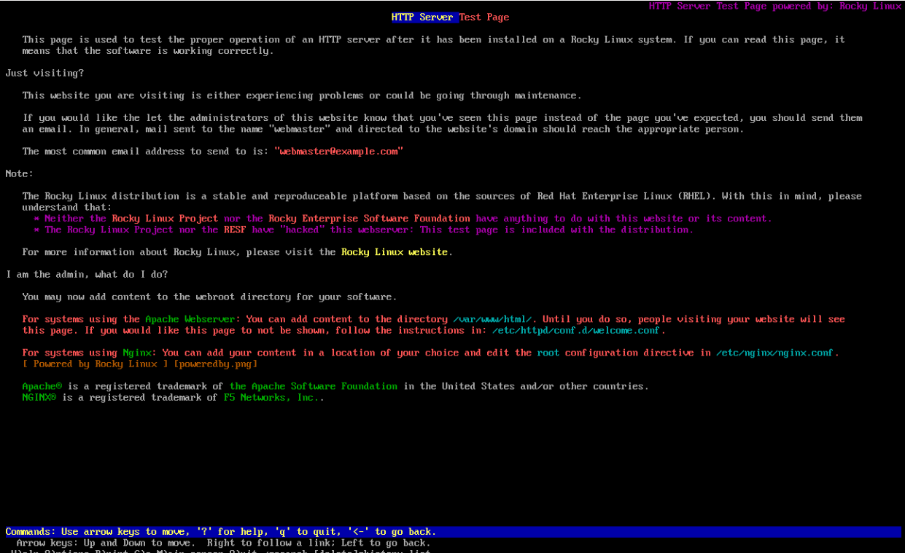

Я попытался изменить контекст с помощью `semanage`, но эта программа не доступна.

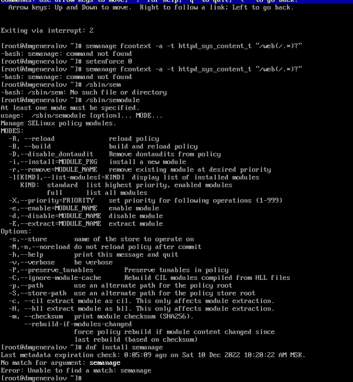

Как оказалось, нужно установить пакет `policycoreutils-python-utils`.

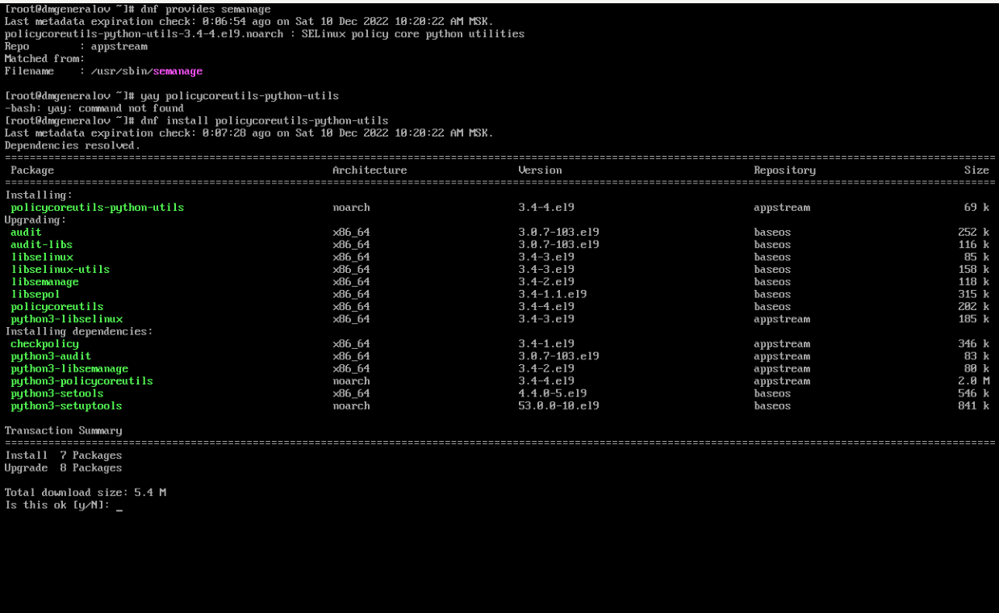

После этого изменения веб-сервер начал выдавать нужную страницу.

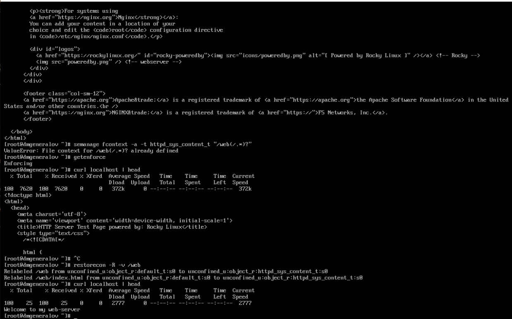

Наконец, я посмотрел на флаги настройки SELinux
для ftpd.
Я увидел, что раньше ftpd_anon_write был выключен,
а затем я изменил его с помощью `setsebool -P`,
что изменило как его текущую настройку, так и перманентную настройку.
Это можно увидеть по тому, что в `semanage boolean` оба параметра указаны `on`.

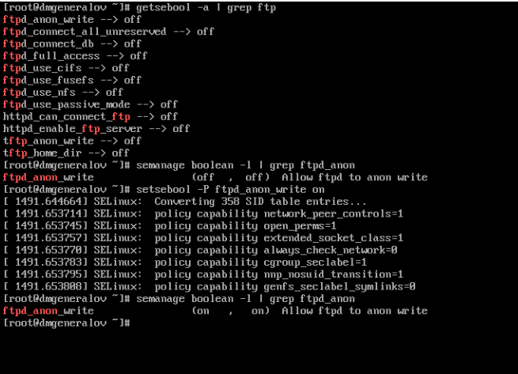

# Выводы

Я получил опыт работы с SELinux.

# Контрольные вопросы

1. Вы хотите временно поставить SELinux в разрешающем режиме. Какую команду
вы используете?

`setenforce 0`

2. Вам нужен список всех доступных переключателей SELinux. Какую команду вы
используете?

`getsebool -a`

3. Каково имя пакета, который требуется установить для получения легко читаемых
сообщений журнала SELinux в журнале аудита?

`audit2why`

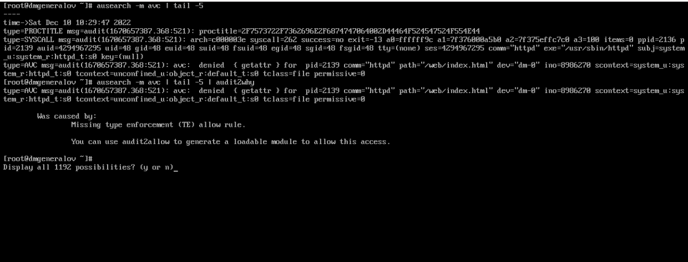

4. Какие команды вам нужно выполнить, чтобы применить тип контекста
httpd_sys_content_t к каталогу /web?

`semanage fcontext -a -t httpd_sys_content_t "/web(/.*)?"`
`restorecon -R -v /web`

5. Какой файл вам нужно изменить, если вы хотите полностью отключить SELinux?

`/etc/sysconfig/selinux`

6. Где SELinux регистрирует все свои сообщения?

`/var/log/audit/audit.log`

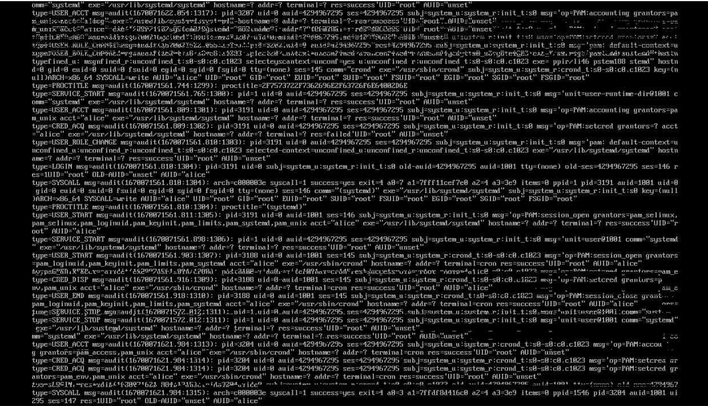

7. Вы не знаете, какие типы контекстов доступны для службы ftp. Какая команда
позволяет получить более конкретную информацию?

`semanage fcontext -l`

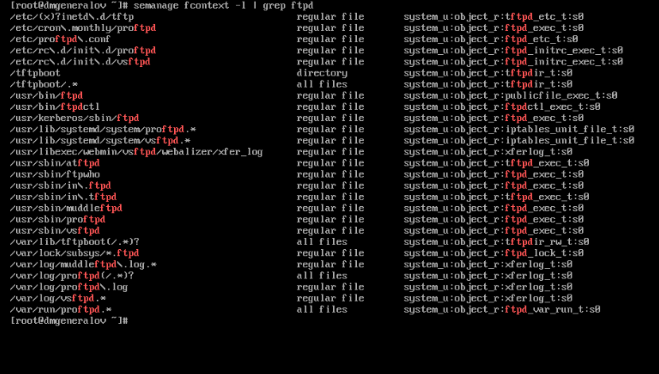

8. Ваш сервис работает не так, как ожидалось, и вы хотите узнать, связано ли это
с SELinux или чем-то ещё. Какой самый простой способ узнать?

`ausearch -m avc`

